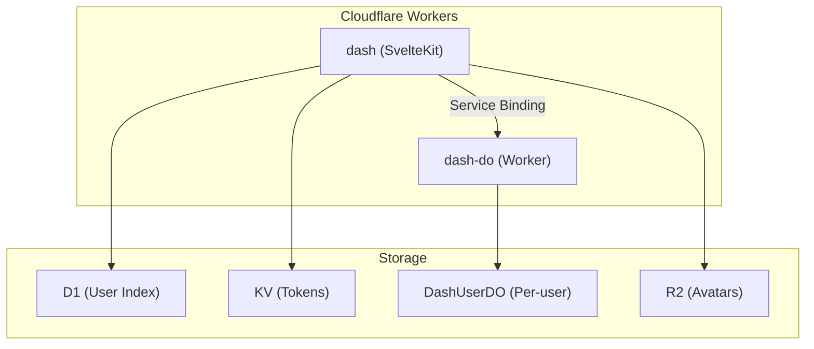

# Firmly Dashboard Documentation

The Firmly Dashboard is an internal admin portal and merchant-facing dashboard built with SvelteKit, deployed on Cloudflare Workers. It serves two distinct user groups: Firmly employees (admins) and merchant users.

## Quick Links

| Section | Description |
|---------|-------------|
| [Architecture](./architecture/overview.md) | System design, tech stack, architectural decisions |
| [Authentication](./authentication/overview.md) | Auth flows, JWT sessions, OTP, magic links |
| [Security](./security-considerations.md) | Security controls, known risks, pre-launch checklist |
| [Merchant System](./merchant/dashboard-system.md) | Dashboards, teams, onboarding |
| [Routes](./routes/overview.md) | Page structure, route groups, middleware |
| [Components](./components/overview.md) | UI library, feature components |
| [Database](./database/d1-schema.md) | D1 and Durable Object schemas |

## Overview

### Two User Types

1. **Firmly Admins** - Internal employees who manage merchants, view all orders, and create dashboards
   - Authenticated via Azure AD SSO
   - Access routes under `/admin/*`

2. **Merchant Users** - External users who manage their merchant dashboards
   - Authenticated via OTP or magic link (passwordless)
   - Access routes under `/merchant/*`

### Key Features

- **Passwordless authentication** - OTP codes and magic links, no passwords
- **Multi-merchant support** - Users can access multiple dashboards with role-based permissions
- **Hybrid auth model** - Firmly admins can view merchant dashboards with admin privileges
- **Real-time session management** - Device tracking, session termination
- **Audit logging** - All sensitive operations are logged
- **Rate limiting** - KV-based rate limiting on all authentication endpoints
- **Security headers** - Standard security headers (X-Frame-Options, CSP, etc.)

## Architecture Summary



For detailed architecture documentation, see [Architecture Overview](./architecture/overview.md).

## Documentation Structure

```
docs/
├── README.md                    # This file
├── security-considerations.md   # Security controls, known risks, pre-launch checklist
├── architecture/
│   ├── overview.md              # Tech stack, system design
│   ├── storage.md               # D1, DashUserDO, KV decisions
│   └── deployment.md            # Cloudflare Workers setup
├── authentication/
│   ├── overview.md              # Auth system summary
│   ├── jwt-sessions.md          # JWT lifecycle & renewal
│   ├── otp-login.md             # OTP flow
│   ├── magic-link.md            # Magic link flow
│   ├── azure-ad.md              # Admin SSO
│   └── invite-system.md         # Team invitations
├── merchant/
│   ├── dashboard-system.md      # Dashboard concept
│   ├── team-management.md       # Roles & permissions
│   ├── onboarding.md            # Integration steps
│   └── audit-logs.md            # Audit logging
├── routes/
│   ├── overview.md              # Route groups & middleware
│   ├── admin-routes.md          # (firmly-user-only) routes
│   ├── user-routes.md           # (logged-in) routes
│   └── public-routes.md         # (logged-out) routes
├── components/
│   ├── overview.md              # Component architecture
│   ├── ui-library.md            # Bits UI foundation
│   └── feature-components.md    # Domain components
└── database/
    ├── d1-schema.md             # D1 tables
    └── durable-objects.md       # DO schemas
```
