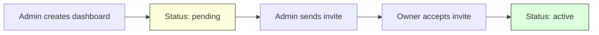

# GET/POST /admin/api/dashboards

Manage merchant dashboards for Firmly administrators.

## Use Case

Allows Firmly employees (authenticated via Azure AD) to:
- View all merchant dashboards in the system
- Create new merchant dashboards

## Endpoints

```
GET  /(firmly-user-only)/admin/api/dashboards
POST /(firmly-user-only)/admin/api/dashboards
```

## Authentication

Azure AD authentication required (Firmly employees only).

---

## GET /admin/api/dashboards

List all merchant dashboards.

### Request

```http
GET /admin/api/dashboards
Cookie: <azure_ad_cookie>=<token>
```

### Response (200)

```json
{
  "dashboards": [
    {
      "domain": "acme.com",
      "created_at": "2024-01-10T08:00:00Z",
      "created_by": "admin_abc123",
      "owner_email": "owner@acme.com",
      "owner_user_id": "usr_def456",
      "status": "active",
      "notes": "Enterprise client"
    },
    {
      "domain": "newclient.com",
      "created_at": "2024-01-15T10:30:00Z",
      "created_by": "admin_abc123",
      "owner_email": "pending@newclient.com",
      "owner_user_id": null,
      "status": "pending",
      "notes": "Onboarding in progress"
    }
  ]
}
```

### Response Fields

| Field | Type | Description |
|-------|------|-------------|
| `domain` | string | Merchant domain identifier |
| `created_at` | string | Dashboard creation time |
| `created_by` | string | Azure AD user ID who created |
| `owner_email` | string | Invited owner's email |
| `owner_user_id` | string | User ID after invite accepted |
| `status` | string | `pending` or `active` |
| `notes` | string | Admin notes |

---

## POST /admin/api/dashboards

Create a new merchant dashboard.

### Request

```http
POST /admin/api/dashboards
Content-Type: application/json
Cookie: <azure_ad_cookie>=<token>
```

```json
{
  "domain": "newmerchant.com",
  "notes": "New enterprise client"
}
```

### Body Parameters

| Field | Type | Required | Description |
|-------|------|----------|-------------|
| `domain` | string | Yes | Merchant domain |
| `notes` | string | No | Admin notes |

### Response (200)

```json
{
  "success": true,
  "dashboard": {
    "domain": "newmerchant.com",
    "created_by": "admin_abc123",
    "status": "pending",
    "notes": "New enterprise client"
  }
}
```

### Errors

**400 - Missing Domain**
```json
{
  "error": "Domain is required"
}
```

**400 - Invalid Domain**
```json
{
  "error": "Invalid domain format"
}
```

**409 - Already Exists**
```json
{
  "error": "A dashboard for this domain already exists"
}
```

## Implementation Details

### Domain Validation

```javascript
const domainRegex = /^[a-zA-Z0-9][a-zA-Z0-9-_.]+\.[a-zA-Z]{2,}$/;
if (!domainRegex.test(domain)) {
  return json({ error: 'Invalid domain format' }, { status: 400 });
}
```

### Duplicate Check

```javascript
const existing = await db
  .prepare('SELECT domain FROM merchant_dashboards WHERE domain = ?')
  .bind(domain)
  .first();

if (existing) {
  return json(
    { error: 'A dashboard for this domain already exists' },
    { status: 409 }
  );
}
```

### Dashboard Creation

```javascript
const createdBy = locals.authInfo?.oid || locals.authInfo?.sub || 'unknown';

await db
  .prepare(`
    INSERT INTO merchant_dashboards (domain, created_by, status, notes)
    VALUES (?, ?, 'pending', ?)
  `)
  .bind(domain, createdBy, notes || null)
  .run();
```

## Dashboard Lifecycle



### Status Meanings

| Status | Description |
|--------|-------------|
| `pending` | Dashboard created, owner not yet assigned |
| `active` | Owner has accepted invite and signed agreement |

## Typical Workflow

1. **Admin creates dashboard**: Sets up the domain entry
2. **Admin sends invite**: Uses `/admin/api/invites/send`
3. **Owner accepts invite**: Creates account or accepts with existing
4. **Dashboard becomes active**: Ready for configuration

## Auto-Creation on Invite

Dashboards can also be auto-created when sending an invite:

```javascript
// In /admin/api/invites/send
if (!existingDashboard) {
  await db.prepare(`
    INSERT INTO merchant_dashboards (domain, created_by, status)
    VALUES (?, ?, 'pending')
  `).bind(merchantDomain, invitedBy).run();
}
```

## D1 Table Schema

```sql
CREATE TABLE merchant_dashboards (
  domain TEXT PRIMARY KEY,
  created_at TIMESTAMP DEFAULT CURRENT_TIMESTAMP,
  created_by TEXT NOT NULL,
  owner_email TEXT,
  owner_user_id TEXT,
  status TEXT DEFAULT 'pending',
  notes TEXT,

  FOREIGN KEY (owner_user_id) REFERENCES users(id)
);
```

## Client Usage

```svelte
<script>
  import DashboardsTable from '$lib/components/admin/dashboards/dashboards-table.svelte';
  import CreateDashboardDialog from '$lib/components/admin/dashboards/create-dashboard-dialog.svelte';

  let dashboards = $state([]);
  let createOpen = $state(false);

  async function loadDashboards() {
    const response = await fetch('/admin/api/dashboards');
    const data = await response.json();
    dashboards = data.dashboards;
  }

  async function createDashboard({ domain, notes }) {
    const response = await fetch('/admin/api/dashboards', {
      method: 'POST',
      headers: { 'Content-Type': 'application/json' },
      body: JSON.stringify({ domain, notes })
    });

    if (response.ok) {
      createOpen = false;
      await loadDashboards();
    }
  }
</script>

<Button onclick={() => createOpen = true}>Create Dashboard</Button>
<DashboardsTable {dashboards} />
<CreateDashboardDialog bind:open={createOpen} oncreate={createDashboard} />
```

## Related

- [POST /admin/api/invites/send](./invites.md) - Send owner invites
- [Admin Routes](../../routes/admin-routes.md) - Admin pages
- [D1 Schema](../../database/d1-schema.md) - Table definitions
