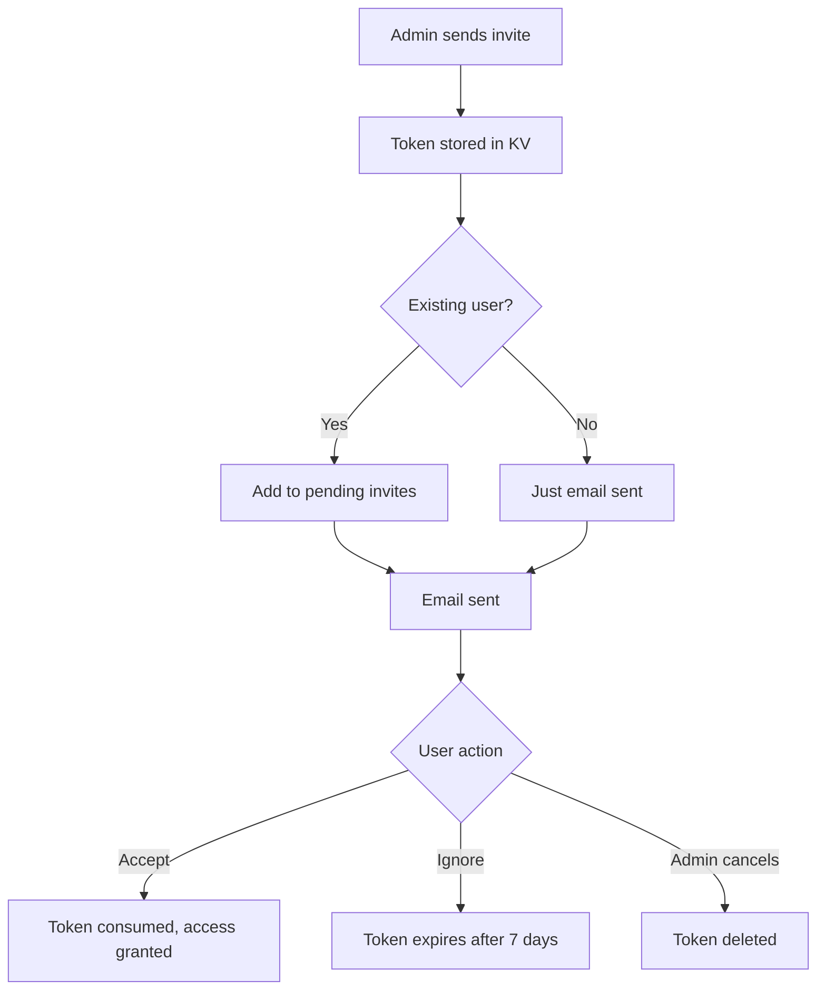

# Admin Invite APIs

Manage merchant invitations as a Firmly administrator.

## Endpoints

```
POST /(firmly-user-only)/admin/api/invites/send
POST /(firmly-user-only)/admin/api/invites/cancel
```

## Authentication

Azure AD authentication required (Firmly employees only).

---

## POST /admin/api/invites/send

Send an invitation to grant merchant dashboard access.

### Use Case

Allows Firmly admins to invite users (typically owners) to merchant dashboards. If the dashboard doesn't exist, it's auto-created.

### Request

```http
POST /admin/api/invites/send
Content-Type: application/json
Cookie: <azure_ad_cookie>=<token>
```

```json
{
  "email": "owner@acme.com",
  "merchantDomain": "acme.com",
  "role": "owner"
}
```

### Body Parameters

| Field | Type | Required | Description |
|-------|------|----------|-------------|
| `email` | string | Yes | Email to send invite to |
| `merchantDomain` | string | Yes | Merchant domain |
| `role` | string | Yes | Role: `owner`, `editor`, `viewer` |

### Response (200)

```json
{
  "success": true,
  "message": "Invitation sent to owner@acme.com",
  "expiresAt": 1705766400000
}
```

### Errors

**400 - Missing Fields**
```json
{
  "error": "Email, merchantDomain, and role are required"
}
```

**400 - Invalid Email**
```json
{
  "error": "Invalid email format"
}
```

**400 - Free Email**
```json
{
  "error": "Please use your business email address. Free email providers are not allowed."
}
```

**400 - Invalid Role**
```json
{
  "error": "Invalid role. Must be owner, editor, or viewer"
}
```

**500 - Email Failed**
```json
{
  "error": "Failed to send invitation email"
}
```

### Implementation Details

#### Dashboard Auto-Creation

```javascript
const existingDashboard = await db
  .prepare('SELECT domain FROM merchant_dashboards WHERE domain = ?')
  .bind(merchantDomain)
  .first();

if (!existingDashboard) {
  await db.prepare(`
    INSERT INTO merchant_dashboards (domain, created_by, status)
    VALUES (?, ?, 'pending')
  `).bind(merchantDomain, invitedBy).run();
}
```

#### Token Generation

```javascript
const tokenBytes = new Uint8Array(32);
crypto.getRandomValues(tokenBytes);
const token = Array.from(tokenBytes)
  .map((b) => b.toString(16).padStart(2, '0'))
  .join('');
```

#### Invite Storage

```javascript
const inviteData = {
  email,
  merchantDomain,
  role,
  invitedBy,
  invitedByEmail,
  expiresAt,
  type: 'merchant_invite',
  isFirmlyAdmin: true
};

await kv.put(`invite:${token}`, JSON.stringify(inviteData), {
  expirationTtl: 7 * 24 * 60 * 60
});
```

#### Existing User Notification

```javascript
const inviteeUser = await getUserIdByEmail({ platform, email });
if (inviteeUser) {
  await addPendingInvite({
    platform,
    userId: inviteeUser.userId,
    invite: {
      token,
      merchantDomain,
      role,
      invitedByEmail,
      expiresAt: new Date(expiresAt).toISOString(),
      isFirmlyAdmin: true
    }
  });
}
```

#### Audit Logging

```javascript
await createAuditLog({
  platform,
  merchantDomain,
  eventType: AuditEventTypes.TEAM_MEMBER_INVITED,
  actorId: invitedBy,
  actorEmail: invitedByEmail,
  targetEmail: email,
  details: { role, source: 'admin' },
  isFirmlyAdmin: true,
  actorType: 'firmly_admin'
});
```

---

## POST /admin/api/invites/cancel

Cancel a pending invitation.

### Use Case

Allows Firmly admins to revoke invitations that haven't been accepted yet.

### Request

```http
POST /admin/api/invites/cancel
Content-Type: application/json
Cookie: <azure_ad_cookie>=<token>
```

```json
{
  "merchantDomain": "acme.com",
  "token": "a1b2c3d4e5f6..."
}
```

### Body Parameters

| Field | Type | Required | Description |
|-------|------|----------|-------------|
| `merchantDomain` | string | Yes | Merchant domain |
| `token` | string | Yes | Invite token to cancel |

### Response (200)

```json
{
  "success": true,
  "message": "Invitation cancelled for owner@acme.com"
}
```

### Errors

**400 - Missing Fields**
```json
{
  "error": "Merchant domain and token are required"
}
```

**404 - Not Found**
```json
{
  "error": "Invite not found"
}
```

**404 - Wrong Merchant**
```json
{
  "error": "Invite not found for this merchant"
}
```

### Implementation Details

#### Token Retrieval

```javascript
const inviteDataStr = await kv.get(`invite:${token}`);
if (!inviteDataStr) {
  return json({ error: 'Invite not found' }, { status: 404 });
}

const inviteData = JSON.parse(inviteDataStr);

if (inviteData.merchantDomain !== merchantDomain) {
  return json({ error: 'Invite not found for this merchant' }, { status: 404 });
}
```

#### Cleanup

```javascript
// Remove from user's pending invites if they have an account
const inviteeUser = await getUserIdByEmail({ platform, email: inviteData.email });
if (inviteeUser) {
  await removePendingInvite({ platform, userId: inviteeUser.userId, token });
}

// Delete the invite KV entry
await kv.delete(`invite:${token}`);
```

#### Owner Email Cleanup

```javascript
// Clear owner_email if this was an owner invite and not yet accepted
if (inviteData.role === 'owner') {
  await db.prepare(`
    UPDATE merchant_dashboards
    SET owner_email = NULL
    WHERE domain = ? AND owner_user_id IS NULL AND owner_email = ?
  `).bind(merchantDomain, inviteData.email).run();
}
```

#### Audit Logging

```javascript
await createAuditLog({
  platform,
  merchantDomain,
  eventType: AuditEventTypes.INVITE_CANCELLED,
  actorId,
  actorEmail,
  targetEmail: inviteData.email,
  details: { role: inviteData.role, source: 'admin' },
  isFirmlyAdmin: true,
  actorType: 'firmly_admin'
});
```

## Admin vs Merchant Invites

| Aspect | Admin Invite | Merchant Invite |
|--------|--------------|-----------------|
| Endpoint | `/admin/api/invites/send` | `/merchant/{domain}/api/team/invite` |
| Auth | Azure AD | Session cookie |
| Dashboard creation | Auto-creates if needed | Dashboard must exist |
| Actor type | `firmly_admin` | `owner` |
| Audit visibility | Hidden from non-admins | Visible to owners |

## Invite Lifecycle



## Client Usage

```svelte
<script>
  import InviteUserDialog from '$lib/components/admin/dashboards/invite-user-dialog.svelte';
  import CancelInviteDialog from '$lib/components/admin/dashboards/cancel-invite-dialog.svelte';

  async function sendInvite({ email, role, domain }) {
    const response = await fetch('/admin/api/invites/send', {
      method: 'POST',
      headers: { 'Content-Type': 'application/json' },
      body: JSON.stringify({
        email,
        merchantDomain: domain,
        role
      })
    });

    if (response.ok) {
      toast.success('Invitation sent');
    } else {
      const { error } = await response.json();
      toast.error(error);
    }
  }

  async function cancelInvite({ domain, token }) {
    await fetch('/admin/api/invites/cancel', {
      method: 'POST',
      headers: { 'Content-Type': 'application/json' },
      body: JSON.stringify({ merchantDomain: domain, token })
    });
  }
</script>
```

## Related

- [GET/POST /admin/api/dashboards](./dashboards.md) - Dashboard management
- [POST /api/invite/accept](../auth/invite-accept.md) - Accept flow
- [Invite System](../../authentication/invite-system.md) - Full documentation
- [Admin Routes](../../routes/admin-routes.md) - Admin pages
