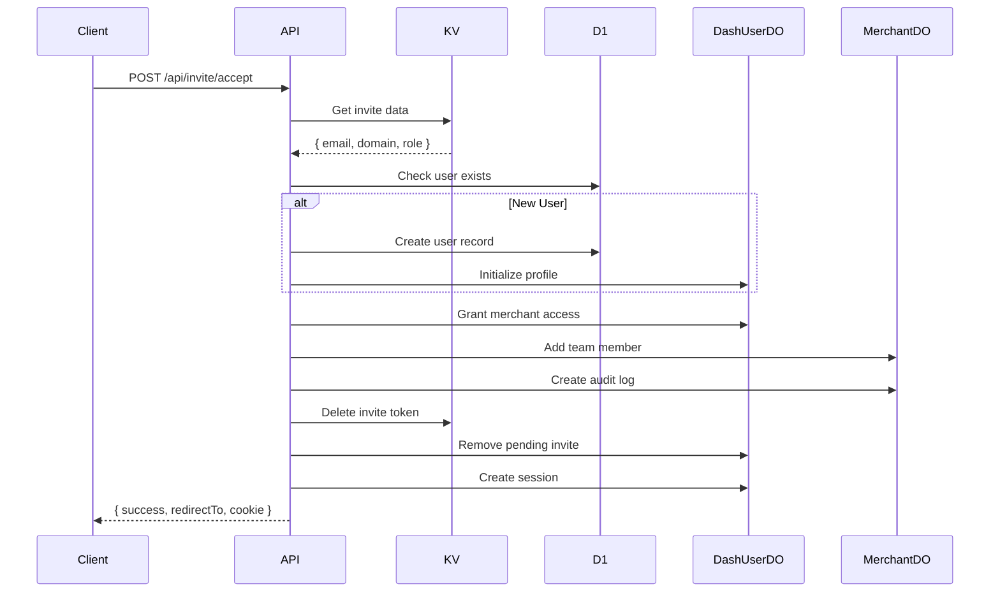

# POST /api/invite/accept

Accept a team invitation and grant merchant access.

## Use Case

Completes the invitation flow by:
1. Creating a new user account (if needed)
2. Granting merchant access with the specified role
3. Adding the user to the merchant team
4. Creating a session

## Endpoint

```
POST /api/invite/accept
```

## Authentication

None required (public endpoint, token-based).

## Request

### Headers

```http
Content-Type: application/json
```

### Body

| Field | Type | Required | Description |
|-------|------|----------|-------------|
| `token` | string | Yes | 64-character hex invite token |
| `profile` | object | Conditional | Required for new users |
| `profile.name` | string | Conditional | User's full name |
| `profile.company` | string | No | Company name |
| `profile.title` | string | No | Job title |
| `profile.location` | string | No | Location |

### Example - Existing User

```json
{
  "token": "a1b2c3d4e5f6..."
}
```

### Example - New User

```json
{
  "token": "a1b2c3d4e5f6...",
  "profile": {
    "name": "John Smith",
    "company": "Acme Corp",
    "title": "Operations Manager"
  }
}
```

## Response

### Success (200)

```json
{
  "success": true,
  "redirectTo": "/merchant/acme.com"
}
```

Session cookie is automatically set:
```
Set-Cookie: session=<jwt>; Path=/; HttpOnly; Secure; SameSite=Lax; Max-Age=604800
```

### Errors

**400 - Missing Token**
```json
{
  "error": "Token is required"
}
```

**400 - Profile Required**
```json
{
  "error": "Profile information is required for new users"
}
```

**404 - Invalid Token**
```json
{
  "error": "Invalid or expired invitation"
}
```

**410 - Expired**
```json
{
  "error": "This invitation has expired"
}
```

## Implementation Details

### User Handling

```javascript
// Check if user exists
let user = await getUser({ platform, email });

if (!user) {
  // New user - profile required
  if (!profile || !profile.name) {
    return error('Profile required');
  }

  user = await getOrCreateUser({
    platform,
    email,
    profile: {
      name: profile.name,
      company: profile.company || '',
      title: profile.title || '',
      location: profile.location || ''
    }
  });
}
```

### Access Granting

Three operations happen:

1. **DashUserDO**: Add merchant to user's access list

```javascript
await grantMerchantAccess({
  platform,
  userId: user.userId,
  userEmail: email,
  merchantDomain,
  role,
  grantedBy: inviteData.invitedBy
});
```

2. **MerchantDO**: Add user to merchant's team

```javascript
await addTeamMember({
  platform,
  merchantDomain,
  userId: user.userId,
  userEmail: email,
  role,
  grantedBy: inviteData.invitedBy,
  actor: { id: user.userId, email }
});
```

3. **D1**: Update dashboard ownership (if owner role)

```javascript
if (role === 'owner') {
  await db.prepare(`
    UPDATE merchant_dashboards
    SET owner_user_id = ?, status = 'active'
    WHERE domain = ? AND owner_user_id IS NULL
  `).bind(user.userId, merchantDomain).run();
}
```

### Token Cleanup

Token is single-use:

```javascript
// Delete from KV
await kv.delete(`invite:${token}`);

// Remove from user's pending invites
await removePendingInvite({ platform, userId: user.userId, token });
```

### Session Creation

```javascript
const { token: sessionToken } = await createSession({
  platform,
  userId: user.userId,
  email: user.email,
  userAgent,
  ipAddress,
  jwtSecret
});

cookies.set('session', sessionToken, {
  path: '/',
  httpOnly: true,
  secure: true,
  sameSite: 'lax',
  maxAge: 7 * 24 * 60 * 60
});
```

## Roles

| Role | Description | Capabilities |
|------|-------------|--------------|
| `owner` | Full control | All actions, invite others |
| `editor` | Operational access | View/edit settings, view orders |
| `viewer` | Read-only | View orders, view team |

## Flow Diagram



## Security Considerations

1. **Single use**: Token deleted after acceptance
2. **Profile validation**: New users must provide name
3. **Audit trail**: Team changes logged in MerchantDO
4. **Session created**: User immediately authenticated

## Related

- [GET /api/invite/verify](./invite-verify.md) - Validate invite token
- [Invite System](../authentication/invite-system.md) - Full flow documentation
- [Team Management](../merchant/team-management.md) - Role details
