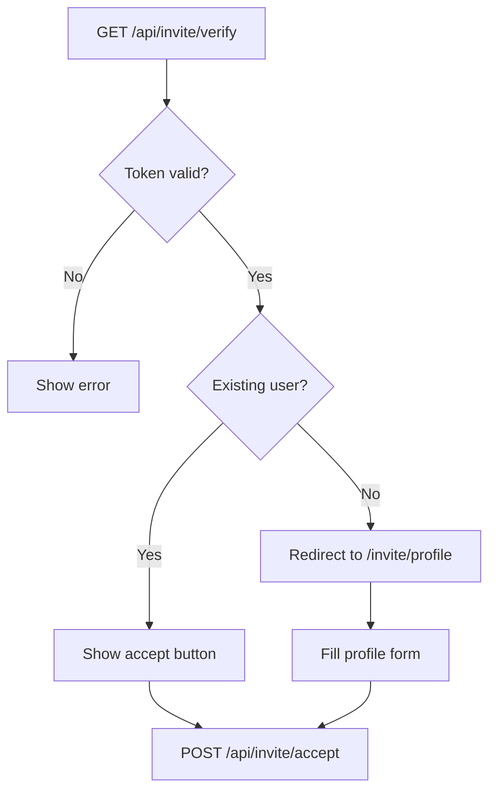

# GET /api/invite/verify

Validate an invitation token and return invite details without accepting it.

## Use Case

Used to display invitation details to the user before they accept. Determines whether the invitee already has an account (quick accept) or needs to create a profile (signup flow).

## Endpoint

```
GET /api/invite/verify?token=<token>
```

## Authentication

None required (public endpoint).

## Request

### Query Parameters

| Parameter | Type | Required | Description |
|-----------|------|----------|-------------|
| `token` | string | Yes | 64-character hex invite token |

### Example

```
GET /api/invite/verify?token=a1b2c3d4e5f6...
```

## Response

### Success (200)

```json
{
  "valid": true,
  "email": "john@acme.com",
  "merchantDomain": "acme.com",
  "role": "editor",
  "invitedByEmail": "owner@acme.com",
  "existingUser": true
}
```

### Errors

**400 - Missing Token**
```json
{
  "error": "Token is required"
}
```

**400 - Invalid Format**
```json
{
  "valid": false,
  "error": "Invalid token format"
}
```

**404 - Not Found**
```json
{
  "valid": false,
  "error": "Invalid or expired invitation"
}
```

**410 - Expired**
```json
{
  "valid": false,
  "error": "This invitation has expired"
}
```

## Response Fields

| Field | Type | Description |
|-------|------|-------------|
| `valid` | boolean | Whether the invite is valid |
| `email` | string | Email address the invite was sent to |
| `merchantDomain` | string | Merchant dashboard being invited to |
| `role` | string | Role being granted (`owner`, `editor`, `viewer`) |
| `invitedByEmail` | string | Email of person who sent invite |
| `existingUser` | boolean | Whether invitee already has an account |

## Implementation Details

### Token Validation

```javascript
// Validate format (64 hex chars)
if (!/^[a-f0-9]{64}$/i.test(token)) {
  return json({ valid: false, error: 'Invalid token format' });
}

// Get from KV
const stored = await kv.get(`invite:${token}`);
if (!stored) {
  return json({ valid: false, error: 'Invalid or expired invitation' });
}
```

### Expiry Check

```javascript
const inviteData = JSON.parse(stored);

if (Date.now() > inviteData.expiresAt) {
  await kv.delete(`invite:${token}`);
  return json({ valid: false, error: 'This invitation has expired' });
}
```

### User Existence Check

Determines the accept flow:

```javascript
const existingUser = await db
  .prepare('SELECT id, email FROM users WHERE email = ?')
  .bind(inviteData.email)
  .first();

return json({
  valid: true,
  existingUser: !!existingUser,
  // ... other fields
});
```

## Client-Side Usage

The invite page uses this to determine flow:

```svelte
<script>
  import { onMount } from 'svelte';

  let invite = $state(null);
  let error = $state('');

  onMount(async () => {
    const token = new URLSearchParams(location.search).get('token');

    const response = await fetch(`/api/invite/verify?token=${token}`);
    const data = await response.json();

    if (data.valid) {
      invite = data;
      if (!data.existingUser) {
        // New user - redirect to profile setup
        goto(`/invite/profile?token=${token}`);
      }
    } else {
      error = data.error;
    }
  });
</script>
```

## Flow Decision



## Security Considerations

1. **Read-only**: Does not consume or modify the token
2. **No authentication**: Anyone with token can view details
3. **Limited exposure**: Only shows email, domain, role
4. **Automatic cleanup**: Expired invites are deleted

## Related

- [POST /api/invite/accept](./invite-accept.md) - Accept the invitation
- [Invite System](../authentication/invite-system.md) - Full flow documentation
