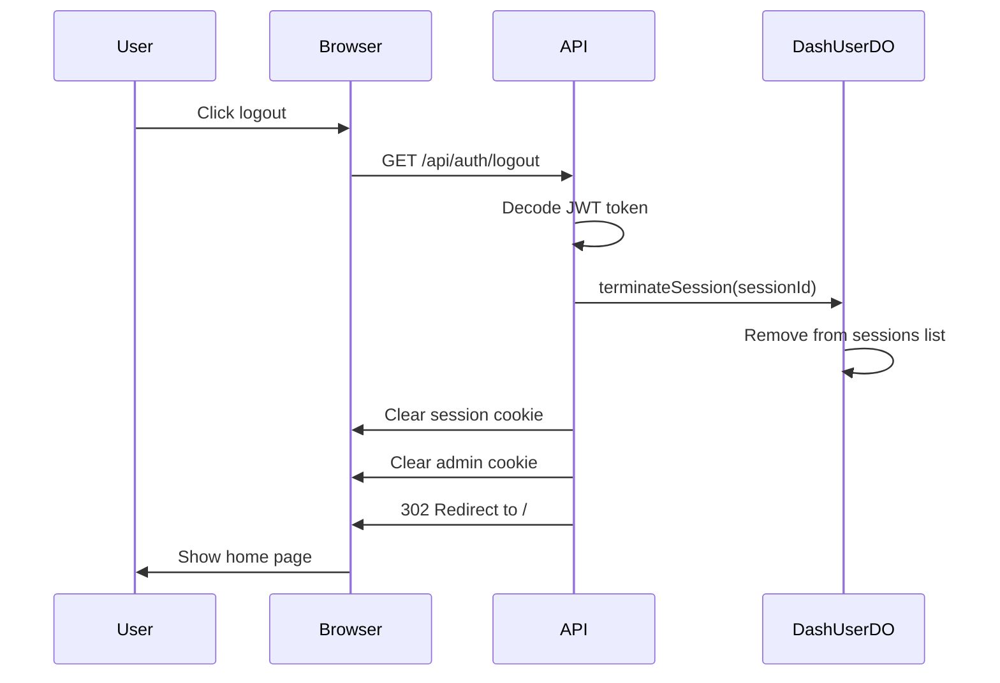

# GET /api/auth/logout

End the current session and redirect to the home page.

## Use Case

Logs the user out by:
1. Terminating the session in DashUserDO
2. Clearing the session cookie
3. Clearing admin cookie (if present)
4. Redirecting to home

## Endpoint

```
GET /(logged-in)/api/auth/logout
```

## Authentication

Session cookie required (but handles gracefully if missing).

## Request

### Method

```
GET /api/auth/logout
```

No body or parameters required.

## Response

### Success (302)

Redirects to `/` with cookies cleared:

```http
HTTP/1.1 302 Found
Location: /
Set-Cookie: session=; Path=/; Expires=Thu, 01 Jan 1970 00:00:00 GMT
```

If Firmly admin cookie exists, it's also cleared:
```http
Set-Cookie: <admin_cookie>=; Path=/; Expires=Thu, 01 Jan 1970 00:00:00 GMT
```

## Implementation Details

### Session Termination

```javascript
const sessionToken = cookies.get('session');

if (sessionToken) {
  try {
    const payload = decodeToken(sessionToken);
    if (payload && payload.sub && payload.jti) {
      await terminateSession({
        platform,
        userId: payload.sub,    // sub = userId
        sessionId: payload.jti  // jti = sessionId
      });
    }
  } catch (error) {
    console.error('Error terminating session:', error);
  }
}
```

### Cookie Clearing

```javascript
// Clear session cookie
cookies.delete('session', { path: '/' });

// Clear admin cookie if present
const adminCookieName = platform?.env?.FIRMLY_AUTH_COOKIE;
if (adminCookieName) {
  cookies.delete(adminCookieName, { path: '/' });
}
```

### Redirect

```javascript
redirect(302, '/');
```

## Session Cleanup

When `terminateSession` is called on DashUserDO:

1. Session removed from active sessions list
2. Session no longer valid for JWT renewal
3. Other sessions remain active

```javascript
// In DashUserDO
async terminateSession(sessionId) {
  const sessions = this.sessions.filter(s => s.id !== sessionId);
  this.sessions = sessions;
  await this.persist();
}
```

## Why GET Instead of POST?

This endpoint uses GET for several reasons:

1. **Link support**: Can be used as a simple `<a href="/api/auth/logout">` link
2. **No CSRF risk**: Logout is not a destructive action
3. **Browser compatibility**: Works without JavaScript
4. **Redirect pattern**: Naturally fits the redirect flow

## Client Usage

### Simple Link

```svelte
<a href="/api/auth/logout">Sign Out</a>
```

### Button with Navigation

```svelte
<button onclick={() => goto('/api/auth/logout')}>
  Sign Out
</button>
```

### Programmatic

```javascript
// Force navigation (not fetch)
window.location.href = '/api/auth/logout';
```

## Session States After Logout

| Component | State |
|-----------|-------|
| Session cookie | Deleted |
| DashUserDO session | Terminated |
| JWT token | Invalid (session gone) |
| Admin cookie | Deleted (if present) |
| Other sessions | Unaffected |

## Flow Diagram



## Security Considerations

1. **Server-side termination**: Session invalidated in DashUserDO
2. **Cookie clearing**: Both user and admin cookies removed
3. **Graceful handling**: Works even if session already invalid
4. **No sensitive data**: Response is just a redirect

## Related

- [JWT Sessions](../authentication/jwt-sessions.md) - Session lifecycle
- [GET/DELETE /api/sessions](../user/sessions.md) - Manage other sessions
- [Authentication Overview](../authentication/overview.md) - Auth system
