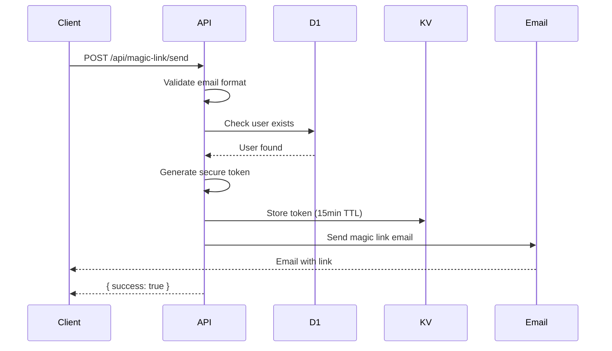

# POST /api/magic-link/send

Send a magic link login email to an existing user.

## Use Case

Used for **login flow** for returning users. Unlike OTP which is for signup, magic links are for users who already have an account.

## Endpoint

```
POST /(logged-out)/api/magic-link/send
```

## Authentication

None required (public endpoint).

## Request

### Headers

```http
Content-Type: application/json
```

### Body

| Field | Type | Required | Description |
|-------|------|----------|-------------|
| `email` | string | Yes | Registered email address |

### Example

```json
{
  "email": "john@acme.com"
}
```

## Response

### Success (200)

```json
{
  "success": true,
  "message": "Login link sent"
}
```

### Errors

**400 - Missing Email**
```json
{
  "error": "Email is required"
}
```

**400 - Invalid Format**
```json
{
  "error": "Invalid email format"
}
```

**400 - Free Email Provider**
```json
{
  "error": "Please use your business email address. Free email providers are not allowed."
}
```

**404 - User Not Found**
```json
{
  "error": "No account found with this email. Please sign up first."
}
```

**500 - Configuration Error**
```json
{
  "error": "Email service not configured"
}
```

## Implementation Details

### Token Generation

Uses cryptographically secure random bytes:

```javascript
function generateToken() {
  const array = new Uint8Array(32);
  crypto.getRandomValues(array);
  return Array.from(array, (byte) =>
    byte.toString(16).padStart(2, '0')
  ).join('');
}
```

- 64 hex characters (256 bits)
- Valid for 15 minutes

### User Verification

Unlike OTP, magic links require existing user:

```javascript
const exists = await userExists({ platform, email });
if (!exists) {
  return json(
    { error: 'No account found with this email. Please sign up first.' },
    { status: 404 }
  );
}
```

### Storage

Token stored in Cloudflare KV:

```javascript
await platform.env.OTP_STORE.put(`magic:${token}`, JSON.stringify({
  email,
  expiresAt
}), {
  expirationTtl: 900 // 15 minutes
});
```

### Magic Link URL

```javascript
const magicLinkUrl = `${url.origin}/login/verify?token=${token}`;
```

Example: `https://dash.firmly.ai/login/verify?token=abc123...`

### Email Service

```javascript
await sendMagicLinkEmail(email, magicLinkUrl, apiKey);
```

## OTP vs Magic Link

| Aspect | OTP | Magic Link |
|--------|-----|------------|
| Purpose | Signup | Login |
| User required | No (creates new) | Yes (existing only) |
| Format | 6 digits | 64 hex chars |
| Expiry | 5 minutes | 15 minutes |
| Delivery | Code in email | Clickable link |

## Security Considerations

1. **Existing users only**: Prevents account enumeration attacks
2. **Business email**: Free providers blocked
3. **Secure token**: 256-bit entropy
4. **TTL expiry**: Auto-deleted after 15 minutes
5. **Single use**: Deleted on verification

## Flow Diagram



## Related

- [POST /api/magic-link/verify](./magic-link-verify.md) - Verify magic link
- [Magic Link Flow](../authentication/magic-link.md) - Full flow documentation
- [POST /api/otp/send](./otp-send.md) - OTP for signup
