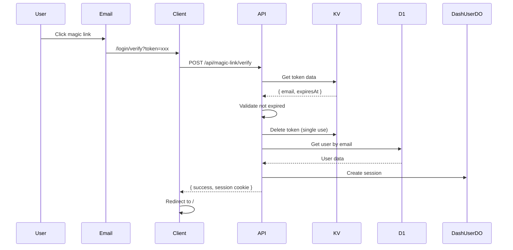

# POST /api/magic-link/verify

Verify a magic link token and create a user session.

## Use Case

Handles the click from a magic link email, validates the token, and establishes a session for the returning user.

## Endpoint

```
POST /(logged-out)/api/magic-link/verify
```

## Authentication

None required (public endpoint).

## Request

### Headers

```http
Content-Type: application/json
```

### Body

| Field | Type | Required | Description |
|-------|------|----------|-------------|
| `token` | string | Yes | 64-character hex token from magic link |

### Example

```json
{
  "token": "a1b2c3d4e5f6..."
}
```

## Response

### Success (200)

```json
{
  "success": true,
  "message": "Login successful",
  "email": "john@acme.com",
  "userId": "usr_abc123",
  "redirectTo": "/"
}
```

Session cookie is automatically set:
```
Set-Cookie: session=<jwt>; Path=/; HttpOnly; Secure; SameSite=Lax; Max-Age=604800
```

### Errors

**400 - Missing Token**
```json
{
  "error": "Token is required"
}
```

**400 - Invalid Format**
```json
{
  "error": "Invalid token format"
}
```

**400 - Invalid or Expired**
```json
{
  "error": "Invalid or expired link. Please request a new one."
}
```

**400 - Token Expired**
```json
{
  "error": "Link has expired. Please request a new one."
}
```

**404 - User Not Found**
```json
{
  "error": "No account found with this email. Please sign up first."
}
```

## Implementation Details

### Token Validation

```javascript
// Validate format (64 hex characters)
if (!/^[a-f0-9]{64}$/.test(token)) {
  return error('Invalid token format');
}

// Get from KV
const stored = await platform.env.OTP_STORE.get(`magic:${token}`);
if (!stored) {
  return error('Invalid or expired link');
}

// Check expiry
if (Date.now() > storedData.expiresAt) {
  await platform.env.OTP_STORE.delete(`magic:${token}`);
  return error('Link has expired');
}
```

### Single Use

Token is deleted immediately after verification:

```javascript
await platform.env.OTP_STORE.delete(`magic:${token}`);
```

### User Retrieval

Gets existing user (doesn't create new):

```javascript
const user = await getUser({
  platform,
  email: storedData.email
});

if (!user) {
  return error('No account found');
}
```

### Session Creation

```javascript
const { token: sessionToken } = await createSession({
  platform,
  userId: user.userId,
  email: user.email,
  userAgent,
  ipAddress,
  jwtSecret
});
```

### Merchant Access Update

Refreshes domain-based access:

```javascript
const emailDomain = email.split('@')[1];
await grantMerchantAccess({
  platform,
  userId: user.userId,
  userEmail: user.email,
  merchantDomain: emailDomain,
  role: 'owner'
});
```

## Client-Side Flow

The verify page (`/login/verify`) handles the token automatically:

```svelte
<script>
  import { onMount } from 'svelte';

  onMount(async () => {
    const token = new URLSearchParams(location.search).get('token');

    const response = await fetch('/api/magic-link/verify', {
      method: 'POST',
      body: JSON.stringify({ token })
    });

    if (response.ok) {
      const { redirectTo } = await response.json();
      goto(redirectTo || '/');
    }
  });
</script>
```

## Security Considerations

1. **Single use**: Token deleted after first verification
2. **Format validation**: Strict 64 hex character check
3. **Existing users only**: Cannot create new accounts
4. **15-minute expiry**: Short window limits attack surface
5. **Secure session**: HttpOnly, Secure, SameSite cookies

## Flow Diagram



## Related

- [POST /api/magic-link/send](./magic-link-send.md) - Send magic link
- [Magic Link Flow](../authentication/magic-link.md) - Full flow documentation
- [JWT Sessions](../authentication/jwt-sessions.md) - Session details
