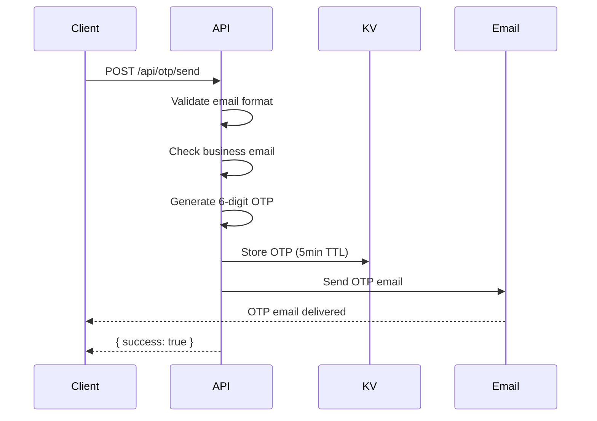

# POST /api/otp/send

Send a 6-digit OTP verification code to the provided email address.

## Use Case

Used during **signup flow** to verify email ownership. Unlike magic links, OTP is used for new user registration.

## Endpoint

```
POST /(logged-out)/api/otp/send
```

## Authentication

None required (public endpoint).

## Request

### Headers

```http
Content-Type: application/json
```

### Body

| Field | Type | Required | Description |
|-------|------|----------|-------------|
| `email` | string | Yes | Email address to send OTP to |
| `domain` | string | No | Merchant domain for signup context |

### Example

```json
{
  "email": "john@acme.com",
  "domain": "acme.com"
}
```

## Response

### Success (200)

```json
{
  "success": true,
  "message": "Verification code sent"
}
```

### Errors

**400 - Missing Email**
```json
{
  "error": "Email is required"
}
```

**400 - Invalid Format**
```json
{
  "error": "Invalid email format"
}
```

**400 - Free Email Provider**
```json
{
  "error": "Please use your business email address. Free email providers are not allowed."
}
```

**500 - Configuration Error**
```json
{
  "error": "Service configuration error"
}
```

**500 - Email Failure**
```json
{
  "error": "Failed to send verification email"
}
```

## Implementation Details

### OTP Generation

```javascript
function generateOTP() {
  return Math.floor(100000 + Math.random() * 900000).toString();
}
```

- 6-digit numeric code
- Cryptographically random
- Valid for 5 minutes

### Storage

OTP is stored in Cloudflare KV:

```javascript
await platform.env.OTP_STORE.put(`otp:${email}`, JSON.stringify({
  code,
  email,
  domain,
  expiresAt
}), {
  expirationTtl: 300 // 5 minutes
});
```

### Email Validation

Business email validation blocks free providers:
- Gmail, Yahoo, Outlook, etc.
- Uses allowlist of free email domains
- Ensures B2B context

### Email Service

Uses MailerSend for transactional emails:

```javascript
await sendOTPEmail(email, code, apiKey);
```

## Security Considerations

1. **Rate limiting**: No explicit limit, but OTP expires in 5 minutes
2. **Email validation**: Prevents signup with personal emails
3. **No user enumeration**: Always returns success message
4. **TTL expiry**: KV auto-deletes expired codes

## Flow Diagram



## Related

- [POST /api/otp/verify](./otp-verify.md) - Verify the OTP code
- [OTP Login Flow](../authentication/otp-login.md) - Full flow documentation
