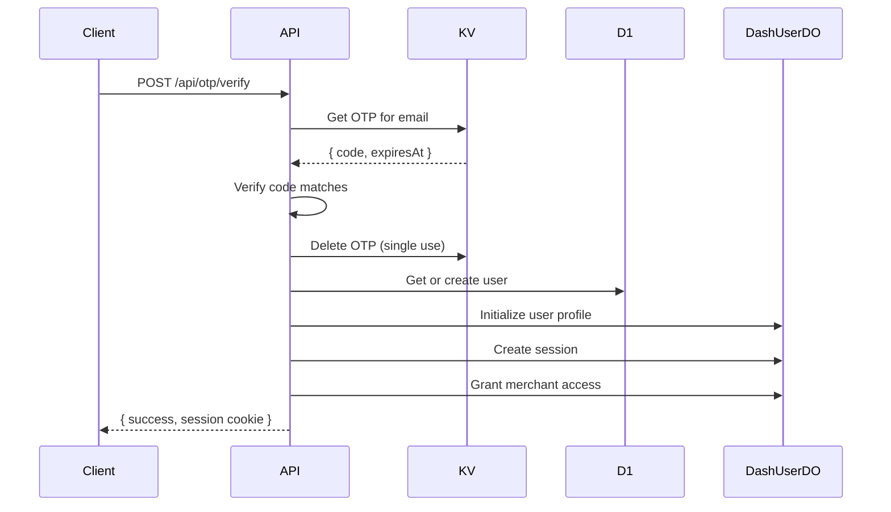

# POST /api/otp/verify

Verify a 6-digit OTP code and create a user session.

## Use Case

Used during **signup flow** to complete email verification. Creates user account if new, establishes session, and grants merchant access.

## Endpoint

```
POST /(logged-out)/api/otp/verify
```

## Authentication

None required (public endpoint).

## Request

### Headers

```http
Content-Type: application/json
```

### Body

| Field | Type | Required | Description |
|-------|------|----------|-------------|
| `email` | string | Yes | Email address that received OTP |
| `code` | string | Yes | 6-digit OTP code |
| `profile` | object | No | User profile for new accounts |
| `profile.name` | string | No | User's full name |
| `profile.company` | string | No | Company name |
| `profile.title` | string | No | Job title |

### Example

```json
{
  "email": "john@acme.com",
  "code": "123456",
  "profile": {
    "name": "John Smith",
    "company": "Acme Corp"
  }
}
```

## Response

### Success (200)

```json
{
  "success": true,
  "message": "Email verified successfully",
  "email": "john@acme.com",
  "domain": "acme.com",
  "userId": "usr_abc123",
  "redirectTo": "/"
}
```

Session cookie is automatically set:
```
Set-Cookie: session=<jwt>; Path=/; HttpOnly; Secure; SameSite=Lax; Max-Age=604800
```

### Errors

**400 - Missing Fields**
```json
{
  "error": "Email and code are required"
}
```

**400 - Invalid Format**
```json
{
  "error": "Invalid code format"
}
```

**400 - Code Not Found**
```json
{
  "error": "No verification code found. Please request a new one."
}
```

**400 - Code Expired**
```json
{
  "error": "Verification code has expired. Please request a new one."
}
```

**400 - Invalid Code**
```json
{
  "error": "Invalid verification code"
}
```

## Implementation Details

### Code Verification

```javascript
// Get stored OTP
const stored = await platform.env.OTP_STORE.get(`otp:${email}`);
const storedData = JSON.parse(stored);

// Check expiry
if (Date.now() > storedData.expiresAt) {
  await platform.env.OTP_STORE.delete(`otp:${email}`);
  return error('Code expired');
}

// Verify code
if (storedData.code !== code) {
  return error('Invalid code');
}
```

### User Creation

For new users:

```javascript
const user = await getOrCreateUser({
  platform,
  email: storedData.email,
  profile: profile || {}
});
```

This:
1. Creates D1 record in `users` table
2. Initializes DashUserDO with profile data
3. Returns existing user if email matches

### Session Creation

```javascript
const { token } = await createSession({
  platform,
  userId: user.userId,
  email: user.email,
  userAgent,
  ipAddress,
  jwtSecret
});
```

Session includes:
- 30-minute JWT expiry
- 7-day renewal window
- Device fingerprint

### Merchant Access

Automatically grants access based on email domain:

```javascript
const merchantDomain = storedData.domain || email.split('@')[1];
await grantMerchantAccess({
  platform,
  userId: user.userId,
  userEmail: user.email,
  merchantDomain,
  role: 'owner'
});
```

### Cookie Settings

| Attribute | Value | Purpose |
|-----------|-------|---------|
| `HttpOnly` | true | Prevent XSS access |
| `Secure` | true | HTTPS only |
| `SameSite` | lax | CSRF protection |
| `Max-Age` | 604800 | 7 days |

## Security Considerations

1. **Single use**: OTP deleted after verification
2. **No retries exposed**: Code deleted on expiry check
3. **Timing-safe comparison**: Using string equality
4. **Secure cookie**: HttpOnly, Secure, SameSite

## Flow Diagram



## Related

- [POST /api/otp/send](./otp-send.md) - Send OTP code
- [OTP Login Flow](../authentication/otp-login.md) - Full flow documentation
- [JWT Sessions](../authentication/jwt-sessions.md) - Session details
