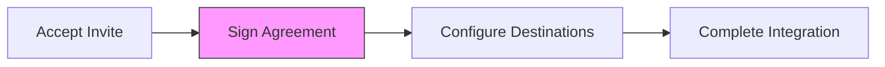

# GET/POST /merchant/{domain}/api/agreement

Manage merchant agreement signing for the Firmly platform.

## Use Case

Before merchants can use the Firmly platform, they must sign a service agreement. This endpoint:
- Retrieves current agreement status
- Records agreement signatures with legal metadata

## Endpoints

```
GET  /(logged-in)/merchant/[domain]/api/agreement
POST /(logged-in)/merchant/[domain]/api/agreement
```

## Authentication

Session cookie required. User must have access to the specified merchant.

---

## GET /merchant/{domain}/api/agreement

Get the current agreement status for a merchant.

### Authorization

All roles (owner, editor, viewer) can view agreement status.

### Request

```http
GET /merchant/acme.com/api/agreement
Cookie: session=<jwt>
```

### Response (200) - Not Signed

```json
{
  "signed": false,
  "required": true,
  "version": "1.0"
}
```

### Response (200) - Signed

```json
{
  "signed": true,
  "signedAt": "2024-01-15T10:30:00Z",
  "signedBy": {
    "userId": "usr_abc123",
    "email": "owner@acme.com",
    "name": "Jane Owner"
  },
  "version": "1.0",
  "clientInfo": {
    "ip": "192.168.1.100",
    "location": "San Francisco, US",
    "browser": "Chrome 120.0"
  }
}
```

### Response Fields

| Field | Type | Description |
|-------|------|-------------|
| `signed` | boolean | Whether agreement is signed |
| `required` | boolean | Whether signing is required |
| `version` | string | Agreement version |
| `signedAt` | string | Signature timestamp |
| `signedBy` | object | User who signed |
| `clientInfo` | object | Signing context |

---

## POST /merchant/{domain}/api/agreement

Sign the merchant agreement.

### Authorization

Only **owners** can sign the agreement.

### Request

```http
POST /merchant/acme.com/api/agreement
Content-Type: application/json
Cookie: session=<jwt>
```

```json
{
  "browserInfo": "Chrome 120.0 on macOS"
}
```

### Response (200)

```json
{
  "success": true,
  "agreement": {
    "signed": true,
    "signedAt": "2024-01-15T10:30:00.000Z",
    "signedBy": {
      "userId": "usr_abc123",
      "email": "owner@acme.com"
    },
    "version": "1.0"
  }
}
```

### Errors

**403 - Access Denied**
```json
{
  "error": "Access denied"
}
```

**403 - Not Owner**
```json
{
  "error": "Only owners can sign the merchant agreement"
}
```

**400 - Already Signed**
```json
{
  "error": "Agreement has already been signed"
}
```

## Implementation Details

### Authorization Check

```javascript
if (!isFirmlyAdmin) {
  const merchantAccess = await getMerchantAccess({ platform, userId });
  const currentAccess = merchantAccess.find(
    (a) => (a.merchant_domain || a.merchantDomain) === domain
  );

  if (!currentAccess) {
    return json({ error: 'Access denied' }, { status: 403 });
  }

  if (currentAccess.role !== 'owner') {
    return json(
      { error: 'Only owners can sign the merchant agreement' },
      { status: 403 }
    );
  }
}
```

### Client Information Collection

For legal purposes, we capture:

```javascript
const clientIp =
  request.headers.get('CF-Connecting-IP') ||
  request.headers.get('X-Forwarded-For');

const cfData = request.cf || {};
const clientLocation =
  cfData.city && cfData.country
    ? `${cfData.city}, ${cfData.country}`
    : null;
```

### Signature Storage

Agreement data stored in **MerchantDO**:

```javascript
const result = await signMerchantAgreement({
  platform,
  merchantDomain: domain,
  userId,
  userEmail: email,
  browserInfo: body.browserInfo,
  clientIp,
  clientLocation
});
```

### MerchantDO Operation

```javascript
// In MerchantDO
async signAgreement({ userId, userEmail, browserInfo, clientIp, clientLocation }) {
  if (this.agreement.signed) {
    return { success: false, error: 'Already signed' };
  }

  this.agreement = {
    signed: true,
    signedAt: new Date().toISOString(),
    signedBy: { userId, email: userEmail },
    version: '1.0',
    clientInfo: {
      ip: clientIp,
      location: clientLocation,
      browser: browserInfo
    }
  };

  // Create audit log
  await this.createAuditLog({
    eventType: 'agreement_signed',
    actor: { id: userId, email: userEmail },
    details: { version: '1.0' }
  });

  await this.persist();
  return { success: true, agreement: this.agreement };
}
```

## Legal Metadata

The following is captured for legal compliance:

| Field | Source | Purpose |
|-------|--------|---------|
| `userId` | Session | Identity verification |
| `email` | Session | Contact for disputes |
| `signedAt` | Server | Timestamp record |
| `clientIp` | CF-Connecting-IP | Geographic location |
| `clientLocation` | Cloudflare cf | City/Country |
| `browserInfo` | Client | Device identification |
| `version` | System | Agreement version tracking |

## Onboarding Flow

Agreement signing is typically the first onboarding step:



## Role Permissions

| Role | View Status | Sign |
|------|-------------|------|
| owner | ✅ | ✅ |
| editor | ✅ | ❌ |
| viewer | ✅ | ❌ |
| Firmly admin | ✅ | ✅ |

## Why Only Owners Can Sign?

The agreement creates legal obligations for the merchant. Only the owner role represents someone with authority to bind the company:

1. **Legal standing**: Owners represent the business
2. **Accountability**: Clear audit trail of who signed
3. **Risk management**: Prevents unauthorized commitments

## Client Usage

```svelte
<script>
  import MerchantAgreement from '$lib/components/merchant/merchant-agreement.svelte';

  let agreement = $state(null);

  async function loadAgreement() {
    const response = await fetch(`/merchant/${domain}/api/agreement`);
    agreement = await response.json();
  }

  async function signAgreement() {
    const response = await fetch(`/merchant/${domain}/api/agreement`, {
      method: 'POST',
      headers: { 'Content-Type': 'application/json' },
      body: JSON.stringify({
        browserInfo: navigator.userAgent
      })
    });

    if (response.ok) {
      agreement = (await response.json()).agreement;
    }
  }
</script>

<MerchantAgreement
  {agreement}
  isOwner={role === 'owner'}
  onsign={signAgreement}
/>
```

## Related

- [Onboarding](../../merchant/onboarding.md) - Integration steps
- [Team Management](../../merchant/team-management.md) - Role details
- [MerchantDO](../../database/durable-objects.md) - Data structure
