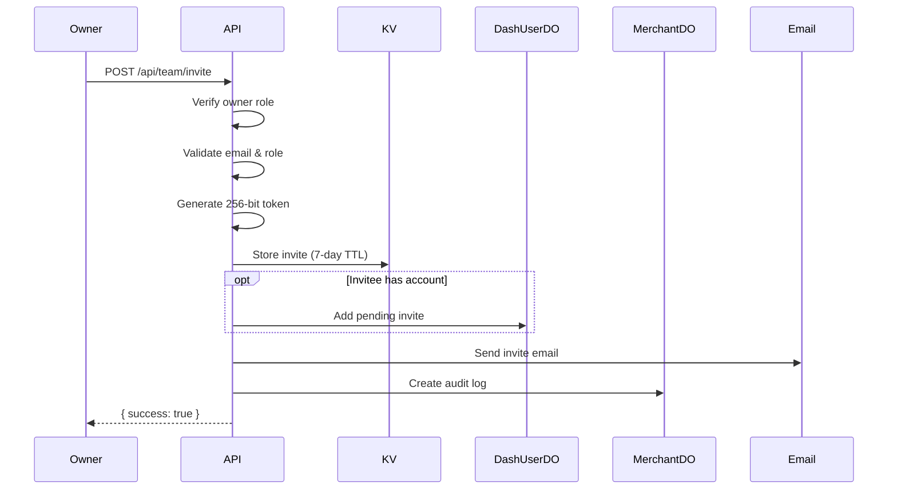

# POST /merchant/{domain}/api/team/invite

Send an invitation to join a merchant's team.

## Use Case

Allows merchant owners to invite users to their dashboard with a specified role.

## Endpoint

```
POST /(logged-in)/merchant/[domain]/api/team/invite
```

## Authentication

Session cookie required.

## Authorization

Only **owners** can invite team members. Firmly admins also have this capability.

## Request

### Path Parameters

| Parameter | Type | Description |
|-----------|------|-------------|
| `domain` | string | Merchant domain (e.g., `acme.com`) |

### Headers

```http
Content-Type: application/json
Cookie: session=<jwt>
```

### Body

| Field | Type | Required | Description |
|-------|------|----------|-------------|
| `email` | string | Yes | Email address to invite |
| `role` | string | Yes | Role to grant: `owner`, `editor`, `viewer` |

### Example

```json
{
  "email": "newmember@company.com",
  "role": "editor"
}
```

## Response

### Success (200)

```json
{
  "success": true,
  "message": "Invitation sent to newmember@company.com",
  "expiresAt": 1705766400000
}
```

### Errors

**400 - Missing Fields**
```json
{
  "error": "Email and role are required"
}
```

**400 - Invalid Email**
```json
{
  "error": "Invalid email format"
}
```

**400 - Free Email**
```json
{
  "error": "Please use your business email address. Free email providers are not allowed."
}
```

**400 - Invalid Role**
```json
{
  "error": "Invalid role. Must be owner, editor, or viewer"
}
```

**403 - Not Owner**
```json
{
  "error": "Only owners can invite team members"
}
```

**403 - Cannot Invite Owner**
```json
{
  "error": "Only owners can invite new owners"
}
```

**500 - Email Failed**
```json
{
  "error": "Failed to send invitation email"
}
```

## Implementation Details

### Authorization Check

```javascript
let isOwner = isFirmlyAdmin === true;

if (!isOwner) {
  const merchantAccess = await getMerchantAccess({ platform, userId });
  const currentAccess = merchantAccess.find(
    (a) => (a.merchant_domain || a.merchantDomain) === domain
  );
  isOwner = currentAccess?.role === 'owner';
}

if (!isOwner) {
  return error('Only owners can invite team members');
}
```

### Token Generation

```javascript
const tokenBytes = new Uint8Array(32);
crypto.getRandomValues(tokenBytes);
const token = Array.from(tokenBytes)
  .map((b) => b.toString(16).padStart(2, '0'))
  .join('');
```

### Invite Storage

Stored in KV with 7-day TTL:

```javascript
const inviteData = {
  email,
  merchantDomain: domain,
  role,
  invitedBy: userId,
  invitedByEmail: senderEmail,
  expiresAt,
  type: 'merchant_team_invite'
};

await kv.put(`invite:${token}`, JSON.stringify(inviteData), {
  expirationTtl: 7 * 24 * 60 * 60
});
```

### Existing User Notification

If invitee already has an account, the invite is stored in their DashUserDO:

```javascript
const inviteeUser = await getUserIdByEmail({ platform, email });
if (inviteeUser) {
  await addPendingInvite({
    platform,
    userId: inviteeUser.userId,
    invite: {
      token,
      merchantDomain: domain,
      role,
      invitedByEmail: senderEmail,
      expiresAt: new Date(expiresAt).toISOString()
    }
  });
}
```

### Audit Logging

```javascript
await createAuditLog({
  platform,
  merchantDomain: domain,
  eventType: AuditEventTypes.TEAM_MEMBER_INVITED,
  actorId: userId,
  actorEmail: senderEmail,
  targetEmail: email,
  details: { role },
  isFirmlyAdmin,
  actorType
});
```

### Email Sending

```javascript
const inviteUrl = `${baseUrl}/invite?token=${token}`;

const emailResult = await sendInviteEmail({
  email,
  merchantDomain: domain,
  role,
  inviteUrl,
  invitedByEmail: senderEmail
}, apiKey);

if (!emailResult.success) {
  await kv.delete(`invite:${token}`);
  return error('Failed to send invitation email');
}
```

## Role Hierarchy

| Current Role | Can Invite As |
|--------------|---------------|
| owner | owner, editor, viewer |
| editor | Cannot invite |
| viewer | Cannot invite |
| Firmly admin | owner, editor, viewer |

## Invite Expiration

- **Duration**: 7 days
- **Single use**: Token deleted after acceptance
- **Can be cancelled**: Via admin or team-invite-cancel endpoint

## Client Usage

```svelte
<script>
  import TeamInviteDialog from '$lib/components/team/team-invite-dialog.svelte';

  let open = $state(false);

  async function handleInvite({ email, role }) {
    const response = await fetch(`/merchant/${domain}/api/team/invite`, {
      method: 'POST',
      headers: { 'Content-Type': 'application/json' },
      body: JSON.stringify({ email, role })
    });

    if (response.ok) {
      toast.success('Invitation sent');
      open = false;
    } else {
      const { error } = await response.json();
      toast.error(error);
    }
  }
</script>

<TeamInviteDialog bind:open oninvite={handleInvite} />
```

## Flow Diagram



## Related

- [GET /merchant/{domain}/api/team](./team.md) - List team
- [POST /api/invite/accept](../auth/invite-accept.md) - Accept invite
- [Invite System](../../authentication/invite-system.md) - Full flow
- [Team Management](../../merchant/team-management.md) - Role details
