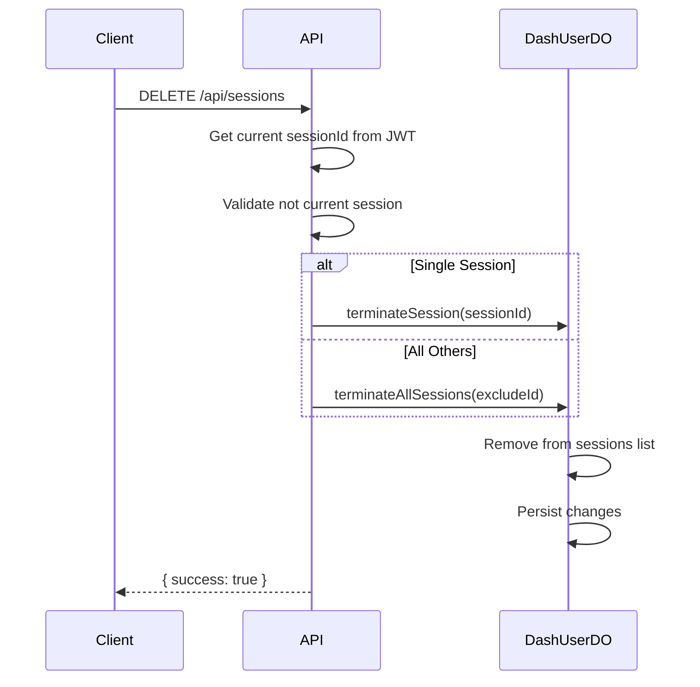

# GET/DELETE /api/sessions

Manage active sessions for the current user.

## Use Case

Allows users to:
- View all their active sessions across devices
- Terminate specific sessions (remote logout)
- Terminate all other sessions (security action)

## Endpoints

```
GET    /(logged-in)/api/sessions
DELETE /(logged-in)/api/sessions
```

## Authentication

Session cookie required.

---

## GET /api/sessions

List all active sessions for the current user.

### Request

```http
GET /api/sessions
Cookie: session=<jwt>
```

### Response (200)

```json
[
  {
    "id": "sess_abc123",
    "createdAt": "2024-01-15T10:30:00Z",
    "lastActiveAt": "2024-01-15T14:45:00Z",
    "userAgent": "Mozilla/5.0 (Macintosh; Intel Mac OS X 10_15_7)...",
    "ipAddress": "192.168.1.100",
    "isCurrent": true
  },
  {
    "id": "sess_def456",
    "createdAt": "2024-01-14T09:00:00Z",
    "lastActiveAt": "2024-01-14T18:30:00Z",
    "userAgent": "Mozilla/5.0 (iPhone; CPU iPhone OS 17_0)...",
    "ipAddress": "10.0.0.50",
    "isCurrent": false
  }
]
```

### Response Fields

| Field | Type | Description |
|-------|------|-------------|
| `id` | string | Session identifier |
| `createdAt` | string | When session was created (ISO 8601) |
| `lastActiveAt` | string | Last activity time (ISO 8601) |
| `userAgent` | string | Browser/device user agent |
| `ipAddress` | string | IP address at login |
| `isCurrent` | boolean | Whether this is the active session |

---

## DELETE /api/sessions

Terminate one or more sessions.

### Request - Terminate Specific Session

```http
DELETE /api/sessions
Content-Type: application/json
Cookie: session=<jwt>
```

```json
{
  "sessionId": "sess_def456"
}
```

### Request - Terminate All Other Sessions

```json
{
  "all": true
}
```

### Response (200) - Single Session

```json
{
  "success": true
}
```

### Response (200) - All Sessions

```json
{
  "success": true,
  "message": "All other sessions terminated"
}
```

### Errors

**400 - Missing Session ID**
```json
{
  "error": "Session ID is required"
}
```

**400 - Cannot Terminate Current**
```json
{
  "error": "Cannot terminate current session. Use logout instead."
}
```

## Implementation Details

### List Sessions

```javascript
const sessions = await listSessions({ platform, userId });

// Mark current session
const sessionsWithCurrent = sessions.map((session) => ({
  ...session,
  isCurrent: session.id === currentSessionId
}));
```

### Terminate Single Session

```javascript
// Prevent terminating current session
if (sessionId === currentSessionId) {
  return error('Cannot terminate current session');
}

await terminateSession({ platform, userId, sessionId });
```

### Terminate All Other Sessions

```javascript
await terminateAllSessions({
  platform,
  userId,
  excludeSessionId: currentSessionId
});
```

### DashUserDO Operations

```javascript
// In DashUserDO
async listSessions() {
  return this.sessions.map(s => ({
    id: s.id,
    createdAt: s.createdAt,
    lastActiveAt: s.lastActiveAt,
    userAgent: s.userAgent,
    ipAddress: s.ipAddress
  }));
}

async terminateSession(sessionId) {
  this.sessions = this.sessions.filter(s => s.id !== sessionId);
  await this.persist();
}

async terminateAllSessions(excludeId) {
  this.sessions = this.sessions.filter(s => s.id === excludeId);
  await this.persist();
}
```

## Session Data Structure

Each session stored in DashUserDO:

```javascript
{
  id: "sess_abc123",         // Unique identifier
  createdAt: "2024-01-15...", // Creation timestamp
  lastActiveAt: "2024-01-15...", // Last JWT renewal
  userAgent: "Mozilla/5.0...", // Browser info
  ipAddress: "192.168.1.100"  // Client IP at login
}
```

## Current Session Protection

The current session cannot be terminated via this endpoint:

```javascript
if (sessionId === currentSessionId) {
  return json(
    { error: 'Cannot terminate current session. Use logout instead.' },
    { status: 400 }
  );
}
```

This ensures users don't accidentally lock themselves out.

## Client Usage

### List Sessions

```svelte
<script>
  let sessions = $state([]);

  onMount(async () => {
    const response = await fetch('/api/sessions');
    sessions = await response.json();
  });
</script>

{#each sessions as session}
  <div>
    {session.userAgent}
    {#if session.isCurrent}
      <Badge>Current</Badge>
    {:else}
      <Button onclick={() => terminateSession(session.id)}>
        Sign Out
      </Button>
    {/if}
  </div>
{/each}
```

### Terminate Session

```javascript
async function terminateSession(sessionId) {
  await fetch('/api/sessions', {
    method: 'DELETE',
    headers: { 'Content-Type': 'application/json' },
    body: JSON.stringify({ sessionId })
  });
  // Refresh list
  sessions = await fetch('/api/sessions').then(r => r.json());
}
```

### Terminate All Others

```javascript
async function terminateAllOthers() {
  await fetch('/api/sessions', {
    method: 'DELETE',
    headers: { 'Content-Type': 'application/json' },
    body: JSON.stringify({ all: true })
  });
}
```

## Security Considerations

1. **Own sessions only**: Cannot view/terminate others' sessions
2. **Current session protected**: Must use logout endpoint
3. **Immediate effect**: Terminated sessions invalid immediately
4. **Audit trail**: Session termination not currently logged

## Flow Diagram



## Related

- [GET /api/auth/logout](../auth/logout.md) - Logout current session
- [JWT Sessions](../../authentication/jwt-sessions.md) - Session lifecycle
- [GET/PUT /api/profile](./profile.md) - Profile management
