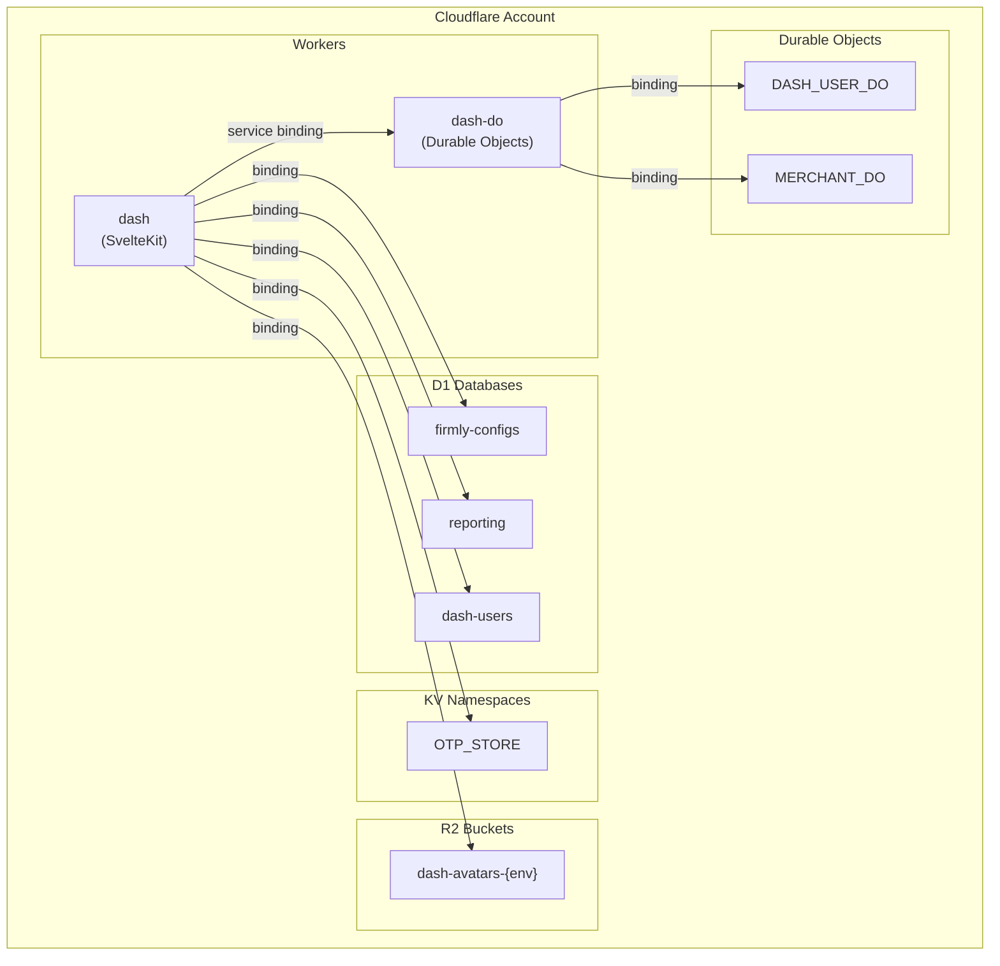

# Deployment Architecture

The dashboard is deployed as two Cloudflare Workers with multiple storage bindings.

## Environments

| Environment | Domain | Account | Purpose |
|-------------|--------|---------|---------|
| dev | dash.firmly.dev | Development | Local testing |
| ci | dash.firmlyci.com | CI | Automated tests |
| qa | dash.amarood.art | QA | QA testing |
| uat | dash.firmlyuat.com | UAT | User acceptance |
| prod | dash.firmly.live | Production | Live traffic |

## Deployment Architecture



## Deployment Order

**Critical**: dash-do must be deployed before dash due to service binding dependency.

```bash
# 1. Deploy dash-do first
cd packages/dash-do
wrangler deploy --env {env}

# 2. Then deploy dash
cd packages/dash
npm run build-{env}
wrangler deploy --env {env}
```

## Initial Setup

### 1. Create D1 Databases

```bash
cd packages/dash

# Create dash-users database for each environment
wrangler d1 create dash-users --env dev
wrangler d1 create dash-users --env ci
wrangler d1 create dash-users --env qa
wrangler d1 create dash-users --env uat
wrangler d1 create dash-users --env prod
```

Update `wrangler.jsonc` with returned database IDs.

### 2. Create KV Namespaces

```bash
wrangler kv:namespace create OTP_STORE --env dev
wrangler kv:namespace create OTP_STORE --env ci
wrangler kv:namespace create OTP_STORE --env qa
wrangler kv:namespace create OTP_STORE --env uat
wrangler kv:namespace create OTP_STORE --env prod
```

Update `wrangler.jsonc` with returned namespace IDs.

### 3. Create R2 Buckets

```bash
wrangler r2 bucket create dash-avatars-dev
wrangler r2 bucket create dash-avatars-ci
wrangler r2 bucket create dash-avatars-qa
wrangler r2 bucket create dash-avatars-uat
wrangler r2 bucket create dash-avatars-prod
```

### 4. Run D1 Migrations

```bash
# Apply all migrations
wrangler d1 migrations apply dash-users --env dev
wrangler d1 migrations apply dash-users --env ci
wrangler d1 migrations apply dash-users --env qa
wrangler d1 migrations apply dash-users --env uat
wrangler d1 migrations apply dash-users --env prod
```

### 5. Set Secrets

```bash
# Generate JWT secret (different for each env)
openssl rand -base64 32

# Set JWT_SECRET for each environment
wrangler secret put JWT_SECRET --env dev
wrangler secret put JWT_SECRET --env ci
wrangler secret put JWT_SECRET --env qa
wrangler secret put JWT_SECRET --env uat
wrangler secret put JWT_SECRET --env prod

# Set MailerSend API key
wrangler secret put MAILERSEND_API_KEY --env dev
# ... repeat for other environments
```

## Wrangler Configuration

### dash/wrangler.jsonc

```jsonc
{
  "name": "dash",
  "compatibility_date": "2025-01-21",
  "compatibility_flags": ["nodejs_compat"],

  // D1 databases
  "d1_databases": [
    { "binding": "firmlyConfigs", "database_name": "firmly-configs", "database_id": "..." },
    { "binding": "reporting", "database_name": "reporting", "database_id": "..." },
    { "binding": "dashUsers", "database_name": "dash-users", "database_id": "..." }
  ],

  // KV namespace
  "kv_namespaces": [
    { "binding": "OTP_STORE", "id": "..." }
  ],

  // R2 bucket
  "r2_buckets": [
    { "binding": "AVATARS", "bucket_name": "dash-avatars-dev" }
  ],

  // Service binding to dash-do
  "services": [
    { "binding": "DASH_DO", "service": "dash-do" }
  ],

  // Environment variables
  "vars": {
    "PUBLIC_AZURE_AD_CLIENT_ID": "...",
    "PUBLIC_AZURE_AD_TENANT_ID": "...",
    "PUBLIC_AZURE_REDIRECT_URL": "...",
    "FIRMLY_AUTH_COOKIE": "fuser"
  },

  // Per-environment overrides
  "env": {
    "dev": { /* ... */ },
    "ci": { /* ... */ },
    "qa": { /* ... */ },
    "uat": { /* ... */ },
    "prod": { /* ... */ }
  }
}
```

### dash-do/wrangler.toml

```toml
name = "dash-do"
main = "src/index.js"
compatibility_date = "2025-01-21"

[durable_objects]
bindings = [
  { name = "DASH_USER_DO", class_name = "DashUserDO" },
  { name = "MERCHANT_DO", class_name = "MerchantDO" }
]

[[migrations]]
tag = "v1"
new_classes = ["DashUserDO", "MerchantDO"]
```

## Local Development

### Running Locally

```bash
# Terminal 1: Run dash-do worker
cd packages/dash-do
npm run dev
# Runs on port 8787

# Terminal 2: Run dash with Cloudflare bindings
cd packages/dash
npm run preview:cloudflare
# Runs on port 5173
```

### Local D1 Database

Wrangler automatically creates a local SQLite database. Run migrations:

```bash
cd packages/dash
wrangler d1 migrations apply dash-users --local
```

### Inspect Local Data

```bash
# View users table
wrangler d1 execute dash-users --local --command="SELECT * FROM users"

# View merchant_dashboards
wrangler d1 execute dash-users --local --command="SELECT * FROM merchant_dashboards"
```

### Local Durable Objects

Durable Object data persists in Wrangler's local storage between restarts. Data is stored in `.wrangler/state/`.

## Build Commands

| Command | Description |
|---------|-------------|
| `npm run build` | Production build |
| `npm run build-dev` | Dev environment build |
| `npm run build-ci` | CI environment build |
| `npm run build-qa` | QA environment build |
| `npm run build-uat` | UAT environment build |
| `npm run build-prod` | Production build |

## Deploy Commands

| Command | Description |
|---------|-------------|
| `npm run deploy-dev` | Deploy to dev |
| `npm run deploy-ci` | Deploy to ci |
| `npm run deploy-qa` | Deploy to qa |
| `npm run deploy-uat` | Deploy to uat |
| `npm run deploy-prod` | Deploy to production |

## Observability

### Logging

Logpush is enabled for all environments:

```jsonc
{
  "logpush": true,
  "observability": { "enabled": true }
}
```

### Honeycomb Integration

Each environment has a dedicated Honeycomb dataset:

| Environment | Dataset |
|-------------|---------|
| dev | requests-dev |
| ci | requests-ci |
| qa | requests-qa |
| uat | requests-uat |
| prod | requests-prod |

## Security Considerations

### Secrets Management

- **JWT_SECRET**: Different for each environment, never committed
- **MAILERSEND_API_KEY**: API key for email service
- Store secrets securely (password manager, secrets vault)
- Rotate JWT_SECRET periodically (requires re-authentication)

### Cookie Security

```javascript
cookies.set('session', token, {
  path: '/',
  httpOnly: true,    // Not accessible via JavaScript
  secure: true,      // HTTPS only
  sameSite: 'lax',   // CSRF protection
  maxAge: 7 * 24 * 60 * 60  // 7 days
});
```

## Related Documentation

- [Architecture Overview](./overview.md)
- [Storage Architecture](./storage.md)
- [Authentication Overview](../authentication/overview.md)
