# Deployment Architecture

The dashboard is deployed as two Cloudflare Workers with multiple storage bindings.

## Environments

| Environment | Domain | Purpose |
|-------------|--------|---------|
| dev | dash.firmly.dev | Local testing |
| ci | dash.firmlyci.com | Automated tests |
| qa | dash.amarood.art | QA testing |
| uat | dash.firmlyuat.com | User acceptance |
| prod | dash.firmly.live | Live traffic |

## Deployment Architecture

```mermaid
graph TB
    subgraph "Cloudflare Account"
        subgraph "Workers"
            dash["dash<br/>(SvelteKit)"]
            dash_do["dash-do<br/>(Durable Objects)"]
        end

        subgraph "D1 Databases"
            firmlyConfigs["firmly-configs"]
            reporting["reporting"]
            dashUsers["dash-users"]
        end

        subgraph "KV Namespaces"
            OTP_STORE["OTP_STORE"]
        end

        subgraph "R2 Buckets"
            AVATARS["dash-avatars-{env}"]
        end

        subgraph "Durable Objects"
            DashUserDO["DASH_USER_DO"]
            MerchantDO["MERCHANT_DO"]
        end
    end

    dash -->|binding| firmlyConfigs
    dash -->|binding| reporting
    dash -->|binding| dashUsers
    dash -->|binding| OTP_STORE
    dash -->|binding| AVATARS
    dash -->|service binding| dash_do
    dash_do -->|binding| DashUserDO
    dash_do -->|binding| MerchantDO
```

## Deployment Order

**Critical**: dash-do must be deployed before dash due to service binding dependency.

1. Deploy dash-do worker first
2. Then deploy dash worker

## Initial Setup

Setting up a new environment requires:

### 1. Create D1 Databases

Create `dash-users` database for each environment via Wrangler CLI. Update `wrangler.jsonc` with returned database IDs.

### 2. Create KV Namespaces

Create `OTP_STORE` namespace for each environment. Update `wrangler.jsonc` with returned namespace IDs.

### 3. Create R2 Buckets

Create avatar buckets: `dash-avatars-dev`, `dash-avatars-ci`, etc.

### 4. Run D1 Migrations

Apply all migrations to each environment's `dash-users` database.

### 5. Set Secrets

Required secrets for each environment:

| Secret | Description |
|--------|-------------|
| `JWT_SECRET` | Cryptographically secure random bytes (min 256 bits), different per environment |
| `MAILERSEND_API_KEY` | API key for email service |

## Wrangler Configuration

### dash Worker Bindings

| Binding Type | Binding Name | Purpose |
|--------------|--------------|---------|
| D1 | `firmlyConfigs` | App configuration |
| D1 | `reporting` | Order data |
| D1 | `dashUsers` | User and merchant data |
| KV | `OTP_STORE` | Authentication tokens |
| R2 | `AVATARS` | User avatar images |
| Service | `DASH_DO` | Durable Objects worker |

### dash-do Worker Bindings

| Binding Type | Binding Name | Class |
|--------------|--------------|-------|
| Durable Object | `DASH_USER_DO` | DashUserDO |
| Durable Object | `MERCHANT_DO` | MerchantDO |

### Environment Variables

| Variable | Description |
|----------|-------------|
| `PUBLIC_AZURE_AD_CLIENT_ID` | Azure AD client ID (per environment) |
| `PUBLIC_AZURE_AD_TENANT_ID` | Azure AD tenant ID |
| `PUBLIC_AZURE_REDIRECT_URL` | OAuth callback URL |
| `FIRMLY_AUTH_COOKIE` | Cookie name for admin auth |

## Local Development

### Running Locally

Run two terminals:

1. **Terminal 1**: Start dash-do worker (runs on port 8787)
2. **Terminal 2**: Start dash with Cloudflare bindings (runs on port 5173)

### Local D1 Database

Wrangler automatically creates a local SQLite database. Apply migrations with `--local` flag.

### Local Durable Objects

Durable Object data persists in Wrangler's local storage (`.wrangler/state/`) between restarts.

## Build and Deploy Commands

| Action | Command |
|--------|---------|
| Build for environment | `npm run build-{env}` |
| Deploy to environment | `npm run deploy-{env}` |

Where `{env}` is: dev, ci, qa, uat, or prod.

## Observability

### Logging

Logpush is enabled for all environments.

### Honeycomb Integration

Each environment has a dedicated Honeycomb dataset:

| Environment | Dataset |
|-------------|---------|
| dev | requests-dev |
| ci | requests-ci |
| qa | requests-qa |
| uat | requests-uat |
| prod | requests-prod |

## Security Considerations

### Secrets Management

- **JWT_SECRET**: Different for each environment, never committed to version control
- **MAILERSEND_API_KEY**: API key for email service
- Store secrets securely (password manager, secrets vault)
- Rotating JWT_SECRET requires re-authentication of all users

### Cookie Security

Session cookies are configured with:

- **httpOnly**: Not accessible via JavaScript
- **secure**: HTTPS only
- **sameSite: lax**: CSRF protection
- **maxAge**: 7 days

## Related Documentation

- [Architecture Overview](./overview.md)
- [Storage Architecture](./storage.md)
- [Authentication Overview](../authentication/overview.md)
