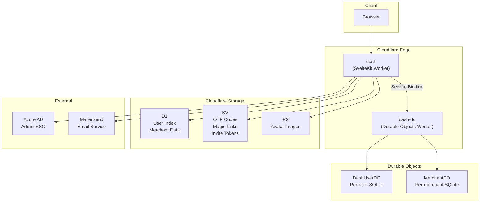
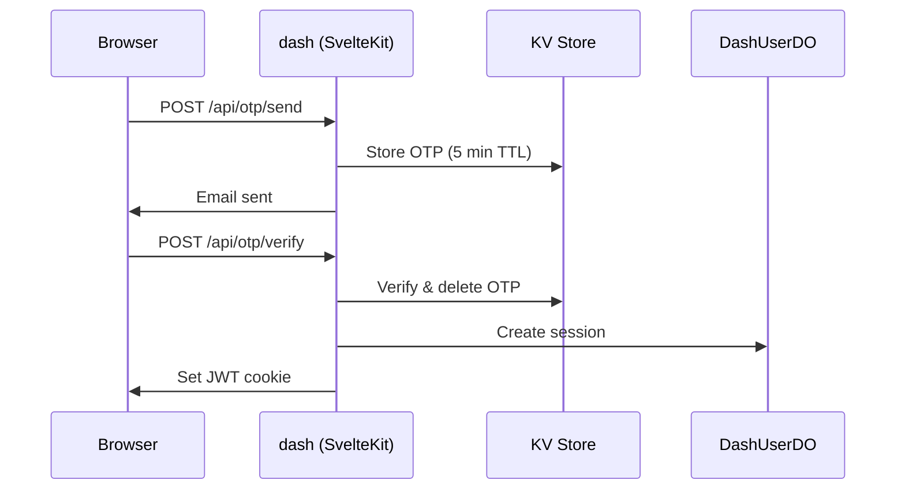
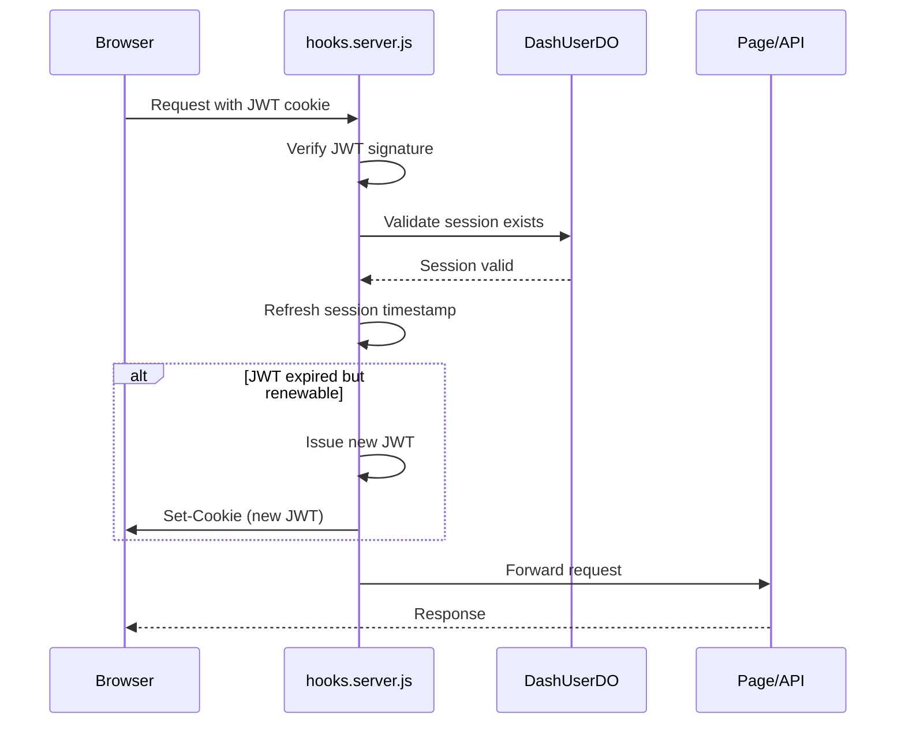

# Architecture Overview

The Firmly Dashboard is a SvelteKit application deployed on Cloudflare Workers with a distributed data layer using D1, Durable Objects, and KV.

## Tech Stack

| Layer | Technology | Purpose |
|-------|------------|---------|
| **Frontend** | Svelte 5, SvelteKit 2 | Component framework, SSR/SSG |
| **Styling** | Tailwind CSS v3 | Utility-first CSS |
| **UI Components** | Bits UI | Headless accessible components |
| **Runtime** | Cloudflare Workers | Edge compute |
| **Database** | D1 (SQLite) | User index, merchant data |
| **Per-user Storage** | Durable Objects | Sessions, access control |
| **Token Storage** | KV | OTP codes, magic links |
| **File Storage** | R2 | Avatar images |
| **Admin Auth** | Azure AD | SSO for Firmly employees |
| **User Auth** | JWT + OTP/Magic Link | Passwordless authentication |

## System Architecture

## Why Two Workers?

The system is split into two Cloudflare Workers connected via service binding:

1. **dash** - The SvelteKit application
2. **dash-do** - The Durable Objects worker

**Reason**: Local SvelteKit development doesn't support Durable Objects. This separation allows:

- Independent local development of each worker
- Clear separation between web layer and data layer
- Independent scaling and deployment
- Easier testing and debugging

See [Storage Architecture](./storage.md) for detailed storage decisions.

## Data Flow

### Authentication Flow

### Protected Route Flow

## Key Architectural Decisions

### 1. Passwordless Authentication

**Decision**: No passwords, only OTP codes and magic links.

**Why**:
- Eliminates password-related security risks (breaches, weak passwords)
- Better UX for occasional users (no password to remember)
- Simpler implementation (no password hashing, reset flows)

### 2. Hybrid Admin Access

**Decision**: Firmly admins (Azure AD) can access merchant dashboards with admin privileges.

**Why**:
- Support staff can view merchant data without separate accounts
- Clear audit trail (actions logged with admin identity)
- No need to create test accounts for internal use

### 3. Per-user Durable Objects

**Decision**: Each user has their own Durable Object with SQLite storage.

**Why**:
- Complete data isolation between users
- Zero latency for user-specific queries
- Strongly consistent (no eventual consistency issues)
- Scales naturally (one DO per user)

See [Storage Architecture](./storage.md) for more details.

### 4. Short-lived JWTs with Server-side Sessions

**Decision**: 30-minute JWT expiry with 7-day renewal window, validated against server-side sessions.

**Why**:
- Short JWT lifetime limits token theft impact
- Server-side sessions enable immediate revocation
- Auto-renewal provides seamless UX
- Device tracking and "sign out everywhere" capability

See [JWT Sessions](../authentication/jwt-sessions.md) for details.

## Related Documentation

- [Storage Architecture](./storage.md) - D1, DashUserDO, KV decisions
- [Deployment](./deployment.md) - Cloudflare Workers setup
- [Authentication Overview](../authentication/overview.md) - Auth system details
- [Routes Overview](../routes/overview.md) - Route structure and middleware
