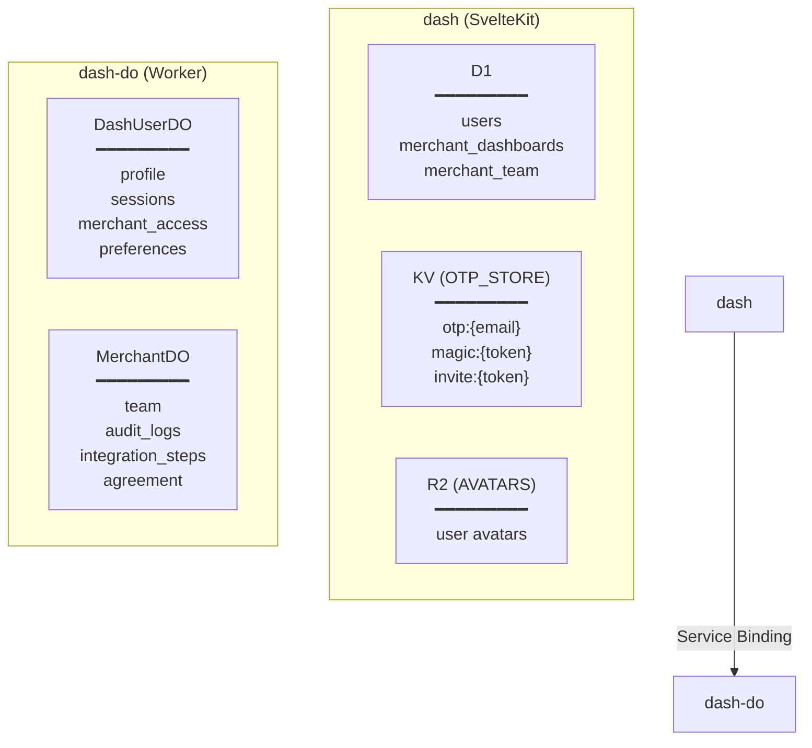
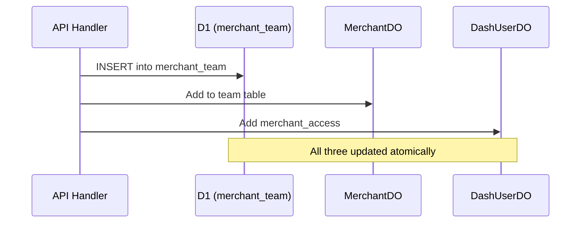

# Storage Architecture

The dashboard uses a hybrid storage approach optimized for different access patterns.

## Storage Overview

| Storage | Data | Access Pattern | TTL |
|---------|------|----------------|-----|
| **D1** | User index, merchant data | Global queries, admin operations | Permanent |
| **DashUserDO** | Profile, sessions, access control | Per-user isolation | Permanent |
| **MerchantDO** | Team, audit logs, integration status | Per-merchant | Permanent |
| **KV** | OTP codes, magic links, invites | Short-lived tokens | 5 min - 7 days |
| **R2** | Avatar images | Static files | Permanent |

## Architecture Diagram

## D1 Database

D1 stores data that needs to be queried globally (across users/merchants).

### Why D1?

- **Admin queries**: List all users, all merchants
- **Existence checks**: Does user with email exist?
- **Analytics**: User growth, login frequency
- **Search**: Find merchants by domain

### Tables

See [D1 Schema](../database/d1-schema.md) for full schema.

| Table | Purpose |
|-------|---------|
| `users` | User index (email, timestamps) |
| `merchant_dashboards` | Admin-created dashboards |
| `merchant_team` | Denormalized team for fast queries |

### D1 Bindings

Three D1 databases are bound to the dash worker:

| Binding | Database | Purpose |
|---------|----------|---------|
| `firmlyConfigs` | firmly-configs | App configuration |
| `reporting` | reporting | Order data |
| `dashUsers` | dash-users | User and merchant data |

## Durable Objects

Durable Objects provide per-entity isolation with colocated compute and storage.

### Why Durable Objects?

1. **Per-user isolation** - Each user has dedicated compute + storage
2. **Zero latency** - Data colocated with processing logic
3. **Strong consistency** - No eventual consistency issues
4. **Scalability** - One DO per user/merchant, scales naturally
5. **Future-ready** - WebSocket support, real-time features

### DashUserDO

Each user has one DashUserDO instance identified by their UUID.

**Data stored**:
- Profile (name, company, avatar)
- Active sessions (devices)
- Merchant access (which dashboards, roles)
- Destination access
- User preferences

See [DashUserDO Schema](../database/durable-objects.md) for details.

### MerchantDO

Each merchant has one MerchantDO instance identified by domain.

**Data stored**:
- Team members
- Audit logs
- Integration steps
- Agreement status
- Onboarding progress

### Service Binding Communication

The dash worker communicates with dash-do via service binding. Requests include a `X-User-ID` header to route to the correct Durable Object instance. The dash-do worker extracts this header and forwards the request to the appropriate DO.

## KV Store

KV stores short-lived authentication tokens with automatic expiration.

### Why KV?

- **Built-in TTL** - Tokens auto-expire, no cleanup needed
- **Global availability** - Low-latency reads worldwide
- **Simple key-value** - Perfect for token storage

### Token Types

| Key Pattern | Value | TTL | Purpose |
|-------------|-------|-----|---------|
| `otp:{email}` | Code and attempts | 5 min | OTP verification |
| `magic:{token}` | Email and domain | 15 min | Magic link login |
| `invite:{token}` | Email, merchant, role, etc. | 7 days | Team invites |
| `invite-domain:{domain}` | Token reference | 7 days | Track pending invites |

## R2 Storage

R2 stores user avatar images. Each environment has a dedicated bucket (e.g., `dash-avatars-dev`, `dash-avatars-prod`).

## Dual-Write Pattern

Some data is written to both D1 and Durable Objects for different access patterns.

### Example: Team Members

**Why dual-write?**
- **D1**: Admin can query all team members across merchants
- **MerchantDO**: Fast merchant-specific team queries
- **DashUserDO**: User sees their own dashboard access

## Storage Decision Matrix

| Need | Use | Reason |
|------|-----|--------|
| Query across all users | D1 | Global queries |
| User's own data | DashUserDO | Per-user isolation |
| Merchant-specific data | MerchantDO | Per-merchant isolation |
| Short-lived tokens | KV | Built-in TTL |
| User files | R2 | Object storage |
| Real-time updates | Durable Objects | WebSocket support |

## Related Documentation

- [Architecture Overview](./overview.md)
- [D1 Schema](../database/d1-schema.md)
- [Durable Objects Schema](../database/durable-objects.md)
- [JWT Sessions](../authentication/jwt-sessions.md)
