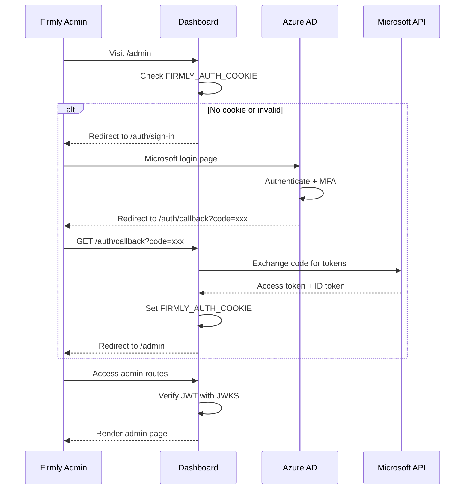

# Azure AD Authentication

Firmly employees authenticate via Azure AD (Microsoft) Single Sign-On to access admin routes.

## Overview

Azure AD provides:
- **Single Sign-On** - Use existing Microsoft/corporate account
- **Centralized access control** - Manage permissions in Azure AD
- **Security features** - MFA, conditional access policies
- **Audit logging** - Microsoft tracks all sign-ins

## Flow Overview



## Configuration

Azure AD is configured via environment variables in `wrangler.jsonc`:

```jsonc
{
  "vars": {
    "PUBLIC_AZURE_AD_CLIENT_ID": "194f24d1-f48d-401e-acaa-b0e2900bce67",
    "PUBLIC_AZURE_AD_TENANT_ID": "98186320-48ac-4b11-b1af-9f6b0b140a45",
    "PUBLIC_AZURE_REDIRECT_URL": "https://dash.firmly.live/auth/callback",
    "FIRMLY_AUTH_COOKIE": "fuser"
  }
}
```

| Variable | Description |
|----------|-------------|
| `PUBLIC_AZURE_AD_CLIENT_ID` | Application (client) ID from Azure AD |
| `PUBLIC_AZURE_AD_TENANT_ID` | Directory (tenant) ID |
| `PUBLIC_AZURE_REDIRECT_URL` | OAuth callback URL |
| `FIRMLY_AUTH_COOKIE` | Cookie name for storing JWT |

## JWT Verification

Azure AD JWTs are verified using Microsoft's JWKS (JSON Web Key Set) endpoint:

```javascript
// auth.js
import { createRemoteJWKSet, jwtVerify } from 'jose';

const MICROSOFT_KEYS_ENDPOINT = 'https://login.microsoftonline.com/common/discovery/v2.0/keys';

export async function enforceSSOAuth(jwt, { azureTenantId, azureClientId }) {
  const jwks = createRemoteJWKSet(new URL(MICROSOFT_KEYS_ENDPOINT));

  const { payload } = await jwtVerify(jwt, jwks, {
    issuer: `https://login.microsoftonline.com/${azureTenantId}/v2.0`,
    audience: azureClientId
  });

  return { authInfo: payload };
}
```

### JWT Claims

| Claim | Description |
|-------|-------------|
| `oid` | Object ID (unique user identifier) |
| `sub` | Subject (user identifier) |
| `email` | User's email address |
| `preferred_username` | User's display name |
| `name` | Full name |
| `tid` | Tenant ID |

## Route Protection

Admin routes are protected in `hooks.server.js`:

```javascript
// hooks.server.js
export async function handle({ event, resolve }) {
  const { pathname } = event.url;

  // Admin routes require Azure AD
  if (pathname.startsWith('/admin')) {
    return handleAdminAuth(event, resolve);
  }

  // ... other routes
}

async function handleAdminAuth(event, resolve) {
  const { platform, cookies } = event;

  const jwt = cookies.get(platform?.env?.FIRMLY_AUTH_COOKIE);

  try {
    event.locals.authInfo = (
      await enforceSSOAuth(jwt, {
        azureTenantId: platform?.env?.PUBLIC_AZURE_AD_TENANT_ID,
        azureClientId: platform?.env?.PUBLIC_AZURE_AD_CLIENT_ID
      })
    ).authInfo;

    return resolve(event);
  } catch {
    redirect(302, '/auth/sign-in');
  }
}
```

## Hybrid Authentication

A unique feature is that Azure AD admins can also access merchant dashboards:

```javascript
// hooks.server.js
export async function handle({ event, resolve }) {
  // Check for Firmly admin (Azure AD) FIRST - takes precedence
  const firmlyAuthCookie = cookies.get(platform?.env?.FIRMLY_AUTH_COOKIE);
  let userSession = null;
  let isFirmlyAdmin = false;

  if (firmlyAuthCookie) {
    try {
      const { authInfo } = await enforceSSOAuth(firmlyAuthCookie, {
        azureTenantId: platform?.env?.PUBLIC_AZURE_AD_TENANT_ID,
        azureClientId: platform?.env?.PUBLIC_AZURE_AD_CLIENT_ID
      });

      // Create synthetic session for Firmly admin
      event.locals.authInfo = authInfo;
      userSession = {
        userId: authInfo.oid || authInfo.sub,
        email: authInfo.email || authInfo.preferred_username,
        sessionId: null,
        isFirmlyAdmin: true
      };
      isFirmlyAdmin = true;
    } catch {
      // Azure AD auth failed, fall through to JWT session
    }
  }

  // Fall back to JWT session for regular users
  if (!userSession) {
    // ... JWT validation
  }
}
```

This allows support staff to:
- View any merchant dashboard
- Debug issues without creating test accounts
- Actions are logged with admin identity

## Admin Routes

| Route | Description |
|-------|-------------|
| `/admin` | Admin dashboard home |
| `/admin/dashboards` | Manage all merchant dashboards |
| `/admin/merchants` | List and manage merchants |
| `/admin/merchants/[domain]` | View specific merchant |
| `/admin/merchants/[domain]/edit` | Edit merchant settings |
| `/admin/orders` | View all orders |
| `/auth/sign-in` | Azure AD sign-in redirect |
| `/auth/callback` | OAuth callback handler |
| `/auth/logout` | Sign out |

## Sign-In Flow

### 1. Redirect to Azure AD

```javascript
// routes/(firmly-user-only)/auth/sign-in/+page.server.js
export function load({ url, platform }) {
  const clientId = platform?.env?.PUBLIC_AZURE_AD_CLIENT_ID;
  const tenantId = platform?.env?.PUBLIC_AZURE_AD_TENANT_ID;
  const redirectUri = platform?.env?.PUBLIC_AZURE_REDIRECT_URL;

  const authUrl = new URL(`https://login.microsoftonline.com/${tenantId}/oauth2/v2.0/authorize`);
  authUrl.searchParams.set('client_id', clientId);
  authUrl.searchParams.set('response_type', 'id_token');
  authUrl.searchParams.set('redirect_uri', redirectUri);
  authUrl.searchParams.set('response_mode', 'fragment');
  authUrl.searchParams.set('scope', 'openid profile email');
  authUrl.searchParams.set('nonce', crypto.randomUUID());

  redirect(302, authUrl.toString());
}
```

### 2. Handle Callback

```javascript
// routes/(firmly-user-only)/auth/callback/+server.js
export async function GET({ url, cookies, platform }) {
  // Token is in URL fragment (handled client-side)
  // Client sends token to server to set cookie

  const token = url.searchParams.get('id_token');

  // Verify token
  await enforceSSOAuth(token, {
    azureTenantId: platform?.env?.PUBLIC_AZURE_AD_TENANT_ID,
    azureClientId: platform?.env?.PUBLIC_AZURE_AD_CLIENT_ID
  });

  // Set cookie
  cookies.set(platform?.env?.FIRMLY_AUTH_COOKIE, token, {
    path: '/',
    httpOnly: true,
    secure: true,
    sameSite: 'lax',
    maxAge: 24 * 60 * 60 // 24 hours
  });

  redirect(302, '/admin');
}
```

## Logout

```javascript
// routes/(firmly-user-only)/auth/logout/+server.js
export async function GET({ cookies, platform }) {
  cookies.delete(platform?.env?.FIRMLY_AUTH_COOKIE, { path: '/' });
  redirect(302, '/auth/sign-in');
}
```

## Security Considerations

### JWKS Caching

The `jose` library automatically caches JWKS keys to avoid repeated fetches. Microsoft rotates keys periodically, and the library handles this transparently.

### Token Validation

- **Issuer** - Must match tenant ID
- **Audience** - Must match client ID
- **Expiration** - Token must not be expired
- **Signature** - Verified against Microsoft's public keys

### Per-Environment Configuration

Each environment has its own Azure AD app registration:

| Environment | Client ID |
|-------------|-----------|
| dev | `194f24d1-f48d-401e-acaa-b0e2900bce67` |
| ci | `b75259e2-e211-4481-a8a8-67ca518838c5` |
| qa | `adc4dd13-b11f-4c32-b853-806b174c9574` |
| uat | `d6e4c0e6-03d6-4681-ae55-6886f9fae696` |
| prod | `c5002bb2-89f9-48eb-b719-a318e021ae6c` |

## Related Documentation

- [Authentication Overview](./overview.md)
- [Routes Overview](../routes/overview.md) - Route protection
- [Admin Routes](../routes/admin-routes.md) - Full admin route list
