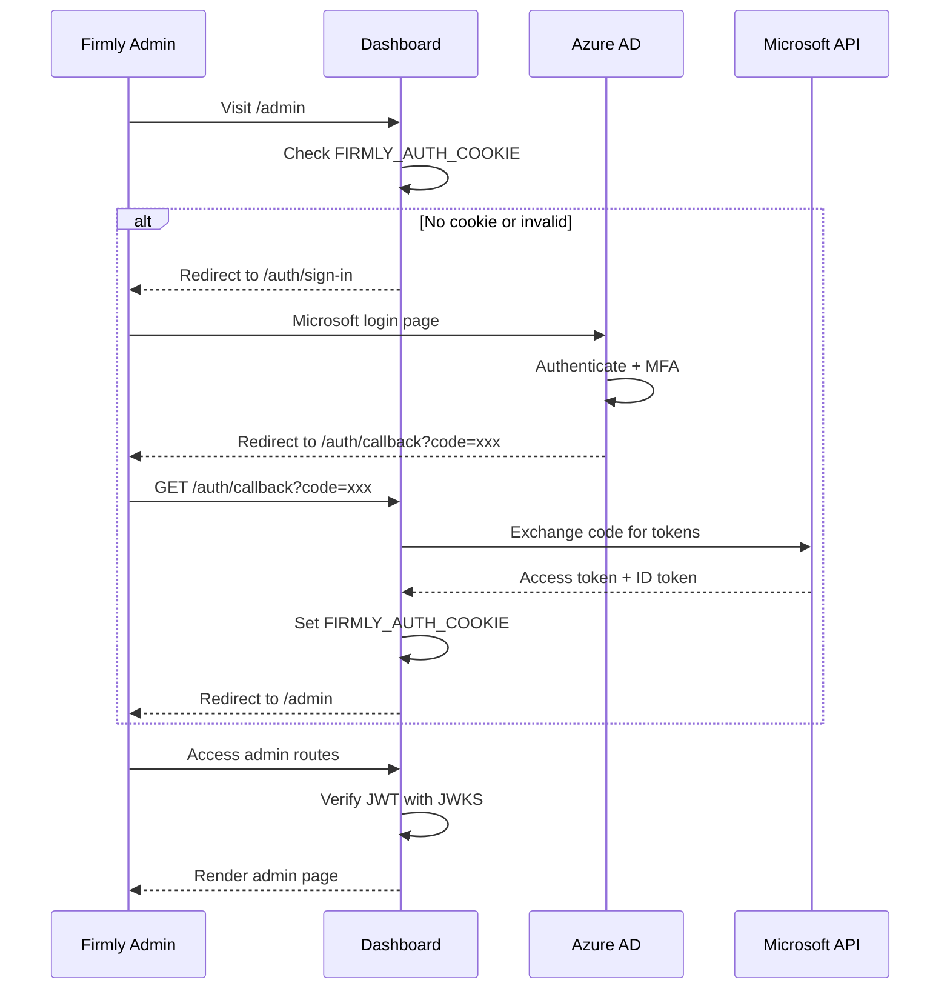

# Azure AD Authentication

Firmly employees authenticate via Azure AD (Microsoft) Single Sign-On to access admin routes.

## Overview

Azure AD provides:
- **Single Sign-On** - Use existing Microsoft/corporate account
- **Centralized access control** - Manage permissions in Azure AD
- **Security features** - MFA, conditional access policies
- **Audit logging** - Microsoft tracks all sign-ins

## Flow Overview

## Configuration

Azure AD requires the following environment variables:

| Variable | Description |
|----------|-------------|
| `PUBLIC_AZURE_AD_CLIENT_ID` | Application (client) ID from Azure AD |
| `PUBLIC_AZURE_AD_TENANT_ID` | Directory (tenant) ID |
| `PUBLIC_AZURE_REDIRECT_URL` | OAuth callback URL |
| `FIRMLY_AUTH_COOKIE` | Cookie name for storing JWT |

## JWT Verification

Azure AD JWTs are verified using Microsoft's JWKS (JSON Web Key Set) endpoint:

- The `jose` library fetches public keys from Microsoft's JWKS endpoint
- Keys are automatically cached and rotated
- Verification checks issuer (must match tenant ID) and audience (must match client ID)

### JWT Claims

| Claim | Description |
|-------|-------------|
| `oid` | Object ID (unique user identifier) |
| `sub` | Subject (user identifier) |
| `email` | User's email address |
| `preferred_username` | User's display name |
| `name` | Full name |
| `tid` | Tenant ID |

## Route Protection

Admin routes under `/admin/*` are protected in `hooks.server.js`:

- Check for `FIRMLY_AUTH_COOKIE` cookie
- Verify JWT against Microsoft's JWKS
- If valid, populate `event.locals.authInfo` with user claims
- If invalid or missing, redirect to `/auth/sign-in`

## Hybrid Authentication

A unique feature is that Azure AD admins can also access merchant dashboards:

- When accessing `/merchant/*` routes, the system first checks for Azure AD cookie
- If valid Azure AD session exists, create a synthetic session with `isFirmlyAdmin: true`
- This allows support staff to view any merchant dashboard with admin privileges
- If no Azure AD session, fall back to regular JWT session validation

This enables support staff to:
- View any merchant dashboard
- Debug issues without creating test accounts
- All actions are logged with admin identity

## Admin Routes

| Route | Description |
|-------|-------------|
| `/admin` | Admin dashboard home |
| `/admin/dashboards` | Manage all merchant dashboards |
| `/admin/merchants` | List and manage merchants |
| `/admin/merchants/[domain]` | View specific merchant |
| `/admin/merchants/[domain]/edit` | Edit merchant settings |
| `/admin/orders` | View all orders |
| `/auth/sign-in` | Azure AD sign-in redirect |
| `/auth/callback` | OAuth callback handler |
| `/auth/logout` | Sign out |

## Sign-In Flow

1. User visits `/admin` without valid cookie
2. Redirect to `/auth/sign-in` which builds Azure AD authorization URL
3. User authenticates with Microsoft (may include MFA)
4. Azure AD redirects to `/auth/callback` with ID token in URL fragment
5. Client-side code extracts token and sends to server
6. Server verifies token and sets `FIRMLY_AUTH_COOKIE`
7. Redirect to `/admin`

## Logout

Logout clears the `FIRMLY_AUTH_COOKIE` and redirects to sign-in page.

## Security Considerations

### JWKS Caching

The `jose` library automatically caches JWKS keys to avoid repeated fetches. Microsoft rotates keys periodically, and the library handles this transparently.

### Token Validation

- **Issuer** - Must match tenant ID
- **Audience** - Must match client ID
- **Expiration** - Token must not be expired
- **Signature** - Verified against Microsoft's public keys

### Per-Environment Configuration

Each environment has its own Azure AD app registration with a unique client ID. This ensures separation between dev, ci, qa, uat, and prod environments.

## Related Documentation

- [Authentication Overview](./overview.md)
- [Routes Overview](../routes/overview.md) - Route protection
