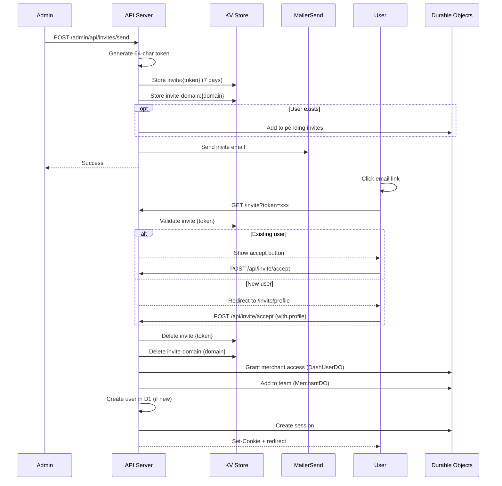

# Invite System

Team invitations allow admins to grant dashboard access to new or existing users via email.

## Overview

The invite system supports two scenarios:

1. **Existing user** - User already has a Firmly account, just needs dashboard access
2. **New user** - User needs to create account and set up profile

## Flow Overview



## KV Storage

### Invite Token

```javascript
// Key format
Key: `invite:${token}`  // token = 64-char hex

// Value structure
{
  "email": "user@example.com",
  "merchantDomain": "merchant.com",
  "role": "owner",           // owner, editor, viewer
  "invitedBy": "admin-uuid",
  "invitedByEmail": "admin@firmly.ai",
  "expiresAt": 1704067200000,
  "type": "merchant_invite"
}

// TTL: 7 days
```

### Domain Lookup

```javascript
// Track pending invite for a domain (enables cancel/resend)
Key: `invite-domain:${merchantDomain}`
Value: token

// TTL: 7 days
```

## Sending Invites

**Endpoint**: `POST /admin/api/invites/send`

```javascript
// routes/(firmly-user-only)/admin/api/invites/send/+server.js
export async function POST({ request, platform, locals }) {
  const { email, merchantDomain, role } = await request.json();

  // Generate token
  const token = generateInviteToken();
  const expiresAt = Date.now() + 7 * 24 * 60 * 60 * 1000;

  // Store invite in KV
  const inviteData = {
    email,
    merchantDomain,
    role,
    invitedBy: locals.authInfo.oid,
    invitedByEmail: locals.authInfo.email,
    expiresAt,
    type: 'merchant_invite'
  };

  await platform.env.OTP_STORE.put(
    `invite:${token}`,
    JSON.stringify(inviteData),
    { expirationTtl: 7 * 24 * 60 * 60 }
  );

  // Store domain lookup
  await platform.env.OTP_STORE.put(
    `invite-domain:${merchantDomain}`,
    token,
    { expirationTtl: 7 * 24 * 60 * 60 }
  );

  // If user exists, add to their pending invites
  const existingUser = await getUserIdByEmail({ platform, email });
  if (existingUser) {
    await addPendingInvite({
      platform,
      userId: existingUser.userId,
      invite: { token, ...inviteData }
    });
  }

  // Send email
  const inviteUrl = `${url.origin}/invite?token=${token}`;
  await sendInviteEmail({
    email,
    merchantDomain,
    role,
    inviteUrl,
    invitedByEmail: locals.authInfo.email
  }, platform.env.MAILERSEND_API_KEY);

  return json({ success: true });
}
```

## Invite Landing Page

**Route**: `/invite?token=xxx`

```javascript
// routes/invite/+page.server.js
export async function load({ url, platform }) {
  const token = url.searchParams.get('token');

  // Validate token
  const stored = await platform.env.OTP_STORE.get(`invite:${token}`);
  if (!stored) {
    return { error: 'Invalid or expired invitation' };
  }

  const invite = JSON.parse(stored);

  // Check if user exists
  const existingUser = await getUserIdByEmail({ platform, email: invite.email });

  return {
    invite,
    userExists: !!existingUser,
    token
  };
}
```

## Accepting Invites

**Endpoint**: `POST /api/invite/accept`

```javascript
// routes/api/invite/accept/+server.js
export async function POST({ request, platform, cookies }) {
  const { token, profile } = await request.json();

  // Get and validate invite
  const stored = await platform.env.OTP_STORE.get(`invite:${token}`);
  if (!stored) {
    return json({ error: 'Invalid or expired invitation' }, { status: 400 });
  }

  const invite = JSON.parse(stored);

  // Check expiration
  if (Date.now() > invite.expiresAt) {
    return json({ error: 'Invitation has expired' }, { status: 400 });
  }

  // Get or create user
  const user = await getOrCreateUser({
    platform,
    email: invite.email,
    profile: profile || {}
  });

  // Grant merchant access (updates DashUserDO + D1)
  await grantMerchantAccess({
    platform,
    userId: user.userId,
    userEmail: invite.email,
    merchantDomain: invite.merchantDomain,
    role: invite.role,
    grantedBy: invite.invitedBy
  });

  // Add to merchant team (MerchantDO)
  await addTeamMember({
    platform,
    merchantDomain: invite.merchantDomain,
    userId: user.userId,
    email: invite.email,
    role: invite.role,
    grantedBy: invite.invitedBy
  });

  // Delete invite tokens
  await platform.env.OTP_STORE.delete(`invite:${token}`);
  await platform.env.OTP_STORE.delete(`invite-domain:${invite.merchantDomain}`);

  // Remove from pending invites (if existing user)
  await removePendingInvite({
    platform,
    userId: user.userId,
    token
  });

  // Create session
  const { token: sessionToken } = await createSession({
    platform,
    userId: user.userId,
    email: invite.email,
    userAgent: request.headers.get('user-agent'),
    ipAddress: request.headers.get('cf-connecting-ip'),
    jwtSecret: platform.env.JWT_SECRET
  });

  // Set cookie
  cookies.set('session', sessionToken, {
    path: '/',
    httpOnly: true,
    secure: true,
    sameSite: 'lax',
    maxAge: 7 * 24 * 60 * 60
  });

  return json({
    success: true,
    redirectUrl: `/merchant/${invite.merchantDomain}`
  });
}
```

## Canceling Invites

**Endpoint**: `POST /admin/api/invites/cancel`

```javascript
// routes/(firmly-user-only)/admin/api/invites/cancel/+server.js
export async function POST({ request, platform }) {
  const { merchantDomain } = await request.json();

  // Get token from domain lookup
  const token = await platform.env.OTP_STORE.get(`invite-domain:${merchantDomain}`);
  if (!token) {
    return json({ error: 'No pending invite' }, { status: 404 });
  }

  // Get invite data for user lookup
  const stored = await platform.env.OTP_STORE.get(`invite:${token}`);
  if (stored) {
    const invite = JSON.parse(stored);

    // Remove from user's pending invites
    const existingUser = await getUserIdByEmail({ platform, email: invite.email });
    if (existingUser) {
      await removePendingInvite({
        platform,
        userId: existingUser.userId,
        token
      });
    }
  }

  // Delete KV entries
  await platform.env.OTP_STORE.delete(`invite:${token}`);
  await platform.env.OTP_STORE.delete(`invite-domain:${merchantDomain}`);

  return json({ success: true });
}
```

## Email Template

```javascript
// email.js
export async function sendInviteEmail(
  { email, merchantDomain, role, inviteUrl, invitedByEmail },
  apiKey
) {
  const roleDescriptions = {
    owner: 'Full access and team management',
    editor: 'Edit merchant settings',
    viewer: 'Read-only access'
  };

  return sendEmail({
    to: email,
    subject: `You're invited to manage ${merchantDomain} on Firmly`,
    html: `
      <div style="font-family: sans-serif; max-width: 600px;">
        <h2>You're Invited!</h2>
        <p>You've been invited to manage the Firmly dashboard for:</p>
        <div style="background: #f5f5f5; padding: 16px; text-align: center;">
          <span style="font-size: 20px; font-weight: 600;">${merchantDomain}</span>
        </div>
        <p><strong>Role:</strong> ${role} (${roleDescriptions[role]})</p>
        <p><strong>Invited by:</strong> ${invitedByEmail}</p>
        <div style="text-align: center; margin: 30px 0;">
          <a href="${inviteUrl}"
             style="background-color: #7979ff; color: white; padding: 14px 32px;
                    text-decoration: none; border-radius: 6px; font-weight: 600;">
            Accept Invitation
          </a>
        </div>
        <p style="color: #666;">This invitation expires in 7 days.</p>
      </div>
    `
  }, apiKey);
}
```

## Roles

| Role | Permissions |
|------|-------------|
| `owner` | Full access + team management (invite/remove members) |
| `editor` | Edit merchant settings, view orders |
| `viewer` | Read-only access to dashboard |

## New User Profile Flow

When a new user accepts an invite, they're redirected to set up their profile:

```mermaid
flowchart TD
    Accept[Click Accept] --> CheckUser{User exists?}
    CheckUser -->|Yes| GrantAccess[Grant access + login]
    CheckUser -->|No| ProfilePage[/invite/profile]
    ProfilePage --> FillForm[Fill name, company, etc.]
    FillForm --> Submit[Submit profile]
    Submit --> CreateUser[Create user in D1]
    CreateUser --> InitProfile[Initialize DashUserDO profile]
    InitProfile --> GrantAccess
    GrantAccess --> Redirect[Redirect to merchant dashboard]
```

## Pending Invites UI

Logged-in users see pending invites on their dashboard:

```javascript
// Show pending invites for existing users
const pendingInvites = await getPendingInvites({ platform, userId });

// Each invite contains:
{
  token: "abc123...",
  merchantDomain: "merchant.com",
  role: "editor",
  invitedByEmail: "admin@firmly.ai",
  expiresAt: 1704067200000
}
```

Users can accept or decline from the UI without clicking the email link.

## Security Considerations

### Token Security

- **64-char hex** - 256 bits of entropy, impossible to guess
- **Single use** - Deleted immediately after acceptance
- **7-day expiry** - Limited window for interception

### Authorization

- Only admins can send invites (`/admin/api/*` routes)
- Invite email must match acceptance (can't forward to someone else)
- Role is fixed at invite time (can't escalate)

### Audit Trail

All invite operations are logged:
- Who sent the invite
- When it was sent/accepted/canceled
- What role was granted

## Related Documentation

- [Authentication Overview](./overview.md)
- [Team Management](../merchant/team-management.md)
- [Admin Routes](../routes/admin-routes.md)
- [API: Invite Accept](../api/auth/invite-accept.md)
- [API: Admin Invites](../api/admin/invites.md)
