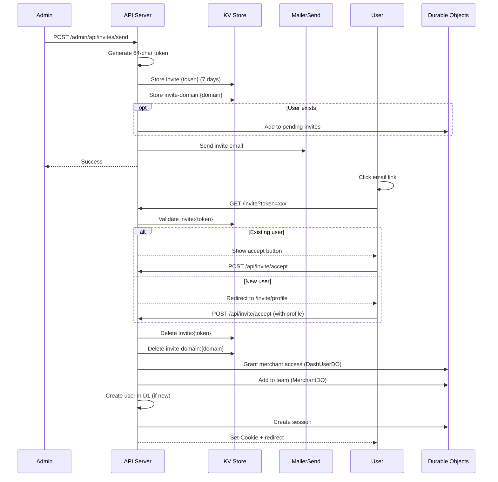

# Invite System

Team invitations allow admins to grant dashboard access to new or existing users via email.

## Overview

The invite system supports two scenarios:

1. **Existing user** - User already has a Firmly account, just needs dashboard access
2. **New user** - User needs to create account and set up profile

## Flow Overview



## KV Storage

### Invite Token

- **Key format**: `invite:{token}` where token is a 64-character hex string
- **Value**: JSON object containing:
  - `email` - Invitee's email address
  - `merchantDomain` - Target merchant domain
  - `role` - Assigned role (owner, editor, viewer)
  - `invitedBy` - Admin user ID who sent the invite
  - `invitedByEmail` - Admin's email address
  - `expiresAt` - Expiration timestamp
  - `type` - Always "merchant_invite"
- **TTL**: 7 days

### Domain Lookup

- **Key format**: `invite-domain:{merchantDomain}`
- **Value**: The invite token
- **Purpose**: Enables cancel/resend operations by domain lookup
- **TTL**: 7 days

## Sending Invites

Only Firmly admins can send invites via `/admin/api/invites/send`:

1. Generate cryptographically secure 64-character token
2. Store invite data in KV with 7-day TTL
3. Store domain lookup for cancel/resend capability
4. If user already exists, add to their pending invites in DashUserDO
5. Send email via MailerSend with invitation details and accept link

## Invite Landing Page

When user clicks the invite link (`/invite?token=xxx`):

1. Validate token exists in KV
2. Check if user already has an account (by email lookup)
3. If existing user: Show accept button
4. If new user: Redirect to profile setup page

## Accepting Invites

When user accepts the invite:

1. Validate token is still valid and not expired
2. Get or create user account (create if new)
3. Grant merchant access by updating DashUserDO
4. Add user to merchant team via MerchantDO
5. Update D1 with team membership
6. Delete invite tokens from KV
7. Remove from pending invites (if existing user)
8. Create session and issue JWT
9. Redirect to merchant dashboard

## Canceling Invites

Admins can cancel pending invites via `/admin/api/invites/cancel`:

1. Look up token from domain lookup key
2. If user exists, remove from their pending invites
3. Delete both KV entries (invite and domain lookup)

## Roles

| Role | Permissions |
|------|-------------|
| `owner` | Full access + team management (invite/remove members) |
| `editor` | Edit merchant settings, view orders |
| `viewer` | Read-only access to dashboard |

## New User Profile Flow

```mermaid
flowchart TD
    Accept[Click Accept] --> CheckUser{User exists?}
    CheckUser -->|Yes| GrantAccess[Grant access + login]
    CheckUser -->|No| ProfilePage[/invite/profile]
    ProfilePage --> FillForm[Fill name, company, etc.]
    FillForm --> Submit[Submit profile]
    Submit --> CreateUser[Create user in D1]
    CreateUser --> InitProfile[Initialize DashUserDO profile]
    InitProfile --> GrantAccess
    GrantAccess --> Redirect[Redirect to merchant dashboard]
```

## Pending Invites UI

Logged-in users see their pending invites on the dashboard home page:

- Each invite shows: merchant domain, role, inviter email, expiration
- Users can accept or decline from the UI without clicking the email link

## Security Considerations

### Token Security

- **64-char hex** - 256 bits of entropy, impossible to guess
- **Single use** - Deleted immediately after acceptance
- **7-day expiry** - Limited window for interception

### Authorization

- Only admins can send invites (`/admin/api/*` routes)
- Invite email must match acceptance (can't forward to someone else)
- Role is fixed at invite time (can't escalate)

### Audit Trail

All invite operations are logged:
- Who sent the invite
- When it was sent/accepted/canceled
- What role was granted

## Related Documentation

- [Authentication Overview](./overview.md)
- [Team Management](../merchant/team-management.md)
