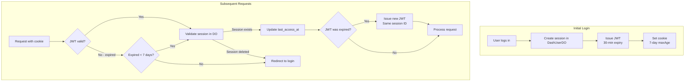

# JWT Sessions

Sessions use JWT (JSON Web Tokens) with server-side validation for security and scalability.

## Token Structure

```json
{
  "sub": "550e8400-e29b-41d4-a716-446655440000",
  "email": "user@example.com",
  "jti": "7c9e6679-7425-40de-944b-e07fc1f90ae7",
  "iat": 1704067200,
  "exp": 1704069000
}
```

| Claim | Description |
|-------|-------------|
| `sub` | User UUID (matches D1 `users.id` and DashUserDO name) |
| `email` | User's email address |
| `jti` | Session ID (JWT ID) - unique per device/session |
| `iat` | Issued at timestamp |
| `exp` | Expiration timestamp (30 minutes from issue) |

## Token Lifecycle



## JWT Signing

```javascript
// jwt.js - Uses jose library with HS256
import * as jose from 'jose';

const ALGORITHM = 'HS256';

export async function createSessionToken({ userId, email, sessionId }, secret) {
  const secretKey = new TextEncoder().encode(secret);
  const thirtyMinutes = 30 * 60;

  return new jose.SignJWT({ sub: userId, email, jti: sessionId })
    .setProtectedHeader({ alg: ALGORITHM })
    .setIssuedAt()
    .setExpirationTime(`${thirtyMinutes}s`)
    .sign(secretKey);
}
```

## Renewal Logic

The system supports auto-renewal to provide seamless UX while maintaining security:

```javascript
// hooks.server.js - Token renewal logic
async function validateUserSession(event, sessionToken, jwtSecret) {
  // Try to verify the token
  let payload = await verifyToken(sessionToken, jwtSecret);
  let needsRenewal = false;

  if (!payload) {
    // Token verification failed - check if it's renewable
    const decoded = decodeToken(sessionToken);

    if (!decoded) return null;

    const expired = isTokenExpired(decoded);
    const renewable = isTokenRenewable(decoded);

    if (!expired) return null; // Invalid signature
    if (expired && !renewable) return null; // Too old

    // Token is expired but renewable
    payload = decoded;
    needsRenewal = true;
  }

  // Validate session exists in DashUserDO
  const session = await validateSession({ platform, userId, sessionId });
  if (!session) return null;

  // Refresh last access time
  await refreshSession({ platform, userId, sessionId });

  // Renew JWT if needed
  if (needsRenewal) {
    const newToken = await createSessionToken({ userId, email, sessionId }, jwtSecret);
    cookies.set('session', newToken, { /* ... */ });
  }

  return { userId, email, sessionId };
}
```

### Renewal Window

```javascript
// jwt.js - Check if token can be renewed
export function isTokenRenewable(payload) {
  if (!payload || !payload.exp) return false;

  const expiredAt = payload.exp * 1000;
  const sevenDaysMs = 7 * 24 * 60 * 60 * 1000;

  // Token must be expired but less than 7 days old
  return Date.now() >= expiredAt && Date.now() < expiredAt + sevenDaysMs;
}
```

## Session Storage

Sessions are stored in DashUserDO (per-user Durable Object):

```sql
CREATE TABLE sessions (
  id TEXT PRIMARY KEY,              -- JWT jti claim
  device_name TEXT,                 -- "Chrome on macOS"
  device_type TEXT,                 -- "desktop", "mobile", "tablet"
  ip_address TEXT,
  user_agent TEXT,
  created_at DATETIME DEFAULT CURRENT_TIMESTAMP,
  last_access_at DATETIME,
  expires_at DATETIME               -- Hard 7-day expiration
);
```

## Creating Sessions

```javascript
// user.js
export async function createSession({ platform, userId, email, userAgent, ipAddress, jwtSecret }) {
  const { deviceName, deviceType } = parseUserAgent(userAgent);
  const expiresAt = getSessionExpiresAt(); // 7 days from now

  // Create session in DashUserDO
  const response = await fetchDashDO(platform, userId, '/sessions', {
    method: 'POST',
    body: JSON.stringify({ deviceName, deviceType, ipAddress, userAgent, expiresAt })
  });

  const { sessionId } = await response.json();
  const token = await createSessionToken({ userId, email, sessionId }, jwtSecret);

  return { token, sessionId, expiresAt };
}
```

## Device Detection

```javascript
// user.js
export function parseUserAgent(userAgent) {
  let browser = 'Browser';
  let os = 'Unknown';
  let deviceType = 'desktop';

  // Detect browser
  if (userAgent.includes('Chrome') && !userAgent.includes('Edg')) browser = 'Chrome';
  else if (userAgent.includes('Safari') && !userAgent.includes('Chrome')) browser = 'Safari';
  else if (userAgent.includes('Firefox')) browser = 'Firefox';
  else if (userAgent.includes('Edg')) browser = 'Edge';

  // Detect OS
  if (userAgent.includes('Mac OS')) os = 'macOS';
  else if (userAgent.includes('Windows')) os = 'Windows';
  else if (userAgent.includes('iPhone')) { os = 'iOS'; deviceType = 'mobile'; }
  else if (userAgent.includes('iPad')) { os = 'iOS'; deviceType = 'tablet'; }
  else if (userAgent.includes('Android')) { os = 'Android'; deviceType = 'mobile'; }

  return { deviceName: `${browser} on ${os}`, deviceType };
}
```

## Security Considerations

### Why Short JWT Expiry?

- **Token theft mitigation** - Stolen token only valid for 30 minutes
- **Force session validation** - Renewal requires checking DashUserDO
- **Balance** - 30 min is short enough for security, long enough to avoid constant renewal

### Why Server-side Sessions?

- **Immediate revocation** - Delete session = instant logout
- **Device management** - Users can see and terminate sessions
- **Audit trail** - Know which devices accessed the account

### JWT Secret Management

```bash
# Generate cryptographically secure secret
openssl rand -base64 32

# Set via Wrangler (different per environment)
wrangler secret put JWT_SECRET --env prod
```

- Use different secrets per environment
- Minimum 256 bits (32 bytes)
- Never commit to version control
- Rotation requires re-authentication of all users

## Related Documentation

- [Authentication Overview](./overview.md)
- [OTP Login](./otp-login.md) - Creates initial session
- [Magic Link](./magic-link.md) - Creates initial session
- [Storage Architecture](../architecture/storage.md) - DashUserDO details
