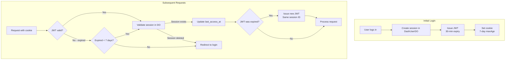

# JWT Sessions

Sessions use JWT (JSON Web Tokens) with server-side validation for security and scalability.

## Token Structure

| Claim | Description |
|-------|-------------|
| `sub` | User UUID (matches D1 `users.id` and DashUserDO name) |
| `email` | User's email address |
| `jti` | Session ID (JWT ID) - unique per device/session |
| `iat` | Issued at timestamp |
| `exp` | Expiration timestamp (30 minutes from issue) |

## Token Lifecycle

## JWT Signing

- Uses the `jose` library with HS256 algorithm
- Secret key is encoded from environment variable `JWT_SECRET`
- Token expiration set to 30 minutes from issuance

## Renewal Logic

The system supports auto-renewal to provide seamless UX while maintaining security:

- On each request, the JWT signature is verified first
- If verification fails but the token is expired (not corrupted), check if it's within the 7-day renewal window
- If renewable, validate that the session still exists in DashUserDO
- If session exists, issue a new JWT with the same session ID and update the cookie
- If session was deleted (user logged out), force re-authentication

### Renewal Window

A token is considered renewable if:
- It has expired (past the `exp` claim)
- It expired less than 7 days ago

## Session Storage

Sessions are stored in DashUserDO (per-user Durable Object) with the following fields:

| Column | Description |
|--------|-------------|
| `id` | Session ID (matches JWT `jti` claim) |
| `device_name` | Human-readable device identifier (e.g., "Chrome on macOS") |
| `device_type` | Device category: desktop, mobile, or tablet |
| `ip_address` | Client IP address at session creation |
| `user_agent` | Full user agent string |
| `created_at` | Session creation timestamp |
| `last_access_at` | Last activity timestamp (updated on each request) |
| `expires_at` | Hard 7-day expiration from creation |

## Creating Sessions

When a user logs in via OTP or magic link:

- Parse user agent to extract browser name, OS, and device type
- Calculate session expiration (7 days from now)
- Create session record in DashUserDO via POST to `/sessions` endpoint
- Generate JWT with user ID, email, and new session ID
- Return token for cookie storage

## Device Detection

User agent parsing extracts:

- **Browser**: Chrome, Safari, Firefox, or Edge
- **OS**: macOS, Windows, iOS, or Android
- **Device type**: desktop, mobile, or tablet

This information is displayed in the sessions management UI so users can recognize their devices.

## Security Considerations

### Why Short JWT Expiry?

- **Token theft mitigation** - Stolen token only valid for 30 minutes
- **Force session validation** - Renewal requires checking DashUserDO
- **Balance** - 30 min is short enough for security, long enough to avoid constant renewal

### Why Server-side Sessions?

- **Immediate revocation** - Delete session = instant logout
- **Device management** - Users can see and terminate sessions
- **Audit trail** - Know which devices accessed the account

### JWT Secret Management

- Use cryptographically secure random bytes (minimum 256 bits / 32 bytes)
- Different secrets per environment (dev, ci, qa, uat, prod)
- Store as Wrangler secret, never commit to version control
- Rotation requires re-authentication of all users

## Related Documentation

- [Authentication Overview](./overview.md)
- [OTP Login](./otp-login.md) - Creates initial session
- [Magic Link](./magic-link.md) - Creates initial session
- [Storage Architecture](../architecture/storage.md) - DashUserDO details
