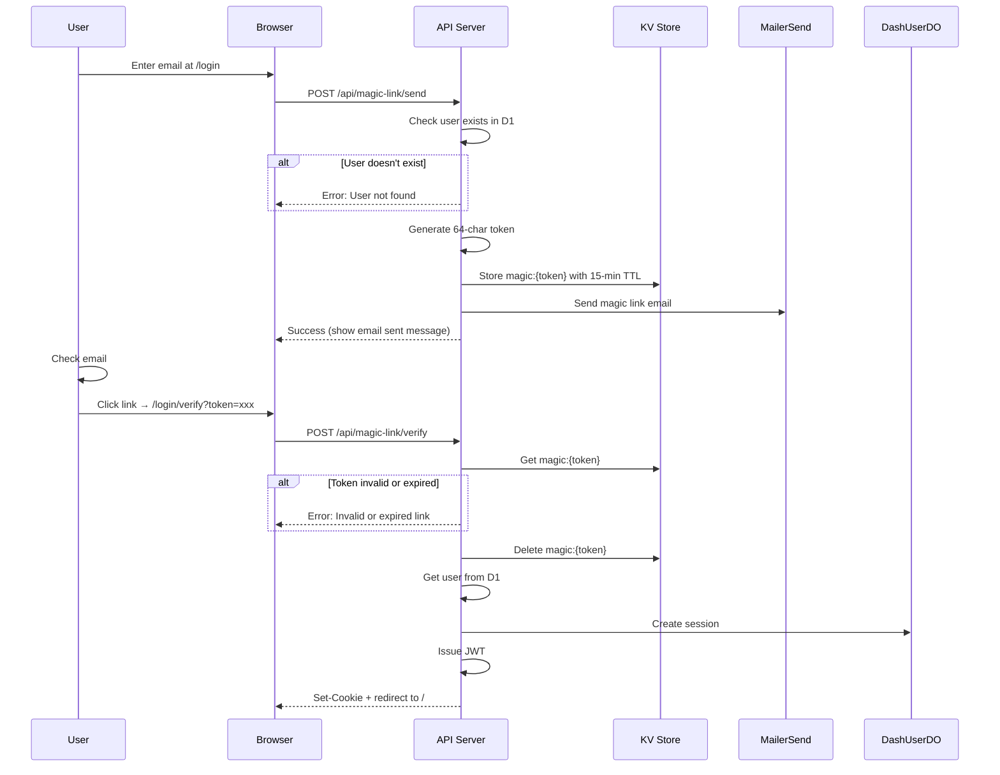

# Magic Link Login

Magic link authentication sends a clickable link via email for one-click passwordless login.

## Flow Overview

## KV Storage

Magic link tokens are stored in KV with automatic expiration:

- **Key format**: `magic:{token}` where token is a 64-character hex string
- **Value**: JSON object containing email and optional redirect domain
- **TTL**: 15 minutes

## How It Works

### Sending Magic Link

1. User enters email on login page
2. Server checks if user exists in D1 database
3. If user exists, generate cryptographically secure 64-character hex token (256 bits of entropy)
4. Store token in KV with email and optional redirect domain
5. Build magic link URL: `{origin}/login/verify?token={token}`
6. Send email via MailerSend with clickable button and fallback link

### Verifying Magic Link

1. User clicks link in email
2. Verification page extracts token from URL
3. Server retrieves token data from KV
4. If token doesn't exist or expired, show error with link to try again
5. If valid, delete token (single-use), create session, issue JWT
6. Redirect to dashboard (or specific merchant if domain was stored)

## OTP vs Magic Link

| Feature | OTP | Magic Link |
|---------|-----|------------|
| User action | Type 6 digits | Click link |
| Security | Rate-limited (3 attempts) | Single-use token |
| Expiry | 5 minutes | 15 minutes |
| Best for | Quick access on same device | Mobile-to-desktop flow |
| Email client | Doesn't need to click | Must support links |

Both methods are equally secure - choice is user preference.

## Security Considerations

### Why 64-Character Tokens?

- **256 bits of entropy** - Impossible to brute force
- **Hex encoding** - URL-safe, easy to handle
- **Industry standard** - Common for email verification

### Why 15-Minute Expiry?

- **Longer than OTP** - User might not check email immediately
- **Still secure** - Limited window for interception
- **Single use** - Token deleted after first use

### Why Single Use?

- **Prevents replay attacks** - Link can't be used twice
- **Immediate invalidation** - Clicked link = consumed
- **Security best practice** - One-time tokens are standard

## Error Responses

| Status | Error | Cause |
|--------|-------|-------|
| 404 | User not found | Email not registered |
| 400 | Invalid or expired link | Token not in KV or TTL exceeded |
| 400 | No token provided | Missing token parameter |
| 500 | Failed to send email | MailerSend error |

## Related Documentation

- [Authentication Overview](./overview.md)
- [OTP Login](./otp-login.md) - Alternative login method
- [JWT Sessions](./jwt-sessions.md) - Session created after verification
