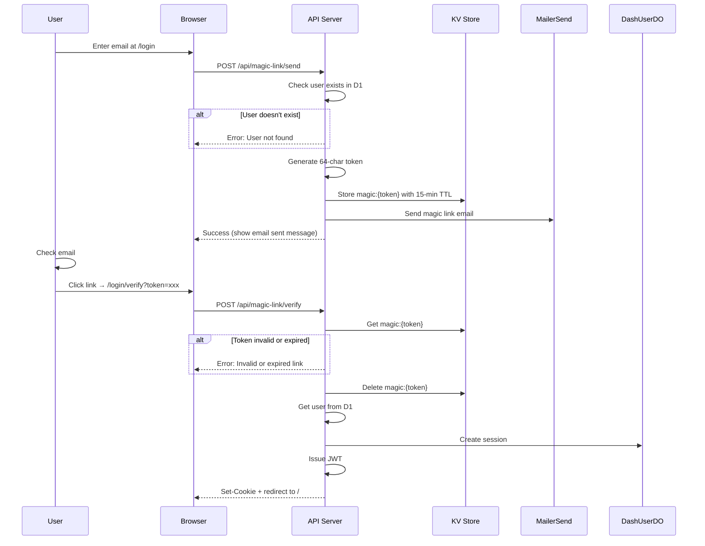

# Magic Link Login

Magic link authentication sends a clickable link via email for one-click passwordless login.

## Flow Overview



## KV Storage

Magic link tokens are stored in KV with automatic expiration:

```javascript
// Key format
Key: `magic:${token}`  // token = 64-char hex string

// Value structure
{
  "email": "user@example.com",
  "domain": "merchant.com"  // optional, for redirect after login
}

// TTL: 15 minutes
```

## Generating Tokens

```javascript
// Generate cryptographically secure 64-character hex token
function generateMagicToken() {
  const bytes = new Uint8Array(32);
  crypto.getRandomValues(bytes);
  return Array.from(bytes, b => b.toString(16).padStart(2, '0')).join('');
}
```

## Sending Magic Link

**Endpoint**: `POST /api/magic-link/send`

```javascript
// routes/(logged-out)/api/magic-link/send/+server.js
export async function POST({ request, platform, url }) {
  const { email, domain } = await request.json();

  // Check user exists
  const exists = await userExists({ platform, email });
  if (!exists) {
    return json({ error: 'User not found' }, { status: 404 });
  }

  // Generate token
  const token = generateMagicToken();

  // Store in KV
  await platform.env.OTP_STORE.put(
    `magic:${token}`,
    JSON.stringify({ email, domain }),
    { expirationTtl: 900 } // 15 minutes
  );

  // Build magic link URL
  const magicLinkUrl = `${url.origin}/login/verify?token=${token}`;

  // Send email
  const result = await sendMagicLinkEmail(
    email,
    magicLinkUrl,
    platform.env.MAILERSEND_API_KEY
  );

  if (!result.success) {
    return json({ error: 'Failed to send email' }, { status: 500 });
  }

  return json({ success: true });
}
```

## Verifying Magic Link

**Endpoint**: `POST /api/magic-link/verify`

```javascript
// routes/(logged-out)/api/magic-link/verify/+server.js
export async function POST({ request, platform, cookies }) {
  const { token } = await request.json();

  // Get stored token data
  const stored = await platform.env.OTP_STORE.get(`magic:${token}`);
  if (!stored) {
    return json({ error: 'Invalid or expired link' }, { status: 400 });
  }

  const { email, domain } = JSON.parse(stored);

  // Delete token (single use)
  await platform.env.OTP_STORE.delete(`magic:${token}`);

  // Get user and create session
  const user = await getUser({ platform, email });
  const { token: sessionToken } = await createSession({
    platform,
    userId: user.userId,
    email,
    userAgent: request.headers.get('user-agent'),
    ipAddress: request.headers.get('cf-connecting-ip'),
    jwtSecret: platform.env.JWT_SECRET
  });

  // Set session cookie
  cookies.set('session', sessionToken, {
    path: '/',
    httpOnly: true,
    secure: true,
    sameSite: 'lax',
    maxAge: 7 * 24 * 60 * 60
  });

  // Return redirect URL (with optional domain for direct merchant access)
  const redirectUrl = domain ? `/merchant/${domain}` : '/';
  return json({ success: true, redirectUrl });
}
```

## Email Template

```javascript
// email.js
export async function sendMagicLinkEmail(email, magicLinkUrl, apiKey) {
  return sendEmail({
    to: email,
    subject: 'Sign in to Firmly',
    text: `Click the link below to sign in:\n\n${magicLinkUrl}\n\nThis link expires in 15 minutes.`,
    html: `
      <div style="font-family: sans-serif; max-width: 600px;">
        <h2>Sign in to Firmly</h2>
        <p>Click the button below to sign in:</p>
        <div style="text-align: center; margin: 30px 0;">
          <a href="${magicLinkUrl}"
             style="background-color: #7979ff; color: white; padding: 14px 32px;
                    text-decoration: none; border-radius: 6px; font-weight: 600;">
            Sign In
          </a>
        </div>
        <p style="color: #666;">Or copy and paste this link:</p>
        <p style="color: #7979ff; word-break: break-all;">${magicLinkUrl}</p>
        <p style="color: #666;">This link expires in 15 minutes.</p>
      </div>
    `
  }, apiKey);
}
```

## OTP vs Magic Link

| Feature | OTP | Magic Link |
|---------|-----|------------|
| User action | Type 6 digits | Click link |
| Security | Rate-limited (3 attempts) | Single-use token |
| Expiry | 5 minutes | 15 minutes |
| Best for | Quick access on same device | Mobile-to-desktop flow |
| Email client | Doesn't need to click | Must support links |

Both methods are equally secure - choice is user preference.

## Security Considerations

### Why 64-Character Tokens?

- **256 bits of entropy** - Impossible to brute force
- **Hex encoding** - URL-safe, easy to handle
- **Industry standard** - Common for email verification

### Why 15-Minute Expiry?

- **Longer than OTP** - User might not check email immediately
- **Still secure** - Limited window for interception
- **Single use** - Token deleted after first use

### Why Single Use?

- **Prevents replay attacks** - Link can't be used twice
- **Immediate invalidation** - Clicked link = consumed
- **Security best practice** - One-time tokens are standard

## Verification Page Flow

```javascript
// routes/(logged-out)/login/verify/+page.svelte
<script>
  import { onMount } from 'svelte';
  import { goto } from '$app/navigation';

  let { data } = $props();
  let status = $state('verifying');
  let error = $state('');

  onMount(async () => {
    const token = new URLSearchParams(window.location.search).get('token');

    if (!token) {
      status = 'error';
      error = 'No token provided';
      return;
    }

    const response = await fetch('/api/magic-link/verify', {
      method: 'POST',
      headers: { 'Content-Type': 'application/json' },
      body: JSON.stringify({ token })
    });

    if (response.ok) {
      const { redirectUrl } = await response.json();
      goto(redirectUrl || '/');
    } else {
      status = 'error';
      const data = await response.json();
      error = data.error || 'Verification failed';
    }
  });
</script>

{#if status === 'verifying'}
  <p>Verifying your link...</p>
{:else if status === 'error'}
  <p>Error: {error}</p>
  <a href="/login">Try again</a>
{/if}
```

## Error Responses

| Status | Error | Cause |
|--------|-------|-------|
| 404 | User not found | Email not registered |
| 400 | Invalid or expired link | Token not in KV or TTL exceeded |
| 400 | No token provided | Missing token parameter |
| 500 | Failed to send email | MailerSend error |

## Related Documentation

- [Authentication Overview](./overview.md)
- [OTP Login](./otp-login.md) - Alternative login method
- [JWT Sessions](./jwt-sessions.md) - Session created after verification
- [API: Magic Link Send](../api/auth/magic-link-send.md) - Full API reference
- [API: Magic Link Verify](../api/auth/magic-link-verify.md) - Full API reference
