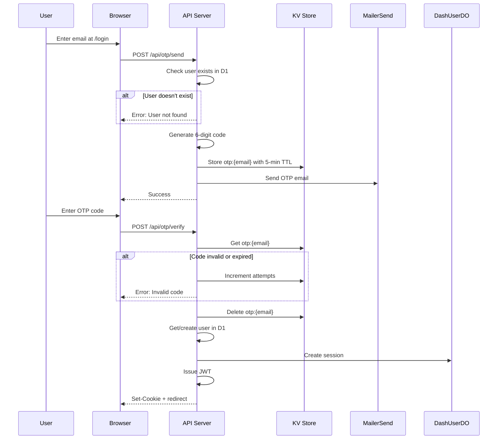

# OTP Login

OTP (One-Time Password) authentication sends a 6-digit code via email for passwordless login.

## Flow Overview

## KV Storage

OTP codes are stored in KV with automatic expiration:

- **Key format**: `otp:{email}`
- **Value**: JSON object containing the 6-digit code and attempt counter
- **TTL**: 5 minutes

## How It Works

### Sending OTP

1. User enters email on login page
2. Server checks if user exists in D1 database
3. If user exists, generate a random 6-digit numeric code
4. Store code in KV with 5-minute TTL and zero attempt counter
5. Send email via MailerSend with the code

### Verifying OTP

1. User enters the 6-digit code
2. Server retrieves stored OTP from KV
3. If code doesn't exist, return "Code expired" error
4. If attempt count exceeds 3, invalidate code and return "Too many attempts"
5. If code doesn't match, increment attempt counter and return error
6. If code matches, delete from KV, create session, issue JWT, set cookie

## Rate Limiting

| Limit | Value | Action on Exceed |
|-------|-------|------------------|
| Code expiry | 5 minutes | Must request new code |
| Max attempts | 3 | Code invalidated, must request new |

## Security Considerations

### Why 6-Digit Codes?

- **Brute force resistant** - 1 million combinations
- **User-friendly** - Easy to type on mobile
- **Industry standard** - Familiar to users

### Why 5-Minute Expiry?

- **Short window** - Limits exposure if email intercepted
- **Long enough** - Time to switch apps and type code
- **Balance** - Security vs. UX

### Why 3 Attempts?

- **Prevents brute force** - Even with 3 attempts, only 0.0003% chance of guessing
- **Forgiving** - Allows for typos
- **Simple recovery** - Just request a new code

## Error Responses

| Status | Error | Cause |
|--------|-------|-------|
| 404 | User not found | Email not registered |
| 400 | Code expired | OTP TTL exceeded |
| 400 | Invalid code | Wrong code entered |
| 429 | Too many attempts | 3+ failed attempts |
| 500 | Failed to send email | MailerSend error |

## Related Documentation

- [Authentication Overview](./overview.md)
- [Magic Link](./magic-link.md) - Alternative login method
- [JWT Sessions](./jwt-sessions.md) - Session created after verification
