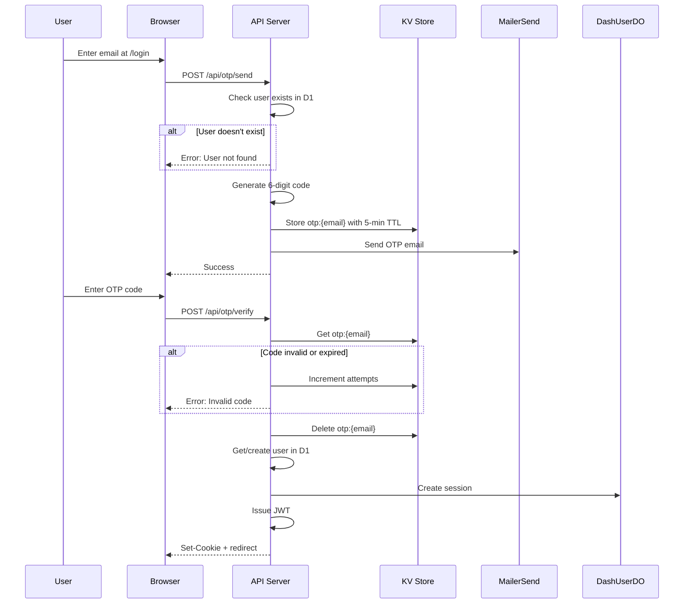

# OTP Login

OTP (One-Time Password) authentication sends a 6-digit code via email for passwordless login.

## Flow Overview



## KV Storage

OTP codes are stored in KV with automatic expiration:

```javascript
// Key format
Key: `otp:${email}`

// Value structure
{
  "code": "123456",
  "attempts": 0
}

// TTL: 5 minutes
```

## Generating OTP Codes

```javascript
// Generate 6-digit code
function generateOTP() {
  return String(Math.floor(100000 + Math.random() * 900000));
}
```

## Sending OTP

**Endpoint**: `POST /api/otp/send`

```javascript
// routes/(logged-out)/api/otp/send/+server.js
export async function POST({ request, platform }) {
  const { email } = await request.json();

  // Check user exists
  const exists = await userExists({ platform, email });
  if (!exists) {
    return json({ error: 'User not found' }, { status: 404 });
  }

  // Generate and store OTP
  const code = generateOTP();
  await platform.env.OTP_STORE.put(
    `otp:${email}`,
    JSON.stringify({ code, attempts: 0 }),
    { expirationTtl: 300 } // 5 minutes
  );

  // Send email
  const result = await sendOTPEmail(
    email,
    code,
    platform.env.MAILERSEND_API_KEY
  );

  if (!result.success) {
    return json({ error: 'Failed to send email' }, { status: 500 });
  }

  return json({ success: true });
}
```

## Verifying OTP

**Endpoint**: `POST /api/otp/verify`

```javascript
// routes/(logged-out)/api/otp/verify/+server.js
export async function POST({ request, platform, cookies }) {
  const { email, code } = await request.json();

  // Get stored OTP
  const stored = await platform.env.OTP_STORE.get(`otp:${email}`);
  if (!stored) {
    return json({ error: 'Code expired' }, { status: 400 });
  }

  const { code: storedCode, attempts } = JSON.parse(stored);

  // Check attempts
  if (attempts >= 3) {
    await platform.env.OTP_STORE.delete(`otp:${email}`);
    return json({ error: 'Too many attempts' }, { status: 429 });
  }

  // Verify code
  if (code !== storedCode) {
    await platform.env.OTP_STORE.put(
      `otp:${email}`,
      JSON.stringify({ code: storedCode, attempts: attempts + 1 }),
      { expirationTtl: 300 }
    );
    return json({ error: 'Invalid code' }, { status: 400 });
  }

  // Delete OTP
  await platform.env.OTP_STORE.delete(`otp:${email}`);

  // Get user and create session
  const user = await getUser({ platform, email });
  const { token } = await createSession({
    platform,
    userId: user.userId,
    email,
    userAgent: request.headers.get('user-agent'),
    ipAddress: request.headers.get('cf-connecting-ip'),
    jwtSecret: platform.env.JWT_SECRET
  });

  // Set session cookie
  cookies.set('session', token, {
    path: '/',
    httpOnly: true,
    secure: true,
    sameSite: 'lax',
    maxAge: 7 * 24 * 60 * 60
  });

  return json({ success: true });
}
```

## Email Template

```javascript
// email.js
export async function sendOTPEmail(email, code, apiKey) {
  return sendEmail({
    to: email,
    subject: 'Your Firmly Verification Code',
    text: `Your verification code is: ${code}\n\nThis code will expire in 5 minutes.`,
    html: `
      <div style="font-family: sans-serif; max-width: 600px;">
        <h2>Your Verification Code</h2>
        <div style="background: #f5f5f5; padding: 20px; text-align: center;">
          <span style="font-size: 32px; font-family: monospace; letter-spacing: 8px;">
            ${code}
          </span>
        </div>
        <p>This code will expire in 5 minutes.</p>
      </div>
    `
  }, apiKey);
}
```

## Rate Limiting

| Limit | Value | Action on Exceed |
|-------|-------|------------------|
| Code expiry | 5 minutes | Must request new code |
| Max attempts | 3 | Code invalidated, must request new |

## Security Considerations

### Why 6-Digit Codes?

- **Brute force resistant** - 1 million combinations
- **User-friendly** - Easy to type on mobile
- **Industry standard** - Familiar to users

### Why 5-Minute Expiry?

- **Short window** - Limits exposure if email intercepted
- **Long enough** - Time to switch apps and type code
- **Balance** - Security vs. UX

### Why 3 Attempts?

- **Prevents brute force** - Even with 3 attempts, only 0.0003% chance of guessing
- **Forgiving** - Allows for typos
- **Simple recovery** - Just request a new code

## Error Responses

| Status | Error | Cause |
|--------|-------|-------|
| 404 | User not found | Email not registered |
| 400 | Code expired | OTP TTL exceeded |
| 400 | Invalid code | Wrong code entered |
| 429 | Too many attempts | 3+ failed attempts |
| 500 | Failed to send email | MailerSend error |

## Related Documentation

- [Authentication Overview](./overview.md)
- [Magic Link](./magic-link.md) - Alternative login method
- [JWT Sessions](./jwt-sessions.md) - Session created after verification
- [API: OTP Send](../api/auth/otp-send.md) - Full API reference
- [API: OTP Verify](../api/auth/otp-verify.md) - Full API reference
