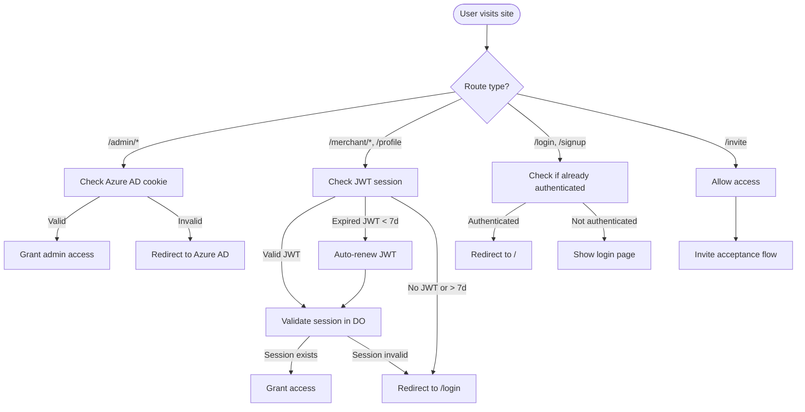
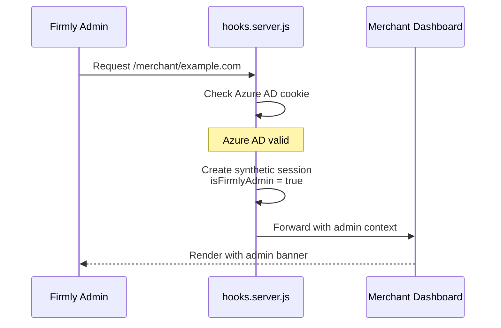
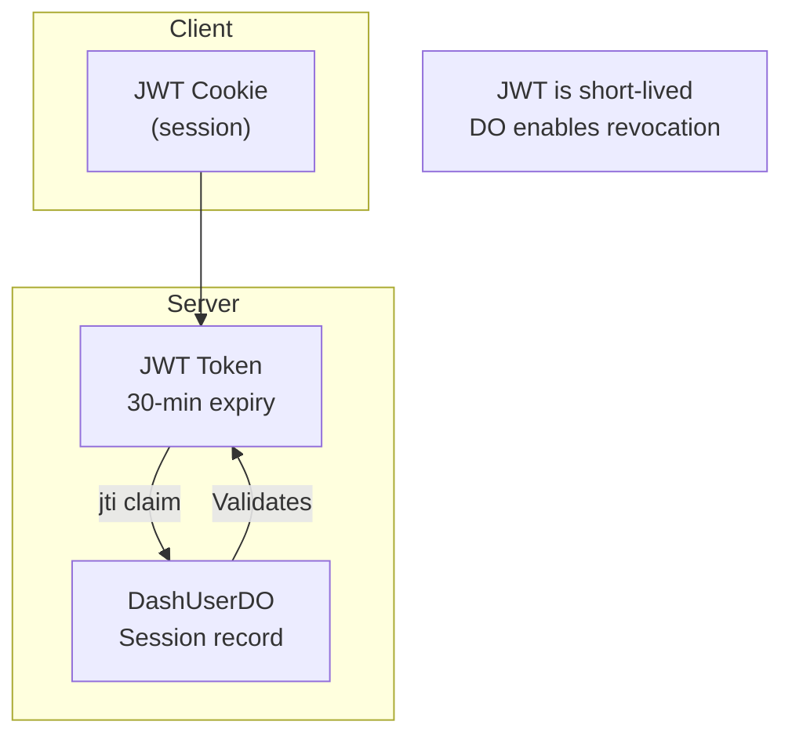

# Authentication Overview

The Firmly Dashboard uses passwordless authentication for security and simplicity. There are two authentication systems: one for Firmly employees (admins) and one for merchant users.

## Authentication Methods

| Method | Users | How it Works |
|--------|-------|--------------|
| **Azure AD SSO** | Firmly employees | Microsoft account login |
| **OTP (One-Time Password)** | Merchant users | 6-digit code via email |
| **Magic Link** | Merchant users | Clickable link via email |
| **Invite Link** | New team members | Single-use link with 7-day expiry |

## User Types

### Firmly Admins

- Authenticate via Azure AD (Microsoft) SSO
- Access admin routes at `/admin/*`
- Can view any merchant dashboard with admin privileges
- Session stored in `FIRMLY_AUTH_COOKIE` cookie

### Merchant Users

- Authenticate via OTP or magic link (passwordless)
- Access merchant routes at `/merchant/*`
- Role-based access to dashboards (owner, editor, viewer)
- Session stored in JWT `session` cookie

## Authentication Flow Overview



## Hybrid Authentication

A key feature is that Firmly admins can access merchant dashboards while maintaining their admin identity. This enables support staff to help merchants without creating separate accounts.



## Session Architecture



### Why This Architecture?

1. **Short JWT lifetime (30 min)** - Limits impact if token is stolen
2. **Server-side session validation** - Every request checks session exists in DashUserDO
3. **Auto-renewal (7-day window)** - Expired JWTs auto-renew if session still valid
4. **Immediate revocation** - Delete session from DO = instant logout

## Cookie Configuration

```javascript
cookies.set('session', token, {
  path: '/',
  httpOnly: true,    // Not accessible via JavaScript
  secure: true,      // HTTPS only
  sameSite: 'lax',   // CSRF protection
  maxAge: 7 * 24 * 60 * 60  // 7 days
});
```

## Route Protection

The `hooks.server.js` file handles all authentication:

| Route Pattern | Auth Required | Behavior |
|---------------|---------------|----------|
| `/admin/*` | Azure AD | Redirect to `/auth/sign-in` if invalid |
| `/auth/*` | None | Azure AD callbacks |
| `/api/otp/*`, `/api/magic-link/*` | None | Public auth APIs |
| `/invite/*` | None | Public invite acceptance |
| `/`, `/merchant/*`, `/profile` | JWT | Redirect to `/login` if invalid |
| `/login/*`, `/signup/*` | None (redirects if authed) | Public for unauthenticated |

## Security Features

- **Passwordless** - No passwords to breach or forget
- **Rate limiting** - KV-based rate limiting on all auth endpoints (3 sends/hour, 5 verify attempts)
- **Single-use tokens** - OTP codes and magic links are deleted after use
- **Device tracking** - IP and user agent stored with sessions
- **Session management** - Users can view and terminate sessions
- **Audit logging** - All sensitive operations logged
- **Security headers** - X-Frame-Options, X-Content-Type-Options, Referrer-Policy, Permissions-Policy
- **Invite verification** - New users must verify email via OTP before accepting invites

## Related Documentation

- [JWT Sessions](./jwt-sessions.md) - Token structure and renewal
- [OTP Login](./otp-login.md) - OTP authentication flow
- [Magic Link](./magic-link.md) - Magic link authentication
- [Azure AD](./azure-ad.md) - Admin SSO
- [Invite System](./invite-system.md) - Team invitations
- [Security Considerations](../security-considerations.md) - Security controls, known risks, pre-launch checklist
