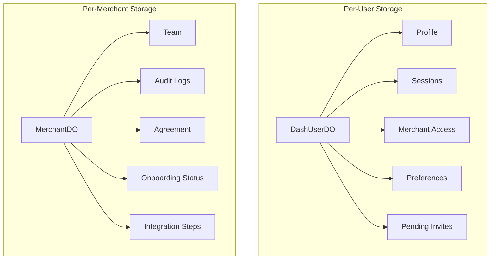

# Durable Objects Schema

The Firmly Dashboard uses Cloudflare Durable Objects for per-entity data storage with transactional guarantees and real-time capabilities.

## Architecture

## Why Durable Objects?

| Benefit | Description |
|---------|-------------|
| **Per-entity isolation** | Each user/merchant has dedicated storage |
| **Transactional updates** | Atomic operations within entity |
| **Global edge availability** | Fast access from any location |
| **SQLite storage** | Relational queries within DO |
| **No cold starts** | Always-on for active entities |

## Dual-Worker Architecture

Due to local development limitations, DOs are deployed separately:

| Worker | Purpose |
|--------|---------|
| `dash` | Main SvelteKit application |
| `dash-do` | Durable Object definitions |

The `dash` worker communicates with `dash-do` via service binding to access Durable Objects.

---

## DashUserDO

Per-user data storage identified by user UUID.

### Profile Data

Stores user profile information:

| Field | Description |
|-------|-------------|
| `name` | User's full name |
| `company` | Company name |
| `title` | Job title |
| `location` | Location string |
| `avatarUrl` | URL to avatar image in R2 |

Profile data is stored as a single-row JSON document for flexibility.

### Sessions

Stores active login sessions for the user:

| Field | Description |
|-------|-------------|
| `id` | Session ID (matches JWT `jti`) |
| `device_name` | Human-readable device identifier |
| `device_type` | desktop, mobile, or tablet |
| `ip_address` | Client IP at session creation |
| `user_agent` | Full user agent string |
| `created_at` | Session creation timestamp |
| `last_access_at` | Last activity timestamp |
| `expires_at` | Hard expiration (7 days from creation) |

**Operations supported:**
- List all sessions
- Create new session
- Validate session exists
- Refresh last access timestamp
- Terminate single session
- Terminate all sessions except current

### Merchant Access

Tracks which merchant dashboards the user can access:

| Field | Description |
|-------|-------------|
| `merchant_domain` | Merchant domain (primary key) |
| `role` | owner, editor, or viewer |
| `granted_at` | When access was granted |

**Operations supported:**
- List all accessible merchants
- Grant access to a merchant
- Revoke access from a merchant

### Pending Invites

Stores pending team invitations for the user:

| Field | Description |
|-------|-------------|
| `token` | Invite token (primary key) |
| `merchant_domain` | Target merchant |
| `role` | Offered role |
| `invited_by_email` | Who sent the invite |
| `expires_at` | When invite expires |
| `created_at` | When invite was created |

### Preferences

Stores user preferences as a JSON document:

| Field | Description |
|-------|-------------|
| `theme` | UI theme preference |
| `notifications` | Notification settings |

---

## MerchantDO

Per-merchant data storage identified by domain.

### Team

Stores team members with access to the merchant dashboard:

| Field | Description |
|-------|-------------|
| `user_id` | User UUID (primary key) |
| `user_email` | User's email address |
| `role` | owner, editor, or viewer |
| `granted_at` | When access was granted |
| `granted_by` | User ID who granted access |

**Operations supported:**
- List all team members
- Add team member
- Update member role
- Remove team member

### Audit Logs

Records all sensitive operations on the merchant:

| Field | Description |
|-------|-------------|
| `id` | Auto-increment ID |
| `event_type` | Type of event (e.g., team_member_invited) |
| `actor_id` | User ID who performed action |
| `actor_email` | Actor's email |
| `actor_type` | Role of actor (owner, editor, admin) |
| `target_id` | Affected user ID (if applicable) |
| `target_email` | Affected user email (if applicable) |
| `details` | JSON with event-specific data |
| `is_firmly_admin` | Whether actor was a Firmly admin |
| `created_at` | Event timestamp |

**Operations supported:**
- List logs with pagination
- Filter by Firmly admin status
- Create new log entry

### Agreement

Tracks merchant agreement signing:

| Field | Description |
|-------|-------------|
| `id` | Agreement record ID |
| `signed_by_user_id` | Who signed |
| `signed_by_email` | Signer's email |
| `signed_at` | Signature timestamp |
| `browser_info` | Browser used for signing |
| `client_ip` | IP address at signing |
| `client_location` | Geographic location |
| `agreement_version` | Version of agreement signed |

### Onboarding Status

Tracks completion of onboarding steps:

| Field | Description |
|-------|-------------|
| `key` | Step identifier (e.g., "agreement", "destinations") |
| `completed` | Whether step is complete |
| `completed_at` | Completion timestamp |
| `completed_by_user_id` | Who completed it |
| `completed_by_email` | Completer's email |

### Integration Steps

Detailed tracking of integration progress:

| Field | Description |
|-------|-------------|
| `step_id` | Main step identifier |
| `substep_id` | Substep identifier (nullable) |
| `status` | pending, in_progress, completed |
| `completed_at` | Completion timestamp |
| `completed_by` | Who completed it |
| `source` | How it was completed (user, api, webhook) |

---

## Data Consistency

### Dual-Write Pattern

Team membership is written to three locations simultaneously:

1. **D1** `merchant_team` - Enables cross-entity queries
2. **DashUserDO** `merchant_access` - User's view of their merchants
3. **MerchantDO** `team` - Merchant's view of their team

This ensures:
- Users can quickly see their accessible merchants
- Merchants can quickly see their team members
- Admins can query across all merchants via D1

## Related Documentation

- [D1 Schema](./d1-schema.md) - Relational database tables
- [Storage Architecture](../architecture/storage.md) - Design decisions
