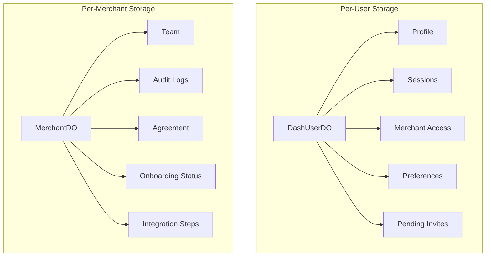

# Durable Objects Schema

The Firmly Dashboard uses Cloudflare Durable Objects for per-entity data storage with transactional guarantees and real-time capabilities.

## Architecture



## Why Durable Objects?

| Benefit | Description |
|---------|-------------|
| **Per-entity isolation** | Each user/merchant has dedicated storage |
| **Transactional updates** | Atomic operations within entity |
| **Global edge availability** | Fast access from any location |
| **SQLite storage** | Relational queries within DO |
| **No cold starts** | Always-on for active entities |

## Dual-Worker Architecture

Due to local development limitations, DOs are deployed separately:

| Worker | Purpose |
|--------|---------|
| `dash` | Main SvelteKit application |
| `dash-do` | Durable Object definitions |

Communication via service binding:
```javascript
// In dash worker
const userDO = platform.env.dashUsersService
  .get(platform.env.dashUsersService.idFromName(userId));
```

---

## DashUserDO

Per-user data storage identified by user UUID.

### Endpoint: `/profile`

**GET** - Retrieve user profile
```json
{
  "name": "John Smith",
  "company": "Acme Corp",
  "title": "Operations Manager",
  "location": "San Francisco, CA",
  "avatarUrl": "https://r2.firmly.ai/avatars/usr_123.jpg"
}
```

**PUT** - Update profile (merges with existing)
```json
{
  "name": "John Smith",
  "title": "Senior Manager"
}
```

### SQLite Schema: `profile`

```sql
CREATE TABLE IF NOT EXISTS profile (
  id INTEGER PRIMARY KEY CHECK (id = 1),
  data TEXT NOT NULL DEFAULT '{}'
);
```

Single-row table storing JSON profile data.

---

### Endpoint: `/sessions`

**GET** - List active sessions
```json
[
  {
    "id": "sess_abc123",
    "device_name": "Chrome on macOS",
    "device_type": "desktop",
    "ip_address": "192.168.1.100",
    "created_at": "2024-01-15T10:30:00Z",
    "last_access_at": "2024-01-15T14:45:00Z",
    "expires_at": "2024-01-22T10:30:00Z"
  }
]
```

**POST** - Create session
```json
{
  "deviceName": "Chrome on macOS",
  "deviceType": "desktop",
  "ipAddress": "192.168.1.100",
  "userAgent": "Mozilla/5.0...",
  "expiresAt": "2024-01-22T10:30:00Z"
}
```

**GET** `/sessions/{id}` - Validate session
**PUT** `/sessions/{id}` - Refresh last_access_at
**DELETE** `/sessions/{id}` - Terminate session
**DELETE** `/sessions/all?exclude={id}` - Terminate all except current

### SQLite Schema: `sessions`

```sql
CREATE TABLE IF NOT EXISTS sessions (
  id TEXT PRIMARY KEY,
  device_name TEXT,
  device_type TEXT,
  ip_address TEXT,
  user_agent TEXT,
  created_at TEXT DEFAULT (datetime('now')),
  last_access_at TEXT DEFAULT (datetime('now')),
  expires_at TEXT
);
```

---

### Endpoint: `/merchant-access`

**GET** - List merchant access
```json
[
  {
    "merchant_domain": "acme.com",
    "role": "owner",
    "granted_at": "2024-01-10T08:00:00Z"
  }
]
```

**POST** - Grant access
```json
{
  "merchantDomain": "acme.com",
  "role": "editor"
}
```

**DELETE** `/merchant-access/{domain}` - Revoke access

### SQLite Schema: `merchant_access`

```sql
CREATE TABLE IF NOT EXISTS merchant_access (
  merchant_domain TEXT PRIMARY KEY,
  role TEXT DEFAULT 'owner',
  granted_at TEXT DEFAULT (datetime('now'))
);
```

---

### Endpoint: `/pending-invites`

**GET** - List pending invitations
```json
[
  {
    "token": "abc123...",
    "merchant_domain": "newclient.com",
    "role": "editor",
    "invited_by_email": "owner@newclient.com",
    "expires_at": "2024-01-22T10:30:00Z",
    "created_at": "2024-01-15T10:30:00Z"
  }
]
```

**POST** - Add pending invite
**DELETE** `/pending-invites/{token}` - Remove invite

### SQLite Schema: `pending_invites`

```sql
CREATE TABLE IF NOT EXISTS pending_invites (
  token TEXT PRIMARY KEY,
  merchant_domain TEXT NOT NULL,
  role TEXT NOT NULL,
  invited_by_email TEXT,
  expires_at TEXT NOT NULL,
  created_at TEXT DEFAULT (datetime('now'))
);
```

---

### Endpoint: `/preferences`

**GET** - Get user preferences
```json
{
  "theme": "dark",
  "notifications": true
}
```

**PUT** - Update preferences (merges)

### SQLite Schema: `preferences`

```sql
CREATE TABLE IF NOT EXISTS preferences (
  id INTEGER PRIMARY KEY CHECK (id = 1),
  data TEXT NOT NULL DEFAULT '{}'
);
```

---

## MerchantDO

Per-merchant data storage identified by domain.

### Endpoint: `/team`

**GET** - List team members
```json
[
  {
    "user_id": "usr_abc123",
    "user_email": "owner@acme.com",
    "role": "owner",
    "granted_at": "2024-01-10T08:00:00Z",
    "granted_by": null
  }
]
```

**POST** - Add team member
```json
{
  "userId": "usr_def456",
  "userEmail": "editor@acme.com",
  "role": "editor",
  "grantedBy": "usr_abc123"
}
```

**PUT** `/team/{userId}` - Update role
**DELETE** `/team/{userId}` - Remove member

### SQLite Schema: `team`

```sql
CREATE TABLE IF NOT EXISTS team (
  user_id TEXT PRIMARY KEY,
  user_email TEXT NOT NULL,
  role TEXT NOT NULL DEFAULT 'viewer',
  granted_at TEXT DEFAULT (datetime('now')),
  granted_by TEXT
);
```

---

### Endpoint: `/audit-logs`

**GET** `?limit=50&offset=0&includeFirmlyAdmin=false`
```json
{
  "logs": [
    {
      "id": 1,
      "event_type": "team_member_invited",
      "actor_id": "usr_abc123",
      "actor_email": "owner@acme.com",
      "actor_type": "owner",
      "target_id": null,
      "target_email": "newmember@acme.com",
      "details": "{\"role\":\"editor\"}",
      "is_firmly_admin": 0,
      "created_at": "2024-01-15T10:30:00Z"
    }
  ],
  "total": 25,
  "limit": 50,
  "offset": 0
}
```

**POST** - Create audit log entry
```json
{
  "eventType": "team_member_invited",
  "actorId": "usr_abc123",
  "actorEmail": "owner@acme.com",
  "targetEmail": "newmember@acme.com",
  "details": { "role": "editor" },
  "isFirmlyAdmin": false,
  "actorType": "owner"
}
```

### SQLite Schema: `audit_logs`

```sql
CREATE TABLE IF NOT EXISTS audit_logs (
  id INTEGER PRIMARY KEY AUTOINCREMENT,
  event_type TEXT NOT NULL,
  actor_id TEXT NOT NULL,
  actor_email TEXT NOT NULL,
  target_id TEXT,
  target_email TEXT,
  details TEXT,
  is_firmly_admin INTEGER DEFAULT 0,
  actor_type TEXT DEFAULT 'user',
  created_at TEXT DEFAULT (datetime('now'))
);

CREATE INDEX IF NOT EXISTS idx_audit_logs_created_at ON audit_logs(created_at);
```

---

### Endpoint: `/agreement`

**GET** - Get agreement status
```json
{
  "signed": true,
  "agreement": {
    "id": 1,
    "signed_by_user_id": "usr_abc123",
    "signed_by_email": "owner@acme.com",
    "signed_at": "2024-01-15T10:30:00Z",
    "browser_info": "Chrome 120.0 on macOS",
    "client_ip": "192.168.1.100",
    "client_location": "San Francisco, US",
    "agreement_version": "1.0"
  }
}
```

**POST** - Sign agreement
```json
{
  "userId": "usr_abc123",
  "userEmail": "owner@acme.com",
  "browserInfo": "Chrome 120.0 on macOS",
  "clientIp": "192.168.1.100",
  "clientLocation": "San Francisco, US"
}
```

### SQLite Schema: `merchant_agreement`

```sql
CREATE TABLE IF NOT EXISTS merchant_agreement (
  id INTEGER PRIMARY KEY AUTOINCREMENT,
  signed_by_user_id TEXT NOT NULL,
  signed_by_email TEXT NOT NULL,
  signed_at TEXT DEFAULT (datetime('now')),
  browser_info TEXT,
  client_ip TEXT,
  client_location TEXT,
  agreement_version TEXT DEFAULT '1.0'
);
```

---

### Endpoint: `/onboarding`

**GET** - Get onboarding status
```json
{
  "agreement": {
    "completed": true,
    "completedAt": "2024-01-15T10:30:00Z",
    "completedByUserId": "usr_abc123",
    "completedByEmail": "owner@acme.com"
  },
  "destinations": {
    "completed": false,
    "completedAt": null,
    "completedByUserId": null,
    "completedByEmail": null
  }
}
```

**PUT** `/onboarding/{key}` - Set status
```json
{
  "completed": true,
  "userId": "usr_abc123",
  "userEmail": "owner@acme.com"
}
```

### SQLite Schema: `onboarding_status`

```sql
CREATE TABLE IF NOT EXISTS onboarding_status (
  key TEXT PRIMARY KEY,
  completed INTEGER DEFAULT 0,
  completed_at TEXT,
  completed_by_user_id TEXT,
  completed_by_email TEXT
);
```

---

### Endpoint: `/integration-steps`

**GET** - Get all integration steps
```json
[
  {
    "step_id": "agreement",
    "substep_id": null,
    "status": "completed",
    "completed_at": "2024-01-15T10:30:00Z",
    "completed_by": "owner@acme.com",
    "source": "user"
  }
]
```

**PUT** - Update step status
```json
{
  "stepId": "destinations",
  "substepId": null,
  "status": "completed",
  "completedBy": "owner@acme.com",
  "source": "user"
}
```

**PUT** `/integration-steps/bulk` - Bulk update

### SQLite Schema: `integration_steps`

```sql
CREATE TABLE IF NOT EXISTS integration_steps (
  id INTEGER PRIMARY KEY AUTOINCREMENT,
  step_id TEXT NOT NULL,
  substep_id TEXT,
  status TEXT NOT NULL DEFAULT 'pending',
  completed_at TEXT,
  completed_by TEXT,
  source TEXT NOT NULL DEFAULT 'api',
  updated_at TEXT DEFAULT (datetime('now')),
  UNIQUE(step_id, substep_id)
);

CREATE INDEX IF NOT EXISTS idx_integration_steps_step_id ON integration_steps(step_id);
```

---

## Usage Patterns

### Accessing DashUserDO

```javascript
// Get DO stub
function getUserDO(platform, userId) {
  const id = platform.env.dashUsersService.idFromName(userId);
  return platform.env.dashUsersService.get(id);
}

// Make request
const userDO = getUserDO(platform, userId);
const response = await userDO.fetch('http://do/profile');
const profile = await response.json();
```

### Accessing MerchantDO

```javascript
// Get DO stub
function getMerchantDO(platform, domain) {
  const id = platform.env.dashUsersService.idFromName(`merchant:${domain}`);
  return platform.env.dashUsersService.get(id);
}

// Make request
const merchantDO = getMerchantDO(platform, domain);
const response = await merchantDO.fetch('http://do/team');
const { team } = await response.json();
```

### Helper Functions

The `$lib/server/user.js` and `$lib/server/merchant.js` files provide helper functions:

```javascript
// User operations
import { getProfile, updateProfile, createSession } from '$lib/server/user.js';

// Merchant operations
import { getMerchantTeam, addTeamMember, createAuditLog } from '$lib/server/merchant.js';
```

## Data Consistency

### Dual-Write Pattern

Team membership is written to three locations:

1. **D1** `merchant_team` - Cross-entity queries
2. **DashUserDO** `merchant_access` - User's view
3. **MerchantDO** `team` - Merchant's view

```javascript
async function grantMerchantAccess({ platform, userId, userEmail, merchantDomain, role }) {
  // 1. D1 (queryable index)
  await platform.env.dashUsers.prepare(`
    INSERT INTO merchant_team (merchant_domain, user_id, user_email, role)
    VALUES (?, ?, ?, ?)
  `).bind(merchantDomain, userId, userEmail, role).run();

  // 2. User DO (user's perspective)
  const userDO = getUserDO(platform, userId);
  await userDO.fetch('http://do/merchant-access', {
    method: 'POST',
    body: JSON.stringify({ merchantDomain, role })
  });

  // 3. Merchant DO (merchant's perspective)
  const merchantDO = getMerchantDO(platform, merchantDomain);
  await merchantDO.fetch('http://do/team', {
    method: 'POST',
    body: JSON.stringify({ userId, userEmail, role })
  });
}
```

## Related Documentation

- [D1 Schema](./d1-schema.md) - Relational database tables
- [Storage Architecture](../architecture/storage.md) - Design decisions
- [API Reference](../api/README.md) - How APIs use storage
