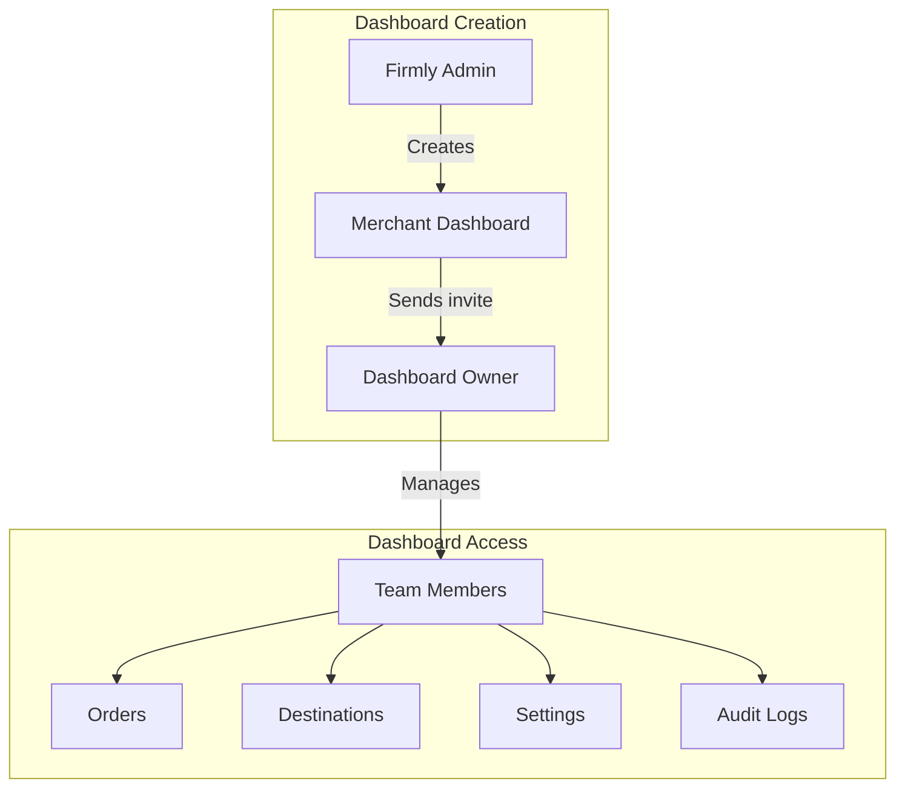
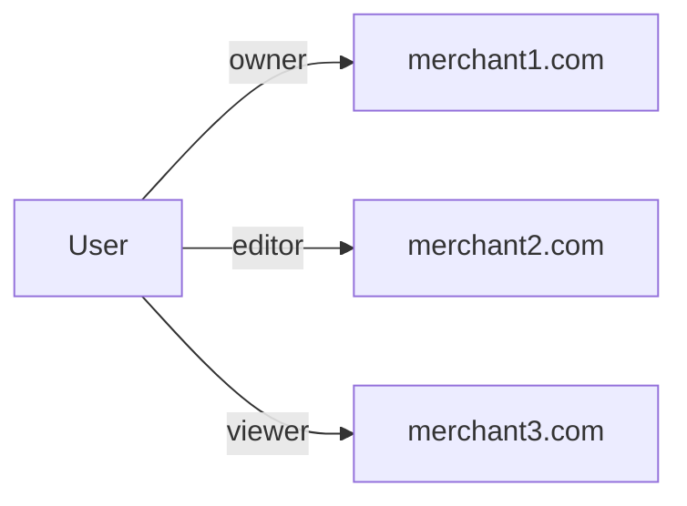

# Dashboard System

Merchant dashboards are the central concept of the Firmly Dashboard. Each merchant (identified by domain) has a dashboard where team members manage orders, destinations, and settings.

## Overview

## Dashboard Lifecycle

### 1. Creation (by Firmly Admin)

Dashboards are created by Firmly admins in the admin panel:

- Admin submits domain and optional notes
- Record created in D1 `merchant_dashboards` with status `pending`

### 2. Owner Invitation

After creation, the admin sends an invite to the dashboard owner:

- Email sent with invite token
- Token stored in KV with 7-day TTL
- Contains email, role, and merchant domain

### 3. Activation

When the owner accepts the invite:

1. Dashboard status changes to `active`
2. Owner is added to team with `owner` role
3. Owner can now invite additional team members

### 4. Ongoing Operations

Once active, the dashboard provides:
- Order management and visibility
- Destination configuration
- Team management
- Agreement signing
- Integration progress tracking
- Audit logging

## Data Storage

Dashboard data is distributed across multiple storage systems:

| Data | Storage | Why |
|------|---------|-----|
| Dashboard metadata | D1 (`merchant_dashboards`) | Admin queries, status tracking |
| Team members | MerchantDO + D1 | Per-merchant + admin queries |
| Audit logs | MerchantDO | Per-merchant isolation |
| Integration steps | MerchantDO | Per-merchant tracking |
| Agreement | MerchantDO | Per-merchant legal record |
| User's dashboard access | DashUserDO | Per-user isolation |

## Dashboard Statuses

| Status | Description |
|--------|-------------|
| `pending` | Created but no owner has accepted invite |
| `active` | Owner has joined, dashboard is operational |
| `suspended` | Temporarily disabled (admin action) |

## D1 Schema

The `merchant_dashboards` table stores:

| Column | Description |
|--------|-------------|
| `domain` | Merchant domain (primary key) |
| `created_at` | Creation timestamp |
| `created_by` | Admin user ID |
| `owner_user_id` | Owner after invite acceptance |
| `status` | pending, active, suspended |
| `notes` | Admin notes |
| `info` | JSON with company info, contact details |

## Multi-Dashboard Access

Users can have access to multiple dashboards with different roles:

The home page (`/`) shows a dashboard selector when a user has multiple dashboards. If a user has only one dashboard, they are automatically redirected to it.

## Creating Dashboards

Dashboards are created via the admin API:

1. Check if domain already exists
2. Create record in D1 with `pending` status
3. Return success

## Admin View of Dashboards

Admins can view all dashboards in a table showing:
- Domain
- Status
- Team size
- Created date
- Actions

## Hybrid Admin Access

Firmly admins can access any merchant dashboard while logged in with Azure AD:

- System creates a synthetic session with `isFirmlyAdmin: true`
- Grants access to all dashboards regardless of team membership

When an admin views a merchant dashboard:
- They see an "Admin Mode" banner
- All actions are logged with `isFirmlyAdmin: true`
- They have full access regardless of team membership

## Related Documentation

- [Team Management](./team-management.md) - Roles and permissions
- [Onboarding](./onboarding.md) - Integration steps
- [Audit Logs](./audit-logs.md) - Event logging
- [Invite System](../authentication/invite-system.md) - Team invitations
- [Admin Routes](../routes/admin-routes.md) - Admin panel pages
