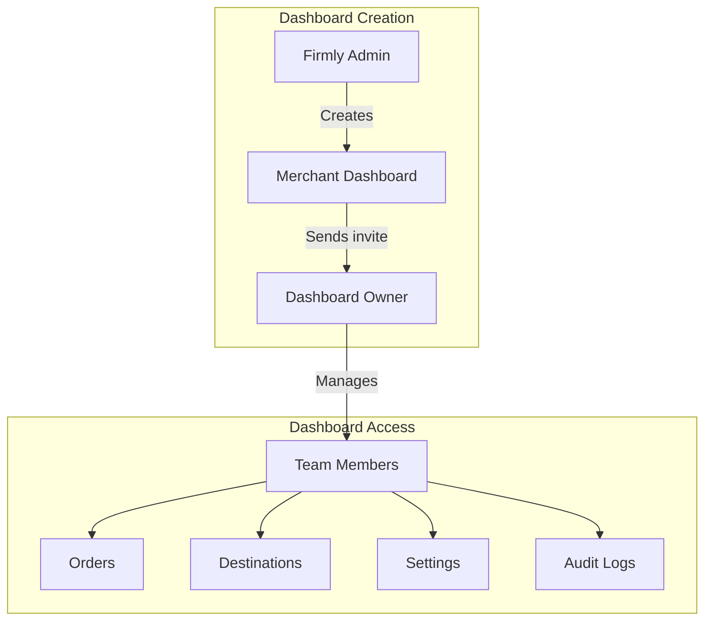
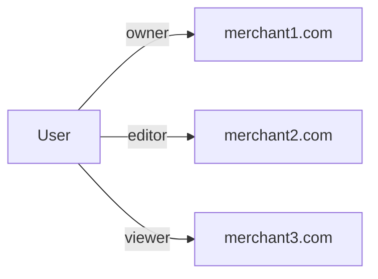

# Dashboard System

Merchant dashboards are the central concept of the Firmly Dashboard. Each merchant (identified by domain) has a dashboard where team members manage orders, destinations, and settings.

## Overview



## Dashboard Lifecycle

### 1. Creation (by Firmly Admin)

Dashboards are created by Firmly admins in the admin panel:

```javascript
// POST /admin/api/dashboards
{
  "domain": "merchant.com",
  "notes": "Initial setup notes"
}
```

This creates a record in D1 `merchant_dashboards` with status `pending`.

### 2. Owner Invitation

After creation, the admin sends an invite to the dashboard owner:

```javascript
// POST /admin/api/invites/send
{
  "email": "owner@merchant.com",
  "merchantDomain": "merchant.com",
  "role": "owner"
}
```

### 3. Activation

When the owner accepts the invite:
1. Dashboard status changes to `active`
2. Owner is added to team with `owner` role
3. Owner can now invite additional team members

### 4. Ongoing Operations

Once active, the dashboard provides:
- Order management and visibility
- Destination configuration
- Team management
- Agreement signing
- Integration progress tracking
- Audit logging

## Data Storage

Dashboard data is distributed across multiple storage systems:

| Data | Storage | Why |
|------|---------|-----|
| Dashboard metadata | D1 (`merchant_dashboards`) | Admin queries, status tracking |
| Team members | MerchantDO + D1 | Per-merchant + admin queries |
| Audit logs | MerchantDO | Per-merchant isolation |
| Integration steps | MerchantDO | Per-merchant tracking |
| Agreement | MerchantDO | Per-merchant legal record |
| User's dashboard access | DashUserDO | Per-user isolation |

## Dashboard Statuses

| Status | Description |
|--------|-------------|
| `pending` | Created but no owner has accepted invite |
| `active` | Owner has joined, dashboard is operational |
| `suspended` | Temporarily disabled (admin action) |

## D1 Schema

```sql
CREATE TABLE merchant_dashboards (
  domain TEXT PRIMARY KEY,
  created_at TEXT,
  created_by TEXT,           -- Admin user ID
  owner_user_id TEXT,        -- Owner after invite acceptance
  status TEXT,               -- pending, active, suspended
  notes TEXT,
  info TEXT                  -- JSON: company info, contact details
);
```

The `info` column stores structured merchant information:

```json
{
  "company": {
    "name": "Acme Corp",
    "address": "123 Main St",
    "country": "US"
  },
  "contact": {
    "email": "contact@merchant.com",
    "phone": "+1-555-0100"
  }
}
```

## Multi-Dashboard Access

Users can have access to multiple dashboards with different roles:



The home page (`/`) shows a dashboard selector when a user has multiple dashboards:

```javascript
// routes/(logged-in)/+page.server.js
export async function load({ platform, locals }) {
  const { userId } = locals.session;

  // Get user's merchant access
  const merchantAccess = await getMerchantAccess({ platform, userId });

  // Smart redirect for single dashboard
  if (merchantAccess.length === 1) {
    redirect(302, `/merchant/${merchantAccess[0].merchantDomain}`);
  }

  return { merchantAccess };
}
```

## Creating Dashboards

Dashboards are created via the admin API:

```javascript
// routes/(firmly-user-only)/admin/api/dashboards/+server.js
export async function POST({ request, platform, locals }) {
  const { domain, notes } = await request.json();

  // Check if domain already exists
  const existing = await db
    .prepare('SELECT domain FROM merchant_dashboards WHERE domain = ?')
    .bind(domain)
    .first();

  if (existing) {
    return json({ error: 'Dashboard already exists' }, { status: 400 });
  }

  // Create dashboard
  await db
    .prepare(`
      INSERT INTO merchant_dashboards (domain, created_at, created_by, status, notes)
      VALUES (?, datetime('now'), ?, 'pending', ?)
    `)
    .bind(domain, locals.authInfo.oid, notes)
    .run();

  return json({ success: true, domain });
}
```

## Admin View of Dashboards

Admins can view all dashboards in a table:

```javascript
// routes/(firmly-user-only)/admin/dashboards/+page.server.js
export async function load({ platform }) {
  const dashboards = await db
    .prepare(`
      SELECT
        d.*,
        (SELECT COUNT(*) FROM merchant_team WHERE merchant_domain = d.domain) as team_size
      FROM merchant_dashboards d
      ORDER BY d.created_at DESC
    `)
    .all();

  return { dashboards: dashboards.results };
}
```

## Hybrid Admin Access

Firmly admins can access any merchant dashboard while logged in with Azure AD:

```javascript
// hooks.server.js - Hybrid auth check
if (firmlyAuthCookie) {
  const { authInfo } = await enforceSSOAuth(firmlyAuthCookie, config);

  // Create synthetic session with admin flag
  userSession = {
    userId: authInfo.oid,
    email: authInfo.email,
    sessionId: null,
    isFirmlyAdmin: true  // Grants access to all dashboards
  };
}
```

When an admin views a merchant dashboard:
- They see an "Admin Mode" banner
- All actions are logged with `isFirmlyAdmin: true`
- They have full access regardless of team membership

## Related Documentation

- [Team Management](./team-management.md) - Roles and permissions
- [Onboarding](./onboarding.md) - Integration steps
- [Audit Logs](./audit-logs.md) - Event logging
- [Invite System](../authentication/invite-system.md) - Team invitations
- [Admin Routes](../routes/admin-routes.md) - Admin panel pages
