# Onboarding

The onboarding system tracks merchant integration progress through a series of steps that must be completed before the dashboard is fully operational.

## Overview


## Onboarding Tasks

| Task | Description | Required |
|------|-------------|----------|
| **Agreement** | Sign merchant service agreement | Yes |
| **Destinations** | Review and enable payment destinations | Yes |
| **Integration** | Complete technical integration steps | Yes |
| **Catalog** | Configure product catalog (optional) | No |

## Onboarding Status Storage

Onboarding status is stored in MerchantDO:

```sql
CREATE TABLE onboarding (
  task TEXT PRIMARY KEY,
  completed INTEGER DEFAULT 0,
  completed_at TEXT,
  completed_by TEXT,
  details TEXT
);
```

### Status Structure

```json
{
  "agreement": {
    "completed": true,
    "completedAt": "2024-01-15T10:30:00Z",
    "completedBy": "user@merchant.com"
  },
  "destinations": {
    "completed": true,
    "completedAt": "2024-01-15T11:00:00Z",
    "completedBy": "user@merchant.com"
  },
  "integration": {
    "completed": false
  }
}
```

## Agreement Signing

### Agreement Flow


### Signature Record

```json
{
  "signed": true,
  "agreement": {
    "signedAt": "2024-01-15T10:30:00Z",
    "signedBy": "owner@merchant.com",
    "signedByUserId": "user-uuid",
    "clientIp": "203.0.113.42",
    "clientLocation": "San Francisco, CA",
    "browserInfo": "Mozilla/5.0 (Macintosh...)"
  }
}
```

### Agreement API

```javascript
// merchant.js
export async function signMerchantAgreement({
  platform,
  merchantDomain,
  userId,
  userEmail,
  browserInfo,
  clientIp,
  clientLocation
}) {
  const response = await fetchMerchantDO(platform, merchantDomain, '/agreement', {
    method: 'POST',
    body: JSON.stringify({
      userId,
      userEmail,
      browserInfo,
      clientIp,
      clientLocation
    })
  });

  // Create audit log
  await createAuditLog({
    platform,
    merchantDomain,
    eventType: 'agreement_signed',
    actorId: userId,
    actorEmail: userEmail,
    details: { clientIp, clientLocation }
  });

  return { success: true };
}
```

## Destination Configuration

### Destination Flow


### Destination States

| State | Description |
|-------|-------------|
| `isActive` | Currently enabled for merchant |
| `canToggle` | Merchant can enable/disable |
| `isComingSoon` | Not yet available |
| `restrictMerchantAccess` | Requires explicit enablement |

## Integration Steps

Integration progress is tracked through a predefined set of steps.

### Step Structure

```javascript
// integration-steps.js
export const INTEGRATION_STEPS = [
  {
    id: 'api-setup',
    title: 'API Setup',
    description: 'Configure API credentials',
    substeps: [
      { id: 'api-key', title: 'Generate API Key' },
      { id: 'webhook', title: 'Configure Webhook' }
    ]
  },
  {
    id: 'testing',
    title: 'Testing',
    description: 'Complete test transactions',
    substeps: [
      { id: 'sandbox', title: 'Test in Sandbox' },
      { id: 'production', title: 'Production Verification' }
    ]
  }
];
```

### Step Storage

```sql
CREATE TABLE integration_steps (
  step_id TEXT NOT NULL,
  substep_id TEXT,
  status TEXT DEFAULT 'pending',
  completed_at TEXT,
  completed_by TEXT,
  source TEXT,
  PRIMARY KEY (step_id, substep_id)
);
```

### Step Statuses

| Status | Description |
|--------|-------------|
| `pending` | Not started |
| `in-progress` | Partially complete |
| `completed` | Fully complete |

### Auto-Sync Logic

When integration steps change, the onboarding integration status is auto-synced:

```javascript
// merchant.js
async function syncOnboardingIntegrationStatus({ platform, merchantDomain, actor }) {
  // Fetch current integration steps
  const dbSteps = await getIntegrationSteps({ platform, merchantDomain });

  // Build status to check completion
  const integrationStatus = buildIntegrationStatus(dbSteps, INTEGRATION_STEPS);

  // Check current onboarding integration status
  const currentlyComplete = await checkIntegrationComplete({ platform, merchantDomain });

  // Sync if status changed
  if (integrationStatus.isComplete && !currentlyComplete) {
    await setIntegrationComplete({ platform, merchantDomain, completed: true, actor });
  } else if (!integrationStatus.isComplete && currentlyComplete) {
    await setIntegrationComplete({ platform, merchantDomain, completed: false, actor });
  }
}
```

### Updating Steps

```javascript
// merchant.js
export async function updateIntegrationStep({
  platform,
  merchantDomain,
  stepId,
  substepId,
  status,
  actor
}) {
  await fetchMerchantDO(platform, merchantDomain, '/integration-steps', {
    method: 'PUT',
    body: JSON.stringify({
      stepId,
      substepId,
      status,
      completedBy: actor?.email,
      source: actor ? 'admin' : 'api'
    })
  });

  // Create audit log
  await createAuditLog({
    platform,
    merchantDomain,
    eventType: status === 'completed'
      ? 'integration_step_completed'
      : 'integration_step_updated',
    actorId: actor?.id || 'system',
    actorEmail: actor?.email || 'system@firmly.com',
    details: { stepId, substepId, status }
  });

  // Auto-sync onboarding status
  await syncOnboardingIntegrationStatus({ platform, merchantDomain, actor });

  return { success: true };
}
```

## Progress Tracking UI

The merchant dashboard shows onboarding progress in the sidebar:

```mermaid
graph TD
    subgraph "Integration Progress"
        Step1[✅ Sign Agreement]
        Step2[✅ Configure Destinations]
        Step3[🔄 Integration - 2/4 steps]
        Step4[⬜ Review & Launch]
    end
```



Components:
- `integration-progress.svelte` - Progress display
- `onboarding-tasks.svelte` - Task checklist

## Getting Onboarding Status

```javascript
// merchant.js
export async function getOnboardingStatus({ platform, merchantDomain }) {
  const response = await fetchMerchantDO(platform, merchantDomain, '/onboarding');
  if (!response.ok) return {};
  return response.json();
}

// Returns:
{
  "agreement": { "completed": true, "completedAt": "..." },
  "destinations": { "completed": true, "completedAt": "..." },
  "integration": { "completed": false },
  "catalog": { "completed": false }
}
```

## Related Documentation

- [Dashboard System](./dashboard-system.md) - Dashboard overview
- [Audit Logs](./audit-logs.md) - Onboarding action logging
- [API: Agreement](../api/merchant/agreement.md) - Agreement API
- [API: Destinations](../api/merchant/destinations.md) - Destinations API
