# Onboarding

The onboarding system tracks merchant integration progress through a series of steps that must be completed before the dashboard is fully operational.

## Overview

## Onboarding Tasks

| Task | Description | Required |
|------|-------------|----------|
| **Agreement** | Sign merchant service agreement | Yes |
| **Destinations** | Review and enable payment destinations | Yes |
| **Integration** | Complete technical integration steps | Yes |
| **Catalog** | Configure product catalog (optional) | No |

## Onboarding Status Storage

Onboarding status is stored in MerchantDO:

| Field | Description |
|-------|-------------|
| `task` | Task identifier (agreement, destinations, integration, catalog) |
| `completed` | Whether task is complete |
| `completed_at` | Completion timestamp |
| `completed_by` | Who completed it |
| `details` | Additional task-specific data |

## Agreement Signing

### Agreement Flow

### Signature Record

When an agreement is signed, the following is captured:

| Field | Description |
|-------|-------------|
| `signedAt` | Signature timestamp |
| `signedBy` | Signer's email |
| `signedByUserId` | Signer's user ID |
| `clientIp` | IP address at signing |
| `clientLocation` | Geographic location |
| `browserInfo` | Browser user agent |

## Destination Configuration

### Destination Flow

### Destination States

| State | Description |
|-------|-------------|
| `isActive` | Currently enabled for merchant |
| `canToggle` | Merchant can enable/disable |
| `isComingSoon` | Not yet available |
| `restrictMerchantAccess` | Requires explicit enablement |

## Integration Steps

Integration progress is tracked through a predefined set of steps and substeps.

### Step Structure

Steps are defined with:
- ID and title
- Description
- Optional substeps

Example steps:
- **API Setup** with substeps: Generate API Key, Configure Webhook
- **Testing** with substeps: Test in Sandbox, Production Verification

### Step Statuses

| Status | Description |
|--------|-------------|
| `pending` | Not started |
| `in-progress` | Partially complete |
| `completed` | Fully complete |

### Auto-Sync Logic

When integration steps change, the onboarding integration status is automatically synchronized:

- Fetch current integration steps
- Calculate overall completion status
- Update onboarding status if changed

## Progress Tracking UI

The merchant dashboard shows onboarding progress in the sidebar:

```mermaid
graph TD
    subgraph "Integration Progress"
        Step1[✅ Sign Agreement]
        Step2[✅ Configure Destinations]
        Step3[🔄 Integration - 2/4 steps]
        Step4[⬜ Review & Launch]
    end
```

## Related Documentation

- [Dashboard System](./dashboard-system.md) - Dashboard overview
- [Audit Logs](./audit-logs.md) - Onboarding action logging
