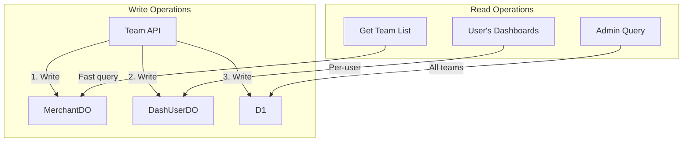
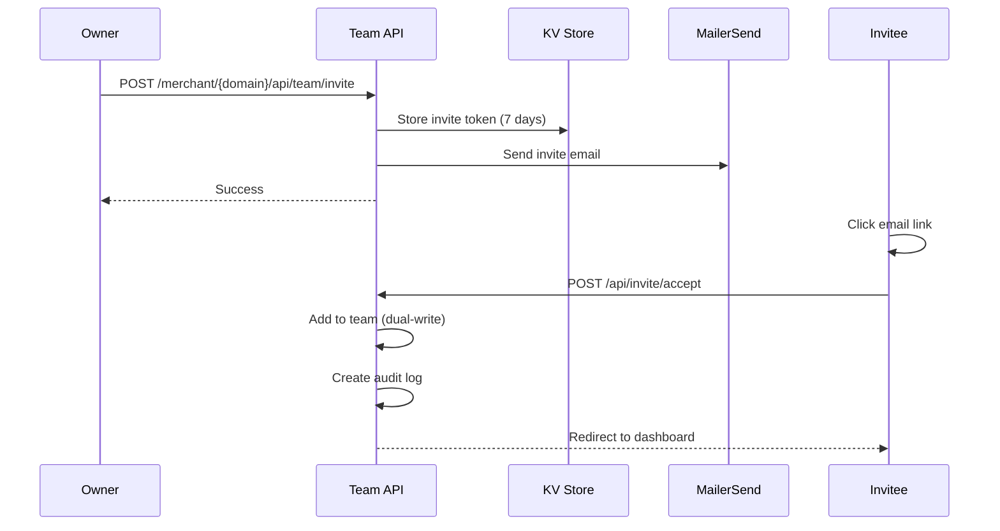

# Team Management

Team management allows dashboard owners to invite members, assign roles, and control access to merchant dashboards.

## Roles

| Role | Description | Permissions |
|------|-------------|-------------|
| `owner` | Dashboard owner (original invitee) | Full access + team management |
| `editor` | Team member with edit rights | Edit settings, manage orders |
| `viewer` | Read-only access | View orders and settings |

### Role Permissions Matrix

| Action | Owner | Editor | Viewer |
|--------|-------|--------|--------|
| View orders | Yes | Yes | Yes |
| View destinations | Yes | Yes | Yes |
| View settings | Yes | Yes | Yes |
| Edit settings | Yes | Yes | No |
| Manage destinations | Yes | Yes | No |
| View audit logs | Yes | Yes | Yes |
| Invite team members | Yes | No | No |
| Remove team members | Yes | No | No |
| Change member roles | Yes | No | No |
| Sign agreement | Yes | No | No |

## Data Storage

Team data is stored in multiple places using the dual-write pattern:

### Storage Locations

| Location | Purpose |
|----------|---------|
| **MerchantDO** `team` | Per-merchant team list, stores user_id, email, role, granted_at, granted_by |
| **DashUserDO** `merchant_access` | Per-user merchant access list, stores merchant_domain, role, granted_at |
| **D1** `merchant_team` | Global index for admin queries, stores composite key of merchant_domain + user_id |

## Team Operations

### Getting Team Members

Fetch from MerchantDO `/team` endpoint. Returns list with userId, email, role, grantedAt, grantedBy.

### Adding Team Members

Members are added through the invite system:

1. Add to MerchantDO team table
2. Add to user's DashUserDO merchant_access table
3. Create audit log

### Updating Roles

1. Update in MerchantDO
2. Update in user's DashUserDO
3. Create audit log

### Removing Team Members

1. Remove from MerchantDO
2. Remove from user's DashUserDO
3. Create audit log

## Team Invite Flow

## Team Page UI

The team management page (`/merchant/{domain}/team`) shows:

1. **Team members table** with:
   - Name/email
   - Role badge
   - Join date
   - Actions (change role, remove)

2. **Invite dialog** (owner only):
   - Email input
   - Role selector
   - Send button

3. **Pending invites** (owner only):
   - Pending invite list
   - Cancel button for each

## Authorization Checks

All team operations verify the user has permission:

- Check if user is owner or Firmly admin
- If not owner and not admin, return 403 Forbidden

## Self-Removal Prevention

Owners cannot remove themselves to prevent orphaned dashboards.

## Related Documentation

- [Dashboard System](./dashboard-system.md) - Dashboard overview
- [Invite System](../authentication/invite-system.md) - Invitation flow
- [Audit Logs](./audit-logs.md) - Team action logging
