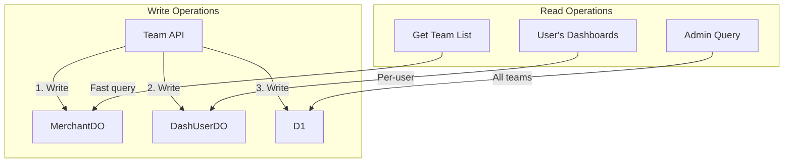
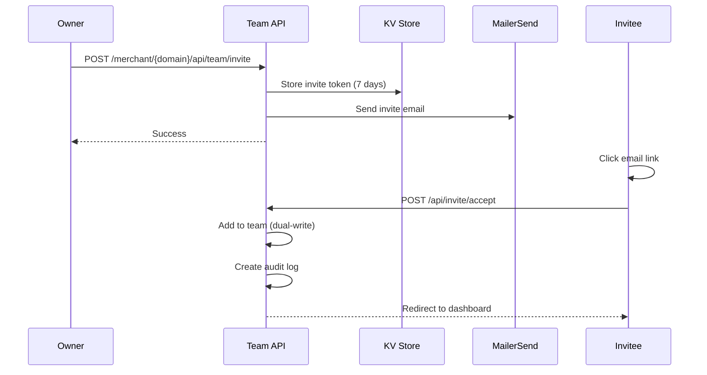

# Team Management

Team management allows dashboard owners to invite members, assign roles, and control access to merchant dashboards.

## Roles

| Role | Description | Permissions |
|------|-------------|-------------|
| `owner` | Dashboard owner (original invitee) | Full access + team management |
| `editor` | Team member with edit rights | Edit settings, manage orders |
| `viewer` | Read-only access | View orders and settings |

### Role Permissions Matrix

| Action | Owner | Editor | Viewer |
|--------|-------|--------|--------|
| View orders | Yes | Yes | Yes |
| View destinations | Yes | Yes | Yes |
| View settings | Yes | Yes | Yes |
| Edit settings | Yes | Yes | No |
| Manage destinations | Yes | Yes | No |
| View audit logs | Yes | Yes | Yes |
| Invite team members | Yes | No | No |
| Remove team members | Yes | No | No |
| Change member roles | Yes | No | No |
| Sign agreement | Yes | No | No |

## Data Storage

Team data is stored in multiple places using the dual-write pattern:



### MerchantDO (Per-merchant)

```sql
CREATE TABLE team (
  user_id TEXT PRIMARY KEY,
  email TEXT NOT NULL,
  role TEXT NOT NULL,
  granted_at TEXT DEFAULT CURRENT_TIMESTAMP,
  granted_by TEXT
);
```

### DashUserDO (Per-user)

```sql
CREATE TABLE merchant_access (
  merchant_domain TEXT PRIMARY KEY,
  role TEXT DEFAULT 'owner',
  granted_at DATETIME DEFAULT CURRENT_TIMESTAMP
);
```

### D1 (Global index)

```sql
CREATE TABLE merchant_team (
  merchant_domain TEXT NOT NULL,
  user_id TEXT NOT NULL,
  user_email TEXT NOT NULL,
  role TEXT,
  granted_at TEXT,
  granted_by TEXT,
  PRIMARY KEY (merchant_domain, user_id)
);
```

## Team Operations

### Getting Team Members

```javascript
// merchant.js
export async function getMerchantTeam({ platform, merchantDomain }) {
  const response = await fetchMerchantDO(platform, merchantDomain, '/team');
  if (!response.ok) return [];
  return response.json();
}

// Returns:
[
  {
    userId: "uuid-1",
    email: "owner@merchant.com",
    role: "owner",
    grantedAt: "2024-01-01T00:00:00Z",
    grantedBy: "admin-uuid"
  },
  {
    userId: "uuid-2",
    email: "editor@merchant.com",
    role: "editor",
    grantedAt: "2024-01-15T00:00:00Z",
    grantedBy: "uuid-1"
  }
]
```

### Adding Team Members

Members are added through the invite system, but the underlying function is:

```javascript
// merchant.js
export async function addTeamMember({
  platform,
  merchantDomain,
  userId,
  userEmail,
  role,
  grantedBy,
  actor
}) {
  // 1. Add to MerchantDO team table
  await fetchMerchantDO(platform, merchantDomain, '/team', {
    method: 'POST',
    body: JSON.stringify({ userId, userEmail, role, grantedBy })
  });

  // 2. Add to user's DashUserDO merchant_access table
  await fetchDashUserDO(platform, userId, '/merchant-access', {
    method: 'POST',
    body: JSON.stringify({ merchantDomain, role })
  });

  // 3. Create audit log
  if (actor) {
    await createAuditLog({
      platform,
      merchantDomain,
      eventType: 'invite_accepted',
      actorId: actor.id,
      actorEmail: actor.email,
      targetId: userId,
      targetEmail: userEmail,
      details: { role }
    });
  }

  return true;
}
```

### Updating Roles

```javascript
// merchant.js
export async function updateTeamMemberRole({
  platform,
  merchantDomain,
  userId,
  newRole,
  actor,
  targetEmail
}) {
  // 1. Update in MerchantDO
  await fetchMerchantDO(platform, merchantDomain, `/team/${userId}`, {
    method: 'PUT',
    body: JSON.stringify({ role: newRole })
  });

  // 2. Update in user's DashUserDO
  await fetchDashUserDO(platform, userId, '/merchant-access', {
    method: 'POST',
    body: JSON.stringify({ merchantDomain, role: newRole })
  });

  // 3. Create audit log
  if (actor) {
    await createAuditLog({
      platform,
      merchantDomain,
      eventType: 'role_changed',
      actorId: actor.id,
      actorEmail: actor.email,
      targetId: userId,
      targetEmail,
      details: { newRole }
    });
  }

  return true;
}
```

### Removing Team Members

```javascript
// merchant.js
export async function removeTeamMember({
  platform,
  merchantDomain,
  userId,
  actor,
  targetEmail
}) {
  // 1. Remove from MerchantDO
  await fetchMerchantDO(platform, merchantDomain, `/team/${userId}`, {
    method: 'DELETE'
  });

  // 2. Remove from user's DashUserDO
  await fetchDashUserDO(platform, userId, `/merchant-access/${merchantDomain}`, {
    method: 'DELETE'
  });

  // 3. Create audit log
  if (actor) {
    await createAuditLog({
      platform,
      merchantDomain,
      eventType: 'member_removed',
      actorId: actor.id,
      actorEmail: actor.email,
      targetId: userId,
      targetEmail
    });
  }

  return true;
}
```

## Team Invite Flow



## Team Page UI

The team management page (`/merchant/{domain}/team`) shows:

1. **Team members table** with:
   - Name/email
   - Role badge
   - Join date
   - Actions (change role, remove)

2. **Invite dialog** (owner only):
   - Email input
   - Role selector
   - Send button

3. **Pending invites** (owner only):
   - Pending invite list
   - Cancel button for each

## Authorization Checks

All team operations verify the user has permission:

```javascript
// routes/(logged-in)/merchant/[domain]/api/team/+server.js
export async function POST({ request, platform, locals, params }) {
  const { merchantDomain } = params;
  const { userId, isFirmlyAdmin } = locals.session;

  // Check if user is owner or admin
  if (!isFirmlyAdmin) {
    const access = await getMerchantAccess({ platform, userId });
    const merchantAccess = access.find(a => a.merchantDomain === merchantDomain);

    if (!merchantAccess || merchantAccess.role !== 'owner') {
      return json({ error: 'Not authorized' }, { status: 403 });
    }
  }

  // Process request...
}
```

## Self-Removal Prevention

Owners cannot remove themselves to prevent orphaned dashboards:

```javascript
// Check before removal
if (userId === targetUserId) {
  return json({ error: 'Cannot remove yourself' }, { status: 400 });
}
```

## Related Documentation

- [Dashboard System](./dashboard-system.md) - Dashboard overview
- [Invite System](../authentication/invite-system.md) - Invitation flow
- [Audit Logs](./audit-logs.md) - Team action logging
- [API: Team](../api/merchant/team.md) - Team API reference
- [API: Team Invite](../api/merchant/team-invite.md) - Invite API reference
