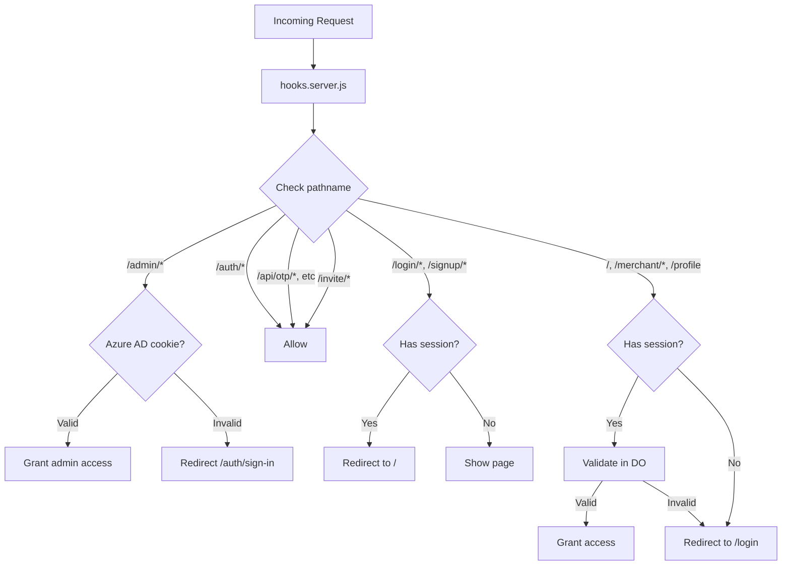

# Routes Overview

The Firmly Dashboard uses SvelteKit's file-based routing with route groups for authentication scoping.

## Route Groups

| Group | Auth Required | Purpose |
|-------|---------------|---------|
| `(firmly-user-only)` | Azure AD SSO | Firmly admin routes |
| `(logged-in)` | JWT session | Protected user routes |
| `(logged-out)` | None (redirects if auth) | Public auth pages |
| Root (`/invite`, `/api`) | Varies | Public routes |

## Route Structure

```
src/routes/
├── (firmly-user-only)/          # Firmly admin routes
│   ├── admin/                   # Admin dashboard
│   │   ├── (dashboard)/         # Home page
│   │   ├── dashboards/          # Manage merchant dashboards
│   │   ├── merchants/           # Manage merchants
│   │   ├── orders/              # View all orders
│   │   └── dropin/              # Drop-in testing
│   └── auth/                    # Azure AD auth
│       ├── sign-in/
│       ├── callback/
│       └── logout/
│
├── (logged-in)/                 # Protected user routes
│   ├── +page.svelte             # Dashboard selector
│   ├── profile/                 # User profile
│   ├── merchant/[domain]/       # Merchant dashboard
│   │   ├── orders/
│   │   ├── destinations/
│   │   ├── team/
│   │   ├── audit-logs/
│   │   ├── settings/
│   │   └── agreement/
│   └── api/                     # Protected APIs
│       ├── auth/logout/
│       ├── profile/
│       └── sessions/
│
├── (logged-out)/                # Public auth routes
│   ├── login/                   # Login page
│   │   ├── otp/                 # OTP verification
│   │   └── verify/              # Magic link verification
│   ├── signup/                  # Signup flow
│   │   ├── verify-email/
│   │   └── verify-domain/
│   └── api/                     # Public auth APIs
│       ├── otp/
│       ├── magic-link/
│       └── login/otp/
│
├── invite/                      # Invite acceptance (public)
│   └── profile/                 # New user profile
│
└── api/invite/                  # Invite APIs (public)
```

## Authentication Flow



## Middleware (hooks.server.js)

All authentication is handled centrally in `hooks.server.js`:

```javascript
export async function handle({ event, resolve }) {
  const { pathname } = event.url;

  // Admin routes - Azure AD
  if (pathname.startsWith('/admin')) {
    return handleAdminAuth(event, resolve);
  }

  // Azure AD callbacks - public
  if (pathname.startsWith('/auth/')) {
    return resolve(event);
  }

  // Public auth APIs
  if (pathname.startsWith('/api/otp/') ||
      pathname.startsWith('/api/magic-link/') ||
      pathname.startsWith('/api/invite/')) {
    return resolve(event);
  }

  // Invite routes - public
  if (pathname.startsWith('/invite')) {
    return resolve(event);
  }

  // Check for Firmly admin (hybrid auth)
  let userSession = await checkFirmlyAdmin(event);

  // Fall back to JWT session
  if (!userSession) {
    userSession = await validateJWTSession(event);
  }

  event.locals.session = userSession;

  // Protected routes require session
  if (isProtectedRoute(pathname) && !userSession) {
    redirect(302, '/login');
  }

  // Logged-out routes redirect if authenticated
  if (isLoggedOutRoute(pathname) && userSession) {
    redirect(302, '/');
  }

  return resolve(event);
}
```

## Session in Locals

After authentication, session data is available in `event.locals`:

```typescript
interface Session {
  userId: string;
  email: string;
  sessionId: string | null;
  isFirmlyAdmin?: boolean;
}

// Access in load functions
export async function load({ locals }) {
  const { userId, email, isFirmlyAdmin } = locals.session;
  // ...
}

// Access in API routes
export async function POST({ locals }) {
  const { userId } = locals.session;
  // ...
}
```

## Dynamic Routes

### `[domain]` - Merchant Domain

Used for merchant-specific pages:
- `/merchant/[domain]` - Dashboard home
- `/merchant/[domain]/orders` - Orders list
- `/merchant/[domain]/team` - Team management

### `[order_id]` - Order Detail

Used for order-specific pages:
- `/merchant/[domain]/orders/[order_id]` - Order detail

### `[userId]` - Team Member

Used for team member operations:
- `/merchant/[domain]/api/team/[userId]` - Update/remove member

## API Routes

API routes follow the convention:
- Located in `api/` directories
- Use `+server.js` files
- Export HTTP method handlers (`GET`, `POST`, `PUT`, `DELETE`)

Example:
```javascript
// routes/(logged-in)/merchant/[domain]/api/team/+server.js
export async function GET({ params, platform }) {
  const team = await getMerchantTeam({
    platform,
    merchantDomain: params.domain
  });
  return json(team);
}

export async function POST({ request, params, platform, locals }) {
  // Invite team member
}
```

## Load Functions

### Server Load (`+page.server.js`)

Runs on server, can access platform bindings:

```javascript
export async function load({ platform, locals, params }) {
  const { domain } = params;
  const { userId } = locals.session;

  const data = await fetchData(platform, domain);
  return { data };
}
```

### Layout Load (`+layout.server.js`)

Runs for all child routes:

```javascript
// routes/(logged-in)/merchant/[domain]/+layout.server.js
export async function load({ platform, locals, params }) {
  // Load merchant data for all child pages
  const merchantAccess = await getMerchantAccess({
    platform,
    userId: locals.session.userId
  });

  return { merchantAccess };
}
```

## Related Documentation

- [Admin Routes](./admin-routes.md) - Firmly admin pages
- [User Routes](./user-routes.md) - Merchant user pages
- [Public Routes](./public-routes.md) - Auth and invite pages
- [Authentication Overview](../authentication/overview.md) - Auth system
