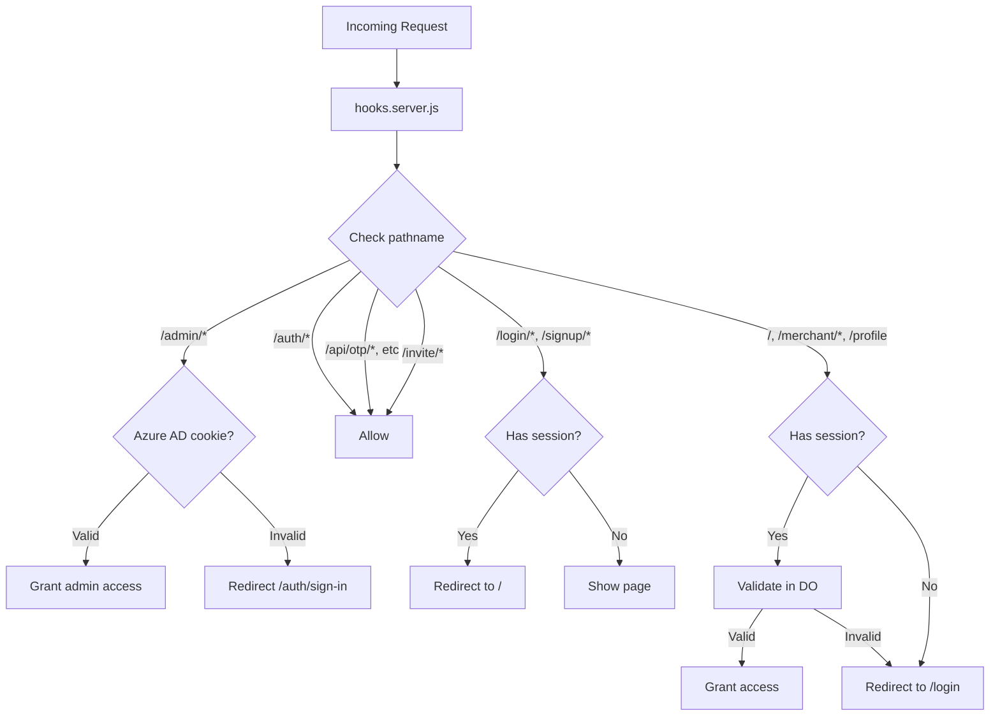

# Routes Overview

The Firmly Dashboard uses SvelteKit's file-based routing with route groups for authentication scoping.

## Route Groups

| Group | Auth Required | Purpose |
|-------|---------------|---------|
| `(firmly-user-only)` | Azure AD SSO | Firmly admin routes |
| `(logged-in)` | JWT session | Protected user routes |
| `(logged-out)` | None (redirects if auth) | Public auth pages |
| Root (`/invite`, `/api`) | Varies | Public routes |

## Route Structure

```
src/routes/
├── (firmly-user-only)/          # Firmly admin routes
│   ├── admin/                   # Admin dashboard
│   │   ├── (dashboard)/         # Home page
│   │   ├── dashboards/          # Manage merchant dashboards
│   │   ├── merchants/           # Manage merchants
│   │   ├── orders/              # View all orders
│   │   └── dropin/              # Drop-in testing
│   └── auth/                    # Azure AD auth
│       ├── sign-in/
│       ├── callback/
│       └── logout/
│
├── (logged-in)/                 # Protected user routes
│   ├── +page.svelte             # Dashboard selector
│   ├── profile/                 # User profile
│   ├── merchant/[domain]/       # Merchant dashboard
│   │   ├── orders/
│   │   ├── destinations/
│   │   ├── team/
│   │   ├── audit-logs/
│   │   ├── settings/
│   │   └── agreement/
│   └── api/                     # Protected APIs
│       ├── auth/logout/
│       ├── profile/
│       └── sessions/
│
├── (logged-out)/                # Public auth routes
│   ├── login/                   # Login page
│   │   ├── otp/                 # OTP verification
│   │   └── verify/              # Magic link verification
│   ├── signup/                  # Signup flow
│   │   ├── verify-email/
│   │   └── verify-domain/
│   └── api/                     # Public auth APIs
│       ├── otp/
│       ├── magic-link/
│       └── login/otp/
│
├── invite/                      # Invite acceptance (public)
│   └── profile/                 # New user profile
│
└── api/invite/                  # Invite APIs (public)
```

## Authentication Flow



## Middleware (hooks.server.js)

All authentication is handled centrally in `hooks.server.js`:

- **Admin routes** (`/admin/*`): Check Azure AD cookie, redirect to `/auth/sign-in` if invalid
- **Azure AD callbacks** (`/auth/*`): Allow without auth
- **Public auth APIs** (`/api/otp/*`, `/api/magic-link/*`): Allow without auth
- **Invite routes** (`/invite/*`): Allow without auth
- **Protected routes** (`/`, `/merchant/*`, `/profile`): Require valid JWT session
- **Logged-out routes** (`/login/*`, `/signup/*`): Redirect to `/` if already authenticated

### Hybrid Authentication

For `/merchant/*` routes, the system first checks for an Azure AD cookie. If valid, it creates a synthetic session with `isFirmlyAdmin: true`. This allows Firmly admins to view any merchant dashboard.

## Session in Locals

After authentication, session data is available in `event.locals`:

| Property | Type | Description |
|----------|------|-------------|
| `userId` | string | User UUID |
| `email` | string | User's email |
| `sessionId` | string | Session ID (null for Azure AD) |
| `isFirmlyAdmin` | boolean | Whether user is Firmly admin |

## Dynamic Routes

### `[domain]` - Merchant Domain

Used for merchant-specific pages:
- `/merchant/[domain]` - Dashboard home
- `/merchant/[domain]/orders` - Orders list
- `/merchant/[domain]/team` - Team management

### `[order_id]` - Order Detail

Used for order-specific pages:
- `/merchant/[domain]/orders/[order_id]` - Order detail

### `[userId]` - Team Member

Used for team member operations:
- `/merchant/[domain]/api/team/[userId]` - Update/remove member

## API Routes

API routes follow the convention:
- Located in `api/` directories
- Use `+server.js` files
- Export HTTP method handlers (GET, POST, PUT, DELETE)

## Load Functions

### Server Load (`+page.server.js`)

Runs on server, can access platform bindings for data fetching.

### Layout Load (`+layout.server.js`)

Runs for all child routes, useful for loading shared data like merchant access list.

## Related Documentation

- [Admin Routes](./admin-routes.md) - Firmly admin pages
- [User Routes](./user-routes.md) - Merchant user pages
- [Public Routes](./public-routes.md) - Auth and invite pages
- [Authentication Overview](../authentication/overview.md) - Auth system
